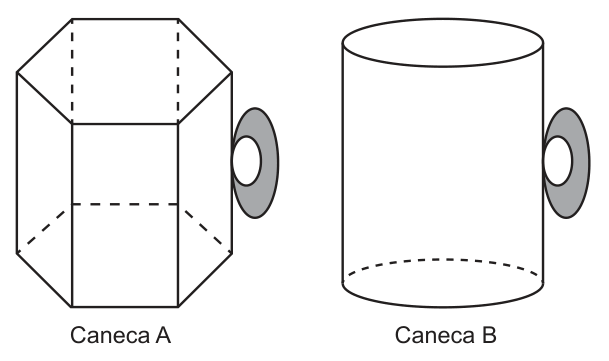
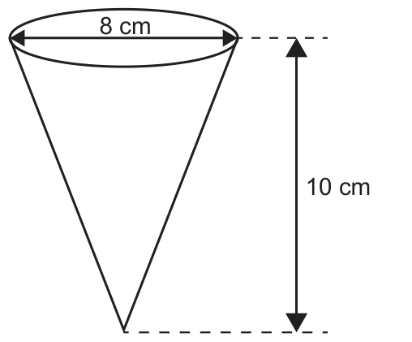
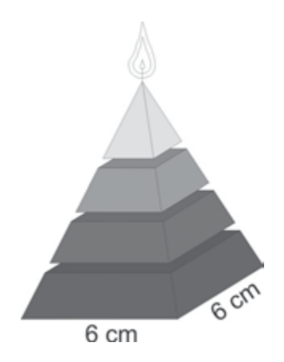

## Antes de Começar

**O que o ENEM cobra aqui.** O ENEM mostra um objeto do cotidiano e pergunta quanto ele guarda. Os padrões são cinco. Calcular o volume de um sólido. Comparar dois recipientes para escolher o maior. Trocar a unidade, como litro para centímetro cúbico. Achar uma medida quando o volume muda. Transformar volume em massa ou em tempo para encher. As questões desta aula vêm da aplicação regular e da 2ª aplicação, a prova publicada junto com a das Pessoas Privadas de Liberdade (PPL).

**Palavras e siglas desta aula**

- **ENEM** (Exame Nacional do Ensino Médio): a prova nacional que dá acesso a faculdades e bolsas.
- **INEP** (Instituto Nacional de Estudos e Pesquisas Educacionais Anísio Teixeira): o órgão do governo que faz o ENEM.
- **PPL** (Pessoas Privadas de Liberdade): pessoas presas; o ENEM tem uma aplicação separada para elas.
- **Sólido**: objeto com três dimensões (comprimento, largura e altura), como uma caixa ou uma bola.
- **Volume**: o espaço que o sólido ocupa. Mede-se em unidades "cúbicas", como cm³.
- **Capacidade**: quanto cabe dentro de um recipiente. Na prática, é o volume da parte de dentro.
- **Base**: a face em que o sólido "se apoia". Num copo, é o fundo.
- **Altura**: a distância reta entre a base e o topo, medida em pé, fazendo ângulo reto com a base.
- **Aresta**: cada "quina" do sólido, a linha onde duas faces se encontram.
- **Prisma**: sólido com duas bases iguais e paralelas, ligadas por paredes retas. Ex.: caixa de sapato.
- **Paralelepípedo** (reto retângulo): o prisma em forma de caixa, com todas as faces retangulares.
- **Cubo**: o paralelepípedo com todas as arestas iguais, como um dado.
- **Cilindro**: sólido com duas bases redondas iguais e paralelas. Ex.: lata de refrigerante.
- **Pirâmide**: sólido com uma base e paredes triangulares que se encontram num ponto, o vértice.
- **Cone**: a "pirâmide de base redonda". Ex.: casquinha de sorvete.
- **Esfera**: a bola perfeita; todos os pontos da superfície ficam à mesma distância do centro.
- **Raio**: a distância do centro de um círculo (ou esfera) até a borda.
- **Diâmetro**: a distância de borda a borda passando pelo centro. Vale dois raios.
- **Triângulo equilátero**: triângulo com os três lados iguais.
- **Hexágono regular**: figura de seis lados iguais, como um favo de mel.
- **Tronco de pirâmide**: o que sobra de uma pirâmide quando se corta a ponta com um corte paralelo à base.
- **Espessura**: a grossura de uma parede, como a casca de um ovo de chocolate.
- **Semelhança**: dois objetos com a mesma forma e tamanhos diferentes, como uma miniatura e o original.
- **Razão de semelhança**: o número que multiplica cada comprimento para passar de um objeto ao outro.
- **Escala**: a razão de semelhança escrita como 1 : 100 (1 da miniatura vale 100 do real).
- **Vazão**: quanto líquido entra (ou sai) por unidade de tempo, como litros por minuto.
- **Ângulo reto**: o canto de 90 graus, como o canto de uma folha de papel.
- **Reto** (prisma reto, cilindro reto, cone reto): com as paredes em pé, em ângulo reto com a base, sem inclinar.
- **Regular**: com a base de lados todos iguais; na pirâmide regular, a ponta fica bem em cima do centro da base.
- **Quadrangular**: com base de quatro lados.
- **Maciço**: cheio por dentro, o contrário de oco.
- **Vértice**: a ponta onde as paredes da pirâmide ou do cone se encontram.
- **Raiz cúbica**: o número que, multiplicado por ele mesmo três vezes, dá o número de dentro.
- **Massa**: a quantidade de matéria de um objeto, medida em gramas (g) ou quilogramas.
- **Fator**: o número que multiplica um valor para aplicar um aumento ou uma redução.

**Símbolos desta aula**

| Símbolo | Como se lê | O que significa | Exemplo |
|---|---|---|---|
| V | vê | volume do sólido | V = 24 cm³ |
| Ab | á bê | área da base | Ab = 12 cm² |
| h | agá | altura do sólido | h = 10 cm |
| a, b, c | a, bê, cê | as três medidas de uma caixa | 4 cm, 3 cm e 2 cm |
| L | éle | lado de um triângulo ou hexágono (não confundir com L de litro) | L = 2 cm |
| r | erre | raio | r = 5 cm |
| d | dê | diâmetro | d = 10 cm, então r = 5 cm |
| π | pi | número fixo, cerca de 3,14; a prova diz qual valor usar (3 ou 3,1) | π ≈ 3 |
| ≈ | aproximadamente | quase igual, depois de arredondar | 3,14 ≈ 3 |
| × | vezes | multiplicação | 3 × 4 = 12 |
| ÷ | dividido por | divisão | 12 ÷ 3 = 4 |
| ² | ao quadrado | o número vezes ele mesmo | 7² = 7 × 7 = 49 |
| ³ | ao cubo | o número vezes ele mesmo, três vezes | 2³ = 2 × 2 × 2 = 8 |
| √ | raiz quadrada | o número que, ao quadrado, dá o de dentro | √0,64 = 0,8, porque 0,8² = 0,64 |
| − | menos | subtração | 125 − 64 = 61 |
| k | cá | razão de semelhança (quantas vezes os comprimentos mudam) | k = 2: tudo fica com o dobro do comprimento |
| cm³ | centímetro cúbico | volume de um cubinho de 1 cm de aresta | 1 cm³ = 1 mL |
| dm³ | decímetro cúbico | volume de um cubo de 10 cm de aresta | 1 dm³ = 1 L |
| m³ | metro cúbico | volume de um cubo de 1 m de aresta | 1 m³ = 1 000 L |
| L, mL | litro, mililitro | unidades de capacidade; 1 L = 1 000 mL | 2 L = 2 000 mL |
| p | pê | porcentagem de aumento ou de redução | p = 36 (36%) |
| t, Q | tê, quê | tempo e vazão | Q = 5 L por minuto |
| A | á | área de uma figura plana | A = 75 cm² |
| cm², m² | centímetro quadrado, metro quadrado | unidades de área (quadradinhos de 1 cm ou de 1 m de lado) | 3 × 4 = 12 cm² |
| / | sobre | fração: o de cima dividido pelo de baixo | 4/3 = 4 ÷ 3 |
| : | para | escala, comparação entre miniatura e real | 1 : 100 |
| % | por cento | partes de cada 100 | 36% = 0,36 |
| ∛ | raiz cúbica | o número que, ao cubo, dá o de dentro | ∛1 000 000 = 100, porque 100³ = 1 000 000 |
| x | xis | número desconhecido numa regra de três | x = 5 |
| g | grama | unidade de massa | 5 g |
| m, u | eme, u | massa (não confundir com o m de metro, em m³), e o volume ocupado por 1 g (em cm³ por grama) | u = 0,8 cm³ por grama |
| V novo | vê novo | volume depois da mudança | V novo = 240 000 cm³ |
| V oco, V externo, V interno | vê oco, vê externo, vê interno | volume do material, da parte de fora e do buraco | V oco = V externo − V interno |
| V tronco, V grande, V pequena | vê tronco, vê grande, vê pequena | volume do tronco, da pirâmide inteira e da ponta tirada | 288 − 36 = 252 |
| fator | fator | número que multiplica o valor antigo numa porcentagem | 36% menor: fator 0,64 |
| n | ene | número de blocos empilhados | 3 blocos: n = 3, então n − 1 = 2 espaços |

**O que você precisa saber antes.**

- **Área das figuras planas.** Quadrado: lado × lado. Retângulo: base × altura. Triângulo: base × altura ÷ 2. Círculo: π × r². Se alguma dessas travar, revise a aula de Geometria Plana.
- **Potências.** 7² = 7 × 7 = 49. 5³ = 5 × 5 × 5 = 125. O número pequeno diz quantas vezes o número aparece na multiplicação.
- **Raiz quadrada de decimal.** √0,49 = 0,7 porque 0,7 × 0,7 = 0,49. Dica: √49 = 7, então √0,49 = 0,7.
- **Porcentagem.** "51% menor" quer dizer que sobra 49% do valor, ou seja, multiplicar por 0,49. Veja a aula de Porcentagem.
- **Regra de três.** Se 1 g ocupa 0,8 cm³, quantos gramas ocupam 4 cm³? Basta dividir: 4 ÷ 0,8 = 5 g. Veja a aula de Regra de Três.
- **Frações.** Para multiplicar frações, multiplique em cima com em cima e embaixo com embaixo: 2/3 × 5/7 = 10/21. Para dividir por uma fração, multiplique pela fração virada de cabeça para baixo: 6 ÷ 2/3 = 6 × 3/2 = 9.

## Aula Teórica Completa

### 1. O que é volume e como converter unidades

Pense numa caixa cheia de cubinhos de açúcar. Contar quantos cubinhos cabem nela é medir o volume.

Se cada cubinho tem 1 cm de aresta, cada um é **1 centímetro cúbico** (1 cm³). Uma caixa com 3 cubinhos de comprimento, 2 de largura e 2 de altura guarda 3 × 2 × 2 = 12 cubinhos. O volume dela é 12 cm³.

<figure class="figura">
  <svg viewBox="0 0 460 190" role="img" aria-labelledby="fig-volume-1-t fig-volume-1-d">
    <title id="fig-volume-1-t">Volume como contagem de cubinhos</title>
    <desc id="fig-volume-1-d">À esquerda, um cubinho de 1 cm de aresta, que vale 1 centímetro cúbico. À direita, uma caixa com 3 cubinhos de comprimento, 2 de largura e 2 de altura, somando 12 cubinhos, ou seja, 12 centímetros cúbicos.</desc>
    <polygon points="40,130 90,130 90,80 40,80" class="preenche" />
    <polygon points="40,130 90,130 90,80 40,80" class="traco" />
    <polygon points="40,80 60,62 110,62 90,80" class="traco" />
    <polygon points="90,130 110,112 110,62 90,80" class="traco" />
    <text x="65" y="150" class="rotulo" text-anchor="middle">1 cm</text>
    <text x="75" y="175" class="rotulo" text-anchor="middle">1 cubinho = 1 cm³</text>
    <polygon points="200,150 350,150 350,50 200,50" class="traco" />
    <line x1="250" y1="150" x2="250" y2="50" class="traco-fino" />
    <line x1="300" y1="150" x2="300" y2="50" class="traco-fino" />
    <line x1="200" y1="100" x2="350" y2="100" class="traco-fino" />
    <polygon points="200,50 240,20 390,20 350,50" class="traco" />
    <line x1="250" y1="50" x2="290" y2="20" class="traco-fino" />
    <line x1="300" y1="50" x2="340" y2="20" class="traco-fino" />
    <line x1="220" y1="35" x2="370" y2="35" class="traco-fino" />
    <polygon points="350,150 390,120 390,20 350,50" class="traco" />
    <line x1="350" y1="100" x2="390" y2="70" class="traco-fino" />
    <line x1="370" y1="35" x2="370" y2="135" class="traco-fino" />
    <text x="275" y="170" class="rotulo" text-anchor="middle">3 de comprimento</text>
    <text x="395" y="68" class="rotulo">2 de</text>
    <text x="395" y="82" class="rotulo">largura</text>
    <text x="190" y="104" class="rotulo" text-anchor="end">2 de altura</text>
    <text x="300" y="186" class="rotulo-fraco" text-anchor="middle">3 × 2 × 2 = 12 cubinhos = 12 cm³</text>
  </svg>
  <figcaption><b>Figura 1.</b> Volume é quantos cubinhos de 1 cm³ cabem dentro do sólido.</figcaption>
</figure>

O litro também mede volume. Um cubo de 10 cm de aresta (1 decímetro) guarda exatamente 1 litro. Isso liga as unidades da régua às unidades da garrafa.

**Fórmula: conversão entre unidades de volume**

**1 m³ = 1 000 L e 1 L = 1 dm³ = 1 000 cm³ = 1 000 mL**

- **m³**: metro cúbico, o volume de um cubo de 1 m de aresta.
- **L**: litro. **dm³**: decímetro cúbico (cubo de 10 cm de aresta).
- **cm³**: centímetro cúbico. **mL**: mililitro. Os dois são a mesma quantidade: 1 cm³ = 1 mL.
- **Em palavras:** um cubo de 1 m guarda mil litros; um litro é mil cubinhos de 1 cm.
- **Quando usar:** sempre que a questão misturar unidades, como "cm" nas medidas e "mL" ou "L" na resposta.

**Exemplo resolvido.** Uma jarra tem 2 500 cm³. Quantos litros ela guarda?

1. Dados: V = 2 500 cm³.
2. Relação: 1 L = 1 000 cm³.
3. Converter: 2 500 ÷ 1 000 = 2,5.
4. Resposta: 2,5 L. Conferência: 2,5 × 1 000 = 2 500 cm³. Certo.

**Erro comum.** Achar que 1 m³ = 100 L. Um metro tem 10 decímetros, e o cubo tem três dimensões: 10 × 10 × 10 = 1 000 dm³ = 1 000 L.

**Como o ENEM cobra isso.** Muitas questões de volume têm uma troca de unidade escondida. A pegadinha é deixar a resposta em cm³ quando o comando pede litros, ou o contrário.

### 2. Prismas: volume é área da base vezes altura

Imagine uma pilha de folhas de papel iguais. Cada folha é a base. A pilha inteira é o sólido. Quanto mais alta a pilha, mais papel.

Todo **prisma** funciona assim: o volume é a área da base "empilhada" até a altura. Por isso, a regra geral é área da base vezes altura.

<figure class="figura">
  <svg viewBox="0 0 460 200" role="img" aria-labelledby="fig-volume-2-t fig-volume-2-d">
    <title id="fig-volume-2-t">Prisma como pilha de bases</title>
    <desc id="fig-volume-2-d">Um prisma de base hexagonal desenhado em pé. A base de baixo está pintada e marcada como Ab, área da base. Uma seta vertical ao lado marca a altura h. O volume é Ab vezes h.</desc>
    <polygon points="120,160 170,160 195,145 170,130 120,130 95,145" class="preenche" />
    <polygon points="120,160 170,160 195,145 170,130 120,130 95,145" class="traco" />
    <polygon points="120,60 170,60 195,45 170,30 120,30 95,45" class="traco" />
    <line x1="95" y1="145" x2="95" y2="45" class="traco" />
    <line x1="120" y1="160" x2="120" y2="60" class="traco" />
    <line x1="170" y1="160" x2="170" y2="60" class="traco" />
    <line x1="195" y1="145" x2="195" y2="45" class="traco" />
    <line x1="120" y1="130" x2="120" y2="30" class="tracejado" />
    <line x1="170" y1="130" x2="170" y2="30" class="tracejado" />
    <line x1="225" y1="160" x2="225" y2="45" class="traco-fino" />
    <line x1="218" y1="160" x2="232" y2="160" class="traco-fino" />
    <line x1="218" y1="45" x2="232" y2="45" class="traco-fino" />
    <text x="238" y="106" class="rotulo">h (altura)</text>
    <text x="145" y="185" class="rotulo" text-anchor="middle">Ab (área da base)</text>
    <text x="375" y="95" class="rotulo" text-anchor="middle">V = Ab × h</text>
    <text x="375" y="115" class="rotulo-fraco" text-anchor="middle">vale para qualquer prisma</text>
    <text x="375" y="131" class="rotulo-fraco" text-anchor="middle">e para o cilindro</text>
  </svg>
  <figcaption><b>Figura 2.</b> O prisma é a base empilhada até a altura: V = Ab × h.</figcaption>
</figure>

**Fórmula: volume de prisma**

**V = Ab × h**

- **V**: volume, em unidade cúbica (cm³, m³…).
- **Ab**: área da base, em unidade quadrada (cm², m²…).
- **h**: altura, em unidade de comprimento (cm, m…), medida em pé, em ângulo reto com a base.
- **Em palavras:** calcule a área do fundo e multiplique pela altura.
- **Quando usar:** em qualquer sólido com duas bases iguais e paredes retas (prismas e cilindro).

**Exemplo resolvido.** Um prisma tem base triangular com base 6 cm e altura 4 cm, e o prisma tem 10 cm de altura. Qual o volume?

1. Dados: triângulo de base 6 cm e altura 4 cm; h = 10 cm.
2. Área da base: 6 × 4 ÷ 2 = 12 cm².
3. Fórmula: V = Ab × h.
4. Substituir e calcular: V = 12 × 10 = 120.
5. Resposta: 120 cm³. Conferência: cm² × cm dá cm³. Certo.

**Erro comum.** Usar a altura do triângulo da base como altura do prisma. São duas alturas diferentes: uma está no desenho da base, a outra é a do sólido.

**Fórmula: volume do paralelepípedo**

**V = a × b × c**

- **a, b, c**: comprimento, largura e altura da caixa, na mesma unidade.
- **Em palavras:** multiplique as três medidas da caixa.
- **Quando usar:** caixas, aquários, piscinas, caixas-d'água retangulares.

**Exemplo resolvido.** Um aquário mede 50 cm por 30 cm por 40 cm. Quantos litros ele guarda?

1. Dados: a = 50 cm, b = 30 cm, c = 40 cm.
2. Fórmula: V = a × b × c.
3. Calcular: 50 × 30 = 1 500; 1 500 × 40 = 60 000 cm³.
4. Converter: 60 000 ÷ 1 000 = 60 L.
5. Resposta: 60 L. Conferência: a base 50 × 30 é a Ab, e 40 é a altura: é a mesma regra V = Ab × h.

**Erro comum.** Somar as medidas (50 + 30 + 40) em vez de multiplicar. Soma de medidas não dá volume.

**Fórmula: volume do cubo**

**V = a³**

- **a**: aresta do cubo.
- **Em palavras:** a aresta vezes ela mesma, três vezes (a × a × a).
- **Quando usar:** quando as três medidas da caixa são iguais.

**Exemplo resolvido.** Um dado tem 2 cm de aresta. Qual o volume?

1. Dados: a = 2 cm.
2. Fórmula: V = a³.
3. Calcular: 2 × 2 × 2 = 8.
4. Resposta: 8 cm³.

**Erro comum.** Fazer 2 × 3 = 6. O ³ não é "vezes 3": é multiplicar o número por ele mesmo três vezes.

Muitas bases de prisma são triângulos equiláteros ou hexágonos regulares. O hexágono regular se divide em **seis triângulos equiláteros** iguais, todos com lado L.

<figure class="figura">
  <svg viewBox="0 0 460 200" role="img" aria-labelledby="fig-volume-3-t fig-volume-3-d">
    <title id="fig-volume-3-t">Hexágono regular dividido em seis triângulos equiláteros</title>
    <desc id="fig-volume-3-d">Um hexágono regular de lado L ligado ao centro forma seis triângulos equiláteros iguais, todos de lado L. A área do hexágono é seis vezes a área de um triângulo equilátero.</desc>
    <polygon points="110,100 150,31 230,31 270,100 230,169 150,169" class="traco" />
    <polygon points="190,100 230,31 270,100" class="preenche" />
    <line x1="190" y1="100" x2="110" y2="100" class="traco-fino" />
    <line x1="190" y1="100" x2="150" y2="31" class="traco-fino" />
    <line x1="190" y1="100" x2="230" y2="31" class="traco-fino" />
    <line x1="190" y1="100" x2="270" y2="100" class="traco-fino" />
    <line x1="190" y1="100" x2="230" y2="169" class="traco-fino" />
    <line x1="190" y1="100" x2="150" y2="169" class="traco-fino" />
    <text x="190" y="24" class="rotulo" text-anchor="middle">L</text>
    <text x="260" y="58" class="rotulo">L</text>
    <text x="232" y="92" class="rotulo">L</text>
    <text x="340" y="90" class="rotulo" text-anchor="middle">hexágono =</text>
    <text x="340" y="110" class="rotulo" text-anchor="middle">6 triângulos equiláteros</text>
  </svg>
  <figcaption><b>Figura 3.</b> Ligando o centro aos seis cantos, o hexágono regular vira seis triângulos equiláteros de lado L.</figcaption>
</figure>

**Fórmula: área do triângulo equilátero**

**A = L² × √3 ÷ 4**

- **A**: área do triângulo, em unidade quadrada.
- **L**: lado do triângulo.
- **√3**: raiz quadrada de 3, cerca de 1,7. A prova costuma dizer qual valor usar.
- **Em palavras:** lado ao quadrado, vezes raiz de 3, dividido por 4.
- **Quando usar:** quando a base é um triângulo com os três lados iguais e a prova não dá a altura dele.

**Exemplo resolvido.** Qual a área de um triângulo equilátero de lado 2 cm? Use √3 = 1,7.

1. Dados: L = 2 cm; √3 = 1,7.
2. Fórmula: A = L² × √3 ÷ 4.
3. Substituir: A = 2² × 1,7 ÷ 4 = 4 × 1,7 ÷ 4.
4. Calcular: 4 × 1,7 = 6,8; 6,8 ÷ 4 = 1,7.
5. Resposta: 1,7 cm².

**Erro comum.** Esquecer de elevar o lado ao quadrado e fazer L × √3 ÷ 4.

**Fórmula: área do hexágono regular**

**A = 6 × L² × √3 ÷ 4**

- **L**: lado do hexágono (que é também o lado de cada triângulo).
- **Em palavras:** a área de um triângulo equilátero, vezes 6.
- **Quando usar:** base em forma de favo de mel: canecas, lápis, porcas de parafuso.

**Exemplo resolvido.** Um prisma tem base hexagonal regular de lado 2 cm e altura 5 cm. Qual o volume? Use √3 = 1,7.

1. Dados: L = 2 cm; h = 5 cm.
2. Área de um triângulo: 2² × 1,7 ÷ 4 = 1,7 cm² (exemplo anterior).
3. Área do hexágono: 6 × 1,7 = 10,2 cm².
4. Volume: V = Ab × h = 10,2 × 5 = 51.
5. Resposta: 51 cm³.

**Erro comum.** Multiplicar a área do triângulo por 3 ou por 12. São 6 triângulos: um para cada lado do hexágono.

**Como o ENEM cobra isso.** O ENEM gosta de comparar dois recipientes de formas diferentes (um prisma e um cilindro) e pedir o de maior capacidade. A pegadinha é marcar o volume do recipiente errado: calcule os dois e compare.

### 3. Cilindro: o prisma de base redonda

Uma lata é uma pilha de moedas iguais. Cada moeda é um círculo. Então o cilindro segue a mesma regra do prisma: área da base vezes altura. A diferença é que a base é um círculo.

<figure class="figura">
  <svg viewBox="0 0 460 210" role="img" aria-labelledby="fig-volume-4-t fig-volume-4-d">
    <title id="fig-volume-4-t">Cilindro com raio e altura</title>
    <desc id="fig-volume-4-d">Um cilindro em pé. Na base redonda, um segmento vai do centro até a borda e é marcado como r, o raio. Outro segmento atravessa a base de borda a borda e é marcado como d, o diâmetro, igual a dois raios. Ao lado, uma seta vertical marca a altura h.</desc>
    <ellipse cx="150" cy="40" rx="70" ry="18" class="traco" />
    <line x1="80" y1="40" x2="80" y2="170" class="traco" />
    <line x1="220" y1="40" x2="220" y2="170" class="traco" />
    <path d="M 80 170 A 70 18 0 0 0 220 170" class="traco" />
    <path d="M 80 170 A 70 18 0 0 1 220 170" class="tracejado" />
    <ellipse cx="150" cy="170" rx="70" ry="18" class="preenche" />
    <line x1="150" y1="170" x2="220" y2="170" class="traco" />
    <text x="185" y="164" class="rotulo" text-anchor="middle">r</text>
    <line x1="80" y1="40" x2="220" y2="40" class="tracejado" />
    <text x="150" y="34" class="rotulo" text-anchor="middle">d = 2 × r</text>
    <line x1="250" y1="40" x2="250" y2="170" class="traco-fino" />
    <line x1="243" y1="40" x2="257" y2="40" class="traco-fino" />
    <line x1="243" y1="170" x2="257" y2="170" class="traco-fino" />
    <text x="262" y="108" class="rotulo">h</text>
    <text x="360" y="100" class="rotulo" text-anchor="middle">V = π × r² × h</text>
    <text x="360" y="120" class="rotulo-fraco" text-anchor="middle">base: círculo de área π × r²</text>
  </svg>
  <figcaption><b>Figura 4.</b> O raio vai do centro até a borda; o diâmetro atravessa o círculo e vale dois raios.</figcaption>
</figure>

**Fórmula: raio a partir do diâmetro**

**r = d ÷ 2**

- **r**: raio. **d**: diâmetro.
- **Em palavras:** o raio é metade do diâmetro.
- **Quando usar:** sempre que a questão der o diâmetro. As fórmulas usam o raio.

**Exemplo resolvido.** Uma lata tem 12 cm de diâmetro. Qual o raio?

1. Dados: d = 12 cm.
2. Fórmula: r = d ÷ 2.
3. Calcular: 12 ÷ 2 = 6.
4. Resposta: r = 6 cm.

**Erro comum.** Colocar o diâmetro na fórmula no lugar do raio. No cilindro e no cone, o volume fica 4 vezes maior; na esfera, 8 vezes. Essa resposta errada costuma estar nas alternativas.

**Fórmula: área do círculo**

**A = π × r²**

- **A**: área do círculo. **r**: raio. **π**: pi (use o valor que a prova mandar).
- **Em palavras:** pi vezes o raio vezes o raio.
- **Quando usar:** para achar a área da base de um cilindro ou de um cone.

**Exemplo resolvido.** Área de um círculo de raio 5 cm, com π = 3.

1. Dados: r = 5 cm; π = 3.
2. Fórmula: A = π × r².
3. Calcular: 5² = 25; 3 × 25 = 75.
4. Resposta: 75 cm².

**Erro comum.** Fazer π × r × 2. Isso é outra coisa (o contorno do círculo), não a área.

**Fórmula: volume do cilindro**

**V = π × r² × h**

- **V**: volume. **r**: raio da base. **h**: altura do cilindro.
- **Em palavras:** área do círculo da base vezes a altura. É a regra do prisma, V = Ab × h.
- **Quando usar:** latas, canos, caixas-d'água redondas, copos retos.

**Exemplo resolvido.** Um copo cilíndrico tem 8 cm de diâmetro e 5 cm de altura. Quantos mililitros cabem? Use π = 3.

1. Dados: d = 8 cm, então r = 4 cm; h = 5 cm; π = 3.
2. Fórmula: V = π × r² × h.
3. Substituir: V = 3 × 4² × 5 = 3 × 16 × 5.
4. Calcular: 3 × 16 = 48; 48 × 5 = 240 cm³.
5. Converter: 1 cm³ = 1 mL, então 240 mL.

**Erro comum.** Esquecer de elevar o raio ao quadrado: fazer 3 × 4 × 5 = 60 em vez de 3 × 16 × 5 = 240. Outro erro é usar π = 3,14 quando a prova manda usar 3; use sempre o valor do enunciado.

**Fórmula: altura a partir do volume**

**h = V ÷ Ab**

- **h**: altura, em cm (ou m).
- **V**: volume que o recipiente precisa guardar, em cm³ (ou m³).
- **Ab**: área da base, em cm² (ou m²).
- **Em palavras:** volume dividido pela área do fundo. É a fórmula V = Ab × h feita de trás para a frente.
- **Quando usar:** quando o volume é conhecido e a altura não, como ao trocar o formato de uma embalagem.

**Exemplo resolvido.** Uma lata de 1 200 cm³ vai virar uma caixa de base quadrada de lado 10 cm. A caixa deve guardar pelo menos 150 mL a mais. Qual a menor altura inteira, em cm?

1. Dados: volume antigo 1 200 cm³; a mais, 150 mL = 150 cm³; base 10 cm × 10 cm.
2. Volume necessário: 1 200 + 150 = 1 350 cm³.
3. Área da base: 10 × 10 = 100 cm².
4. Fórmula: h = V ÷ Ab = 1 350 ÷ 100 = 13,5 cm.
5. Resposta: 14 cm. Com 13 cm, a caixa guardaria só 100 × 13 = 1 300 cm³, menos do que o necessário. Conferência: 100 × 14 = 1 400 cm³, que é pelo menos 1 350 cm³.

**Erro comum.** Esquecer de somar a capacidade a mais, ou arredondar para baixo. Quando a caixa precisa guardar "pelo menos" um volume, a altura se arredonda para cima.

**Como o ENEM cobra isso.** Um padrão frequente troca o formato da embalagem (de lata para caixa, por exemplo) e pede a nova medida. Primeiro calcule o volume antigo, depois use V = Ab × h no novo formato e isole a medida pedida (h = V ÷ Ab).

### 4. Pirâmide e cone: um terço do prisma

Pegue uma caixa e uma pirâmide com a mesma base e a mesma altura. Encha a pirâmide de areia e despeje na caixa. São precisas **três** pirâmides cheias para encher a caixa. O mesmo vale para cone e cilindro.

<figure class="figura">
  <svg viewBox="0 0 460 200" role="img" aria-labelledby="fig-volume-5-t fig-volume-5-d">
    <title id="fig-volume-5-t">Pirâmide dentro do prisma e cone dentro do cilindro</title>
    <desc id="fig-volume-5-d">À esquerda, uma pirâmide de base quadrada desenhada dentro de um prisma de mesma base e mesma altura. À direita, um cone desenhado dentro de um cilindro de mesma base e mesma altura. Em cada caso, o sólido de ponta ocupa um terço do volume do sólido reto.</desc>
    <polygon points="40,160 140,160 170,140 70,140" class="preenche" />
    <polygon points="40,160 140,160 140,50 40,50" class="tracejado" />
    <polygon points="40,50 70,30 170,30 140,50" class="tracejado" />
    <line x1="170" y1="140" x2="170" y2="30" class="tracejado" />
    <line x1="40" y1="160" x2="140" y2="160" class="traco" />
    <line x1="140" y1="160" x2="170" y2="140" class="traco" />
    <line x1="40" y1="160" x2="105" y2="40" class="traco" />
    <line x1="140" y1="160" x2="105" y2="40" class="traco" />
    <line x1="170" y1="140" x2="105" y2="40" class="traco" />
    <line x1="70" y1="140" x2="105" y2="40" class="tracejado" />
    <line x1="40" y1="160" x2="70" y2="140" class="tracejado" />
    <line x1="70" y1="140" x2="170" y2="140" class="tracejado" />
    <text x="105" y="185" class="rotulo" text-anchor="middle">pirâmide = prisma ÷ 3</text>
    <ellipse cx="330" cy="40" rx="60" ry="15" class="tracejado" />
    <line x1="270" y1="40" x2="270" y2="160" class="tracejado" />
    <line x1="390" y1="40" x2="390" y2="160" class="tracejado" />
    <ellipse cx="330" cy="160" rx="60" ry="15" class="preenche" />
    <path d="M 270 160 A 60 15 0 0 0 390 160" class="traco" />
    <line x1="270" y1="160" x2="330" y2="40" class="traco" />
    <line x1="390" y1="160" x2="330" y2="40" class="traco" />
    <text x="330" y="195" class="rotulo" text-anchor="middle">cone = cilindro ÷ 3</text>
  </svg>
  <figcaption><b>Figura 5.</b> Com a mesma base e a mesma altura, a pirâmide ocupa um terço do prisma, e o cone ocupa um terço do cilindro.</figcaption>
</figure>

**Fórmula: volume de pirâmide**

**V = Ab × h ÷ 3**

- **Ab**: área da base. **h**: altura (do vértice até a base, em linha reta).
- **Em palavras:** o volume do prisma de mesma base e altura, dividido por 3.
- **Quando usar:** pirâmides, tendas, velas pontudas, telhados.

**Exemplo resolvido.** Uma pirâmide tem base quadrada de lado 3 cm e altura 8 cm. Qual o volume?

1. Dados: lado da base 3 cm; h = 8 cm.
2. Área da base: 3 × 3 = 9 cm².
3. Fórmula: V = Ab × h ÷ 3.
4. Calcular: 9 × 8 = 72; 72 ÷ 3 = 24.
5. Resposta: 24 cm³.

**Erro comum.** Esquecer o "÷ 3". O resultado fica três vezes maior e costuma estar entre as alternativas.

**Fórmula: volume do cone**

**V = π × r² × h ÷ 3**

- **r**: raio da base. **h**: altura do cone.
- **Em palavras:** o volume do cilindro de mesma base e altura, dividido por 3.
- **Quando usar:** casquinhas, funis, montes de areia, chocolates em forma de cone.

**Exemplo resolvido.** Um funil cônico tem 10 cm de diâmetro e 6 cm de altura. Qual o volume? Use π = 3.

1. Dados: d = 10 cm, então r = 5 cm; h = 6 cm.
2. Fórmula: V = π × r² × h ÷ 3.
3. Substituir: V = 3 × 25 × 6 ÷ 3.
4. Calcular: 3 × 25 = 75; 75 × 6 = 450; 450 ÷ 3 = 150.
5. Resposta: 150 cm³.

**Erro comum.** Usar o diâmetro como raio e esquecer o ÷ 3 ao mesmo tempo. Faça a conta em etapas.

O **tronco de pirâmide** é uma pirâmide com a ponta cortada. Ele não precisa de fórmula nova.

**Fórmula: volume do tronco**

**V tronco = V grande − V pequena**

- **V grande**: volume da pirâmide inteira, antes do corte, em cm³.
- **V pequena**: volume da ponta que foi tirada (também uma pirâmide), em cm³.
- **V tronco**: o que sobra, em cm³.
- **Em palavras:** a pirâmide inteira menos a ponta.
- **Quando usar:** peças em forma de pirâmide sem a ponta, baldes, vasos, blocos empilhados.

**Exemplo resolvido.** Uma pirâmide de base quadrada tem lado 12 cm e altura 6 cm. Corta-se a ponta, uma pirâmide de base 6 cm × 6 cm e altura 3 cm. Qual o volume do tronco?

1. Pirâmide grande: Ab = 12 × 12 = 144 cm²; V = 144 × 6 ÷ 3 = 288 cm³.
2. Ponta: Ab = 6 × 6 = 36 cm²; V = 36 × 3 ÷ 3 = 36 cm³.
3. Tronco: 288 − 36 = 252.
4. Resposta: 252 cm³.

Vários troncos podem se encaixar um sobre o outro: a base de cima de um é a base de baixo do outro. Juntos, sem espaço, eles formam uma pirâmide inteira. Se houver espaços entre os blocos, tire os espaços da altura primeiro.

**Exemplo resolvido.** Uma peça tem 3 blocos de mesma altura, empilhados com espaços de 1 cm entre eles. A altura total, contando os espaços, é 17 cm. Encaixados sem espaço, os blocos formam uma pirâmide. Qual a altura dessa pirâmide e a de cada bloco?

1. Quantos espaços: com 3 blocos em fila, há 3 − 1 = 2 espaços.
2. Altura dos espaços: 2 × 1 = 2 cm.
3. Altura da pirâmide: 17 − 2 = 15 cm.
4. Altura de cada bloco: 15 ÷ 3 = 5 cm.
5. Resposta: a pirâmide tem 15 cm, e cada bloco, 5 cm.

**Erro comum.** Contar um espaço para cada bloco. Entre 3 blocos há 2 espaços; entre 4 blocos, 3.

**Como o ENEM cobra isso.** A prova descreve um objeto feito de partes (blocos, espaços, uma ponta retirada). O caminho é: descobrir a pirâmide inteira, calcular o volume dela e somar ou tirar as partes. Leia com atenção os espaços vazios entre os blocos: eles não entram na altura da pirâmide.

### 5. Esfera e sólidos ocos

A esfera não tem base nem altura. Ela tem fórmula própria, que depende só do raio.

**Fórmula: volume da esfera**

**V = 4 × π × r³ ÷ 3**

- **r**: raio da esfera (metade do diâmetro).
- **Em palavras:** 4 vezes pi vezes o raio ao cubo, dividido por 3.
- **Quando usar:** bolas, bolhas, pérolas, tanques esféricos.

**Exemplo resolvido.** Qual o volume de uma bola de 6 cm de diâmetro? Deixe o π indicado.

1. Dados: d = 6 cm, então r = 3 cm.
2. Fórmula: V = 4 × π × r³ ÷ 3.
3. Substituir: V = 4 × π × 3³ ÷ 3 = 4 × π × 27 ÷ 3.
4. Calcular: 4 × 27 = 108; 108 ÷ 3 = 36.
5. Resposta: 36π cm³ (com π = 3, seriam 108 cm³).

**Erro comum.** Elevar o raio ao quadrado. Na esfera, o raio vai ao **cubo**.

Um **sólido oco** (bola de chocolate oca, cano, caixa de paredes grossas) tem duas medidas: a de fora e a de dentro. O material é o que fica entre elas.

<figure class="figura">
  <svg viewBox="0 0 460 200" role="img" aria-labelledby="fig-volume-6-t fig-volume-6-d">
    <title id="fig-volume-6-t">Esfera oca em corte</title>
    <desc id="fig-volume-6-d">Corte de uma esfera oca. O círculo de fora tem raio externo igual a 5 centímetros. O de dentro tem raio interno igual a 4 centímetros. A faixa pintada entre os dois tem espessura de 1 centímetro. O volume de material é o volume da esfera de fora menos o da de dentro.</desc>
    <path d="M 50 100 a 80 80 0 1 0 160 0 a 80 80 0 1 0 -160 0 M 66 100 a 64 64 0 1 0 128 0 a 64 64 0 1 0 -128 0" fill-rule="evenodd" class="preenche" />
    <circle cx="130" cy="100" r="80" class="traco" />
    <circle cx="130" cy="100" r="64" class="traco" />
    <line x1="130" y1="100" x2="210" y2="100" class="traco-fino" />
    <text x="170" y="94" class="rotulo" text-anchor="middle">5 cm</text>
    <line x1="130" y1="100" x2="85" y2="145" class="tracejado" />
    <text x="92" y="122" class="rotulo">4 cm</text>
    <text x="214" y="70" class="rotulo">espessura 1 cm</text>
    <text x="340" y="90" class="rotulo" text-anchor="middle">material =</text>
    <text x="340" y="110" class="rotulo" text-anchor="middle">esfera de fora − esfera de dentro</text>
  </svg>
  <figcaption><b>Figura 6.</b> Numa esfera oca, a espessura tira 1 cm do raio (não 2): o raio de dentro é 5 − 1 = 4 cm.</figcaption>
</figure>

**Fórmula: volume de um sólido oco**

**V oco = V externo − V interno**

- **V externo**: volume calculado com as medidas de fora.
- **V interno**: volume do "buraco", com as medidas de dentro.
- **Em palavras:** o sólido cheio menos o espaço vazio.
- **Quando usar:** para saber quanto material foi gasto (chocolate, madeira, plástico).

**Exemplo resolvido.** Uma bola oca tem raio externo 4 cm e espessura 1 cm. Quanto material ela tem? Deixe o π indicado.

1. Dados: raio de fora 4 cm; espessura 1 cm, então raio de dentro 4 − 1 = 3 cm.
2. Volume de fora: 4 × π × 4³ ÷ 3 = 4 × π × 64 ÷ 3 = 256π/3.
3. Volume de dentro: 4 × π × 3³ ÷ 3 = 4 × π × 27 ÷ 3 = 108π/3 = 36π.
4. Diferença: 256π/3 − 108π/3 = 148π/3.
5. Resposta: 148π/3 cm³. Também dá para fazer de uma vez: 4 × π × (64 − 27) ÷ 3 = 4 × π × 37 ÷ 3 = 148π/3.

**Erro comum.** Tirar a espessura duas vezes do raio (4 − 2 = 2). A espessura some duas vezes do **diâmetro** (uma de cada lado), mas só uma vez do **raio**.

**Como o ENEM cobra isso.** O ENEM dá o diâmetro de fora e a espessura, e pede a massa ou o preço do material. São três passos: raios, volume da casca, conversão para massa (seção 7).

### 6. Quando uma medida muda: quadrado, cubo e escala

Dobre só o raio de uma lata e mantenha a altura. O volume não dobra: ele fica **4 vezes** maior, porque o raio aparece ao quadrado na fórmula. Esse tipo de raciocínio resolve muitas questões sem conta longa.

- **Só o raio muda** (altura fixa, cilindro ou cone): o volume muda com o **quadrado** do raio.
- **Tudo muda na mesma proporção** (miniatura, maquete, objeto semelhante): comprimentos multiplicam por k, áreas por k², volumes por k³.

<figure class="figura">
  <svg viewBox="0 0 460 210" role="img" aria-labelledby="fig-volume-7-t fig-volume-7-d">
    <title id="fig-volume-7-t">Pirâmide pequena semelhante à pirâmide grande</title>
    <desc id="fig-volume-7-d">Uma pirâmide grande de altura 12 e base de lado 9. Um corte paralelo à base, perto da ponta, separa uma pirâmide pequena de altura 4 e base de lado 3. A razão de semelhança é 4 dividido por 12, igual a um terço. O volume da pequena é o da grande vezes um terço ao cubo, ou seja, dividido por 27.</desc>
    <polygon points="60,180 200,180 130,20" class="traco" />
    <polygon points="107,73 153,73 130,20" class="preenche" />
    <line x1="107" y1="73" x2="153" y2="73" class="tracejado" />
    <line x1="220" y1="180" x2="220" y2="20" class="traco-fino" />
    <line x1="214" y1="180" x2="226" y2="180" class="traco-fino" />
    <line x1="214" y1="20" x2="226" y2="20" class="traco-fino" />
    <text x="230" y="104" class="rotulo">12</text>
    <text x="160" y="52" class="rotulo">4</text>
    <text x="130" y="198" class="rotulo" text-anchor="middle">base 9</text>
    <text x="92" y="70" class="rotulo">3</text>
    <text x="350" y="80" class="rotulo" text-anchor="middle">k = 4 ÷ 12 = 1/3</text>
    <text x="350" y="100" class="rotulo" text-anchor="middle">volume × (1/3)³ = volume ÷ 27</text>
  </svg>
  <figcaption><b>Figura 7.</b> A ponta cortada é uma pirâmide semelhante à inteira: se as medidas são 1/3 das da grande, o volume é 1/27.</figcaption>
</figure>

**Fórmula: fator de aumento ou de redução**

**fator = 1 − p ÷ 100**

- **p**: a porcentagem de redução (para aumento, use 1 + p ÷ 100).
- **fator**: o número que multiplica o valor antigo.
- **Em palavras:** "p% menor" é multiplicar por (1 − p ÷ 100).
- **Quando usar:** "volume 36% menor", "capacidade 25% maior".

**Exemplo resolvido.** Um pote de 500 cm³ terá volume 36% menor. Qual o novo volume?

1. Dados: V = 500 cm³; p = 36.
2. Fator: 1 − 36 ÷ 100 = 1 − 0,36 = 0,64.
3. Novo volume: 500 × 0,64 = 320.
4. Resposta: 320 cm³.

**Erro comum.** Aplicar a porcentagem à medida quando ela vale para o volume. Se o **volume** fica × 0,64 e só o raio muda, o **raio** fica × √0,64 = × 0,8 (porque o volume depende do raio ao quadrado).

**Fórmula: volume depois de ampliar ou reduzir tudo**

**V novo = V × k³**

- **k**: razão de semelhança: quantas vezes cada comprimento muda. Na escala 1 : 100, do modelo para o real, k = 100.
- **Em palavras:** se cada comprimento é multiplicado por k, a área fica × k² e o volume fica × k³.
- **Quando usar:** maquetes, miniaturas, objetos "de mesma forma", pontas cortadas de pirâmide e de cone.

**Exemplo resolvido.** Uma miniatura na escala 1 : 20 tem volume de 30 cm³. Qual o volume do objeto real, em litros?

1. Dados: k = 20 (do modelo para o real); V = 30 cm³.
2. Fórmula: V novo = V × k³.
3. Calcular: 20³ = 20 × 20 × 20 = 8 000; 30 × 8 000 = 240 000 cm³.
4. Converter: 240 000 ÷ 1 000 = 240 L.
5. Resposta: 240 L.

**Erro comum.** Multiplicar o volume por k (ou por k²). Volume é cúbico: use k³. O caminho de volta também vale: se o volume real é 1 000 000 de vezes o do modelo, a escala linear é a raiz cúbica, 100 (1 : 100).

**Como o ENEM cobra isso.** Duas formas aparecem muito. Na primeira, o volume muda uma porcentagem e a altura fica igual: ache o novo raio com raiz quadrada do fator. Na segunda, a prova fala de maquete ou escala: compare volumes com k³.

### 7. Do volume para massa, tempo e porcentagem

Muitas questões não param no volume. Elas perguntam quantos gramas de material, quanto tempo para encher, ou quantos por cento de algo.

**Massa.** A prova diz quanto espaço ocupa cada grama, por exemplo "1 g equivale a 0,8 cm³". É uma regra de três: 1 g está para 0,8 cm³ assim como x gramas estão para o volume todo.

**Fórmula: massa a partir do volume**

**m = V ÷ u**

- **m**: massa, em gramas (g).
- **V**: volume do material, em cm³.
- **u**: volume ocupado por 1 grama, em cm³ por grama.
- **Em palavras:** quantas vezes o espaço de 1 grama cabe no volume do material.
- **Quando usar:** quando a prova diz quanto espaço ocupa 1 g e pede a massa (ou o custo) do material.

**Exemplo resolvido.** Um material tem 1 g para cada 0,5 cm³. Quantos gramas há em 12 cm³?

1. Dados: V = 12 cm³; u = 0,5 cm³ por grama.
2. Fórmula: m = V ÷ u.
3. Calcular: 12 ÷ 0,5 = 24.
4. Resposta: 24 g. Conferência: 24 × 0,5 = 12 cm³. Certo.

Quando o volume tem π e fração, troque o decimal por fração. Como 0,8 = 8/10 = 4/5, dividir por 0,8 é multiplicar por 5/4 (a fração virada de cabeça para baixo).

**Exemplo resolvido.** Uma casca de chocolate tem 148π/3 cm³, e 1 g ocupa 0,8 cm³. Qual a massa? Deixe o π indicado.

1. Dados: V = 148π/3 cm³; u = 0,8 = 4/5.
2. Fórmula: m = V ÷ u = 148π/3 ÷ 4/5.
3. Virar a fração: 148π/3 × 5/4.
4. Multiplicar: em cima, 148 × 5 = 740; embaixo, 3 × 4 = 12. Fica 740π/12.
5. Simplificar dividindo em cima e embaixo por 4: 740 ÷ 4 = 185 e 12 ÷ 4 = 3. Resposta: 185π/3 g.

**Erro comum.** Multiplicar o volume por 0,8 em vez de dividir. Se cada grama ocupa menos de 1 cm³, a massa em gramas sai maior que o volume em cm³.

**Fórmula: tempo para encher**

**t = V ÷ Q**

- **t**: tempo. **V**: volume a encher. **Q**: vazão (volume por tempo).
- **Em palavras:** quanto cabe, dividido por quanto entra a cada minuto (ou segundo, ou hora).
- **Quando usar:** encher piscina, caixa-d'água, tanque, com torneira ou bomba.

**Exemplo resolvido.** Uma caixa-d'água de 1 m³ é enchida por uma torneira de 20 L por minuto. Quanto tempo leva?

1. Dados: V = 1 m³ = 1 000 L; Q = 20 L por minuto.
2. Fórmula: t = V ÷ Q.
3. Calcular: 1 000 ÷ 20 = 50.
4. Resposta: 50 minutos.

**Erro comum.** Dividir sem converter antes. Volume em m³ e vazão em L por minuto: passe tudo para litros primeiro.

**Como o ENEM cobra isso.** A última etapa da conta costuma ser essa troca: de cm³ para gramas, de litros para minutos. Leia o comando até o fim e confira a unidade da resposta.

### Armadilhas típicas do INEP

1. **Diâmetro no lugar do raio.** Nas fórmulas entra o raio. Diâmetro dado? Divida por 2 antes de tudo.
2. **Esquecer o ÷ 3** de pirâmide e cone. A alternativa "três vezes maior" costuma estar lá.
3. **Unidade trocada.** 1 L = 1 000 cm³ e 1 m³ = 1 000 L. A pegadinha é responder em cm³ quando se pede litro.
4. **Porcentagem na medida errada.** "Volume 36% menor" com a mesma altura: o raio fica × √0,64 = × 0,8, e não × 0,64.
5. **Escala linear x escala de volume.** Volume muda com k³. Para voltar do volume para a escala, use a raiz cúbica.
6. **Espessura contada duas vezes no raio.** A espessura tira 1 vez do raio e 2 vezes do diâmetro.
7. **Arredondar para baixo** quando o recipiente precisa guardar "pelo menos" certa quantidade.
8. **Espaços vazios contados como sólido.** Numa peça feita de blocos separados, tire os espaços da altura antes de montar o sólido inteiro. Com n blocos em fila há n − 1 espaços (4 blocos têm 3 espaços, não 4).
9. **Multiplicar pelo volume de 1 g em vez de dividir.** Se 1 g ocupa 0,8 cm³, a massa é o volume ÷ 0,8.
10. **Escolher o recipiente errado.** Quando a questão compara dois, confira se o comando pede o maior ou o menor.

## Tópicos-Chave para Revisão

#### 1. Volume e unidades

**Volume** é quantos cubinhos cabem dentro do sólido. Troque unidades com **1 m³ = 1 000 L e 1 L = 1 dm³ = 1 000 cm³ = 1 000 mL**, lembrando que **1 cm³ = 1 mL**.

#### 2. Prismas

Todo **prisma** é a base empilhada até a altura: **V = Ab × h**. A caixa é o caso **V = a × b × c**, e o cubo é o caso **V = a³**. Para comparar dois recipientes, calcule os dois e confira se o comando pede o **maior** ou o **menor**.

#### 3. Bases de triângulo e hexágono

O **triângulo equilátero** tem área **A = L² × √3 ÷ 4**. O **hexágono regular** é feito de seis desses triângulos: **A = 6 × L² × √3 ÷ 4**.

<figure class="figura">
  <svg viewBox="0 0 300 120" role="img" aria-labelledby="fig-volume-3-rev-t fig-volume-3-rev-d">
    <title id="fig-volume-3-rev-t">Hexágono em seis triângulos</title>
    <desc id="fig-volume-3-rev-d">Hexágono regular de lado L dividido em seis triângulos equiláteros de lado L.</desc>
    <polygon points="60,60 85,17 135,17 160,60 135,103 85,103" class="traco" />
    <polygon points="110,60 135,17 160,60" class="preenche" />
    <line x1="110" y1="60" x2="60" y2="60" class="traco-fino" />
    <line x1="110" y1="60" x2="85" y2="17" class="traco-fino" />
    <line x1="110" y1="60" x2="135" y2="17" class="traco-fino" />
    <line x1="110" y1="60" x2="160" y2="60" class="traco-fino" />
    <line x1="110" y1="60" x2="135" y2="103" class="traco-fino" />
    <line x1="110" y1="60" x2="85" y2="103" class="traco-fino" />
    <text x="230" y="64" class="rotulo" text-anchor="middle">6 triângulos de lado L</text>
  </svg>
  <figcaption>Versão compacta da Figura 3.</figcaption>
</figure>

#### 4. Cilindro

O **raio** é metade do **diâmetro**: **r = d ÷ 2**. A base é um círculo de área **A = π × r²**, e o cilindro tem **V = π × r² × h**. Para trocar o formato da embalagem, ache o volume necessário e isole a altura: **h = V ÷ Ab**, arredondando para cima quando precisar "caber pelo menos".

<figure class="figura">
  <svg viewBox="0 0 300 120" role="img" aria-labelledby="fig-volume-4-rev-t fig-volume-4-rev-d">
    <title id="fig-volume-4-rev-t">Cilindro com raio e altura</title>
    <desc id="fig-volume-4-rev-d">Cilindro em pé com o raio r marcado na base e a altura h ao lado; o diâmetro vale dois raios.</desc>
    <ellipse cx="70" cy="22" rx="40" ry="10" class="traco" />
    <line x1="30" y1="22" x2="30" y2="98" class="traco" />
    <line x1="110" y1="22" x2="110" y2="98" class="traco" />
    <path d="M 30 98 A 40 10 0 0 0 110 98" class="traco" />
    <line x1="70" y1="98" x2="110" y2="98" class="traco-fino" />
    <text x="90" y="93" class="rotulo" text-anchor="middle">r</text>
    <line x1="122" y1="22" x2="122" y2="98" class="traco-fino" />
    <text x="128" y="64" class="rotulo">h</text>
    <text x="215" y="55" class="rotulo" text-anchor="middle">V = π × r² × h</text>
    <text x="215" y="75" class="rotulo-fraco" text-anchor="middle">d = 2 × r</text>
  </svg>
  <figcaption>Versão compacta da Figura 4.</figcaption>
</figure>

#### 5. Pirâmide, cone e tronco

Pirâmide e cone valem **um terço** do prisma e do cilindro: **V = Ab × h ÷ 3** e **V = π × r² × h ÷ 3**. O **tronco** é a pirâmide grande menos a pequena: **V tronco = V grande − V pequena**. Blocos encaixados formam a **pirâmide inteira**; antes, tire da altura os espaços vazios, que são **n − 1** para n blocos.

<figure class="figura">
  <svg viewBox="0 0 300 120" role="img" aria-labelledby="fig-volume-5-rev-t fig-volume-5-rev-d">
    <title id="fig-volume-5-rev-t">Pirâmide dentro do prisma</title>
    <desc id="fig-volume-5-rev-d">Vista de frente: uma pirâmide de mesma base e mesma altura que o prisma cabe dentro dele e ocupa um terço do volume.</desc>
    <polygon points="30,100 110,100 110,20 30,20" class="tracejado" />
    <polygon points="30,100 110,100 70,20" class="preenche" />
    <polygon points="30,100 110,100 70,20" class="traco" />
    <text x="210" y="64" class="rotulo" text-anchor="middle">pirâmide = prisma ÷ 3</text>
  </svg>
  <figcaption>Versão compacta da Figura 5.</figcaption>
</figure>

#### 6. Esfera e sólidos ocos

A **esfera** tem **V = 4 × π × r³ ÷ 3**, com o raio ao **cubo**. Num sólido oco, **V oco = V externo − V interno**, e a **espessura** tira uma vez do raio.

<figure class="figura">
  <svg viewBox="0 0 300 120" role="img" aria-labelledby="fig-volume-6-rev-t fig-volume-6-rev-d">
    <title id="fig-volume-6-rev-t">Esfera oca em corte</title>
    <desc id="fig-volume-6-rev-d">Dois círculos concêntricos: raio de fora 5 e raio de dentro 4; a casca entre eles tem 1 de espessura.</desc>
    <path d="M 20 60 a 50 50 0 1 0 100 0 a 50 50 0 1 0 -100 0 M 30 60 a 40 40 0 1 0 80 0 a 40 40 0 1 0 -80 0" fill-rule="evenodd" class="preenche" />
    <circle cx="70" cy="60" r="50" class="traco" />
    <circle cx="70" cy="60" r="40" class="traco" />
    <text x="200" y="55" class="rotulo" text-anchor="middle">de fora 5, de dentro 4</text>
    <text x="200" y="75" class="rotulo-fraco" text-anchor="middle">casca = fora − dentro</text>
  </svg>
  <figcaption>Versão compacta da Figura 6.</figcaption>
</figure>

#### 7. Mudança de medida e escala

Redução vira **fator = 1 − p ÷ 100**, e aumento vira **1 + p ÷ 100**. Com a altura fixa, o volume segue o **raio ao quadrado**, então o raio muda com a **raiz quadrada** do fator. Em objetos semelhantes, **V novo = V × k³**, e da escala de volume se volta à escala linear com a **raiz cúbica**.

#### 8. Massa e tempo

Para achar a **massa**, divida o volume pelo espaço que 1 g ocupa: **m = V ÷ u** (dividir por 0,8 é multiplicar por 5/4). Para achar o **tempo para encher**, use **t = V ÷ Q**, com volume e vazão na mesma unidade.

## Teste de Fogo

*Marque uma alternativa em cada questão e confira tudo de uma vez no botão do fim.*

**Questão 1**

*ENEM 2024 · 2ª aplicação · 2º dia · caderno azul · questão 171*

Uma empresa produz embalagens para acomodar seu produto. As embalagens atuais são cilíndricas e medem 16 cm de diâmetro e 20 cm de altura. A pedido da direção, as embalagens terão um novo formato. Elas serão na forma de paralelepípedos retos retângulos, de base quadrada, de lado medindo 16 cm. A capacidade delas deverá ser, pelo menos, 400 mL maior que a das embalagens atuais.

Use 3 como valor aproximado de π.

O valor aproximado da medida da altura das novas embalagens, em centímetro, é

A) 11.\
B) 15.\
C) 17.\
D) 62.\
E) 66.

**Questão 2**

*ENEM 2022 · 2ª aplicação · 2º dia · caderno azul · questão 150*

Um novo produto, denominado bolo de caneca no micro-ondas, foi lançado no mercado com o objetivo de atingir ao público que não tem muito tempo para cozinhar. Para prepará-lo, uma pessoa tem à sua disposição duas opções de canecas, apresentadas na figura.

<figure class="figura">

<figcaption>Fonte: INEP, ENEM 2022, 2ª aplicação, 2º dia, caderno azul, questão 150.</figcaption>
</figure>

A caneca A tem formato de um prisma reto regular hexagonal de lado L = 4 cm, e a caneca B tem formato de um cilindro circular reto de diâmetro d = 6 cm. Sabe-se que ambas têm a mesma altura h = 10 cm, e que essa pessoa escolherá a caneca com maior capacidade. Considere π = 3,1 e √3 = 1,7.

A medida da capacidade, em centímetro cúbico, da caneca escolhida é

A) 186.\
B) 279.\
C) 408.\
D) 816.\
E) 1 116.

**Questão 3**

*ENEM 2022 · 2º dia · caderno azul · questão 153*

Uma empresa produz e vende um tipo de chocolate, maciço, em formato de cone circular reto com as medidas do diâmetro da base e da altura iguais a 8 cm e 10 cm, respectivamente, como apresenta a figura.

<figure class="figura">

<figcaption>Fonte: INEP, ENEM 2022, 2º dia, caderno azul, questão 153.</figcaption>
</figure>

Devido a um aumento de preço dos ingredientes utilizados na produção desse chocolate, a empresa decide produzir esse mesmo tipo de chocolate com um volume 19% menor, no mesmo formato de cone circular reto com altura de 10 cm.

Para isso, a empresa produzirá esses novos chocolates com medida do raio da base, em centímetro, igual a

A) 1,52.\
B) 3,24.\
C) 3,60.\
D) 6,48.\
E) 7,20.

**Questão 4**

*ENEM 2023 · 2ª aplicação · 2º dia · caderno azul · questão 159*

Uma empresa produziu uma bola de chocolate, em formato esférico, para utilizar na decoração de sua loja. Essa bola tem 20 cm de diâmetro externo, sendo oca por dentro, e a medida da espessura entre as superfícies interna e externa corresponde a 1 cm. Considere que, na confecção dessa bola, foi utilizado um tipo de chocolate em que 1 g equivale a 0,75 cm³.

A quantidade de chocolate, em grama, utilizado na confecção dessa bola é

A) 76π/3\
B) 304π/9\
C) 4 336π/9\
D) 4 000π/3\
E) 18 256π/9

**Questão 5**

*ENEM 2009 · 2º dia · caderno azul · questão 173*

Uma fábrica produz velas de parafina em forma de pirâmide quadrangular regular com 19 cm de altura e 6 cm de aresta da base. Essas velas são formadas por 4 blocos de mesma altura — 3 troncos de pirâmide de bases paralelas e 1 pirâmide na parte superior —, espaçados de 1 cm entre eles, sendo que a base superior de cada bloco é igual à base inferior do bloco sobreposto, com uma haste de ferro passando pelo centro de cada bloco, unindo-os, conforme a figura.

<figure class="figura">

<figcaption>Fonte: INEP, ENEM 2009, 2º dia, caderno azul, questão 173.</figcaption>
</figure>

Se o dono da fábrica resolver diversificar o modelo, retirando a pirâmide da parte superior, que tem 1,5 cm de aresta na base, mas mantendo o mesmo molde, quanto ele passará a gastar com parafina para fabricar uma vela?

A) 156 cm³.\
B) 189 cm³.\
C) 192 cm³.\
D) 216 cm³.\
E) 540 cm³.
