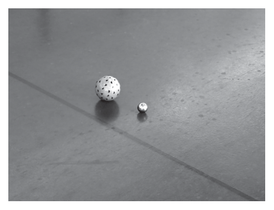

<Accordion titulo="Palavras e siglas desta aula" dica="Consulte quando encontrar um termo novo" icone="spell-check">

- **ENEM** (Exame Nacional do Ensino Médio): a prova nacional que dá acesso a faculdades e bolsas.
- **INEP** (Instituto Nacional de Estudos e Pesquisas Educacionais Anísio Teixeira): o órgão do governo que faz o ENEM.
- **TV** (televisão): o aparelho de televisão; o tamanho da tela é dado pela diagonal.
- **Polegada**: unidade de comprimento que vale 2,54 cm, usada para telas de TV.
- **Entalar**: ficar preso num espaço apertado.
- **Vão**: o espaço livre embaixo de um viaduto ou de uma ponte.
- **Carroceria**: a parte do caminhão onde vai a carga.
- **Raio externo**: o raio medido até a parte de fora de um cano, incluindo a espessura da parede dele.
- **Cancha**: o terreno onde se joga bocha.
- **Tablados perimétricos**: tábuas de madeira que cercam a cancha pela borda.
- **Inscrito e circunscrito**: o círculo inscrito fica dentro do quadrado, tocando os lados; o circunscrito fica por fora, passando pelos vértices.
- **Forro**: o teto de dentro da casa, abaixo do telhado.
- **Milheiro**: um lote de 1 000 unidades.

</Accordion>

## Antes de Começar

**O que o ENEM cobra aqui.** A prova quase nunca mostra um triângulo retângulo com dois lados marcados e pede o terceiro: o triângulo fica escondido na situação. Os temas que costumam aparecer são estes:

- **Achar a diagonal** de um retângulo ou de um quadrado.
- **Usar a razão entre os lados** (como 8 : 15) junto com Pitágoras.
- **Dividir um triângulo equilátero ao meio** para achar a altura.
- **Ligar os centros de círculos** para formar um triângulo retângulo.
- **Usar o quadrado da hipotenusa direto**, sem tirar a raiz, quando a fórmula pede.

**O que você precisa saber antes.**

- **Potências e raízes.** 9² = 81. O símbolo √ é a raiz quadrada: √81 = 9, porque 9 × 9 = 81. Quando a raiz não é exata, separe um quadrado perfeito: √45 = √(9 × 5) = 3√5. O sinal ≈ quer dizer "aproximadamente igual". Revise a aula de Potências e Raízes se precisar.
- **Razão e proporção.** A razão de X para Y é X ÷ Y, nessa ordem. "Lados na razão 8 : 15" (lê-se "8 para 15") quer dizer que um lado tem 8 partes iguais e o outro, 15 partes do mesmo tamanho. Revise a aula de Razão e Proporção.
- **Geometria plana.** Área do círculo = π × r²; triângulo equilátero tem os três lados iguais. Revise a aula de Geometria Plana.
- **Porcentagem.** 25% de 8 é 0,25 × 8 = 2. Revise a aula de Porcentagem se precisar.

## Aula Teórica

### 1. O teorema de Pitágoras

Um **triângulo retângulo** tem um ângulo reto (90°). O lado oposto ao ângulo reto, o maior deles, é a **hipotenusa**; os outros dois são os **catetos**. Dizer que o triângulo FGH é "retângulo em G" significa que o ângulo reto está no vértice G; então a hipotenusa é o lado oposto a G, o lado FH.

<figure class="figura">
  <svg viewBox="0 0 460 180" role="img" aria-labelledby="fig-pit-1-t fig-pit-1-d">
    <title id="fig-pit-1-t">Triângulo retângulo</title>
    <desc id="fig-pit-1-d">Triângulo retângulo com o ângulo reto embaixo à esquerda. Os catetos b e c formam o ângulo reto; a hipotenusa a fica na frente dele.</desc>
    <path d="M 120 150 L 340 150 L 120 30 Z" class="traco" />
    <rect x="120" y="138" width="12" height="12" class="traco-fino" />
    <text x="230" y="170" class="rotulo" text-anchor="middle">c (cateto)</text>
    <text x="110" y="94" class="rotulo" text-anchor="end">b (cateto)</text>
    <text x="244" y="80" class="rotulo">a (hipotenusa)</text>
  </svg>
</figure>

**Fórmula: teorema de Pitágoras**

**a² = b² + c²**

- **a**: a hipotenusa, o lado oposto ao ângulo reto.
- **b, c**: os catetos, os lados que formam o ângulo reto (os três na mesma unidade: metro, centímetro).
- **Em palavras:** o quadrado do maior lado é a soma dos quadrados dos outros dois.
- **Quando usar:** sempre que houver um ângulo reto e dois lados conhecidos, para achar o terceiro.

**Exemplo resolvido.** Um triângulo retângulo tem catetos de 8 cm e 15 cm. Quanto mede a hipotenusa? E se a hipotenusa medisse 37 cm e um cateto 12 cm, quanto mediria o outro cateto?

1. Hipotenusa: a² = 8² + 15² = 64 + 225 = 289, então a = √289 = 17 cm.
2. Cateto: 37² = 12² + c², ou seja, 1 369 = 144 + c², c² = 1 225 e c = √1 225 = 35 cm.
3. Resposta: 17 cm e 35 cm.

**Erro comum.** Somar os lados sem elevar ao quadrado (8 + 15 = 23), ou colocar a hipotenusa do lado dos catetos. A hipotenusa é sempre o lado que fica **sozinho** no lado esquerdo da fórmula.

### 2. Lados em proporção e troca de unidade

Quando o problema dá a razão entre os catetos (por exemplo, 8 : 15), chame de k o tamanho de uma "parte": os lados ficam 8k e 15k. Depois use Pitágoras para achar k. Lembre que (8k)² = 8² × k² = 64k².

**Exemplo resolvido.** Uma escada de 3,4 m está apoiada num muro. A distância do pé da escada ao muro e a altura que ela atinge no muro estão na razão 8 : 15. A que distância do muro está o pé da escada, em centímetro?

1. Distância 8k e altura 15k; a escada é a hipotenusa.
2. Pitágoras: escada² = (8k)² + (15k)² = 64k² + 225k² = 289k².
3. Então a escada mede √(289k²) = 17k. Como ela mede 3,4 m, 17k = 3,4 e k = 3,4 ÷ 17 = 0,2 m.
4. A distância é 8 × 0,2 = 1,6 m; em centímetro, 1,6 × 100 = 160.
5. Resposta: 160 cm.

<figure class="figura">
  <svg viewBox="0 0 460 180" role="img" aria-labelledby="fig-pit-2-t fig-pit-2-d">
    <title id="fig-pit-2-t">Escada com lados na razão 8 : 15</title>
    <desc id="fig-pit-2-d">Uma escada apoiada num muro forma um triângulo retângulo: a distância do pé da escada ao muro é 8k, a altura atingida no muro é 15k e a escada, a hipotenusa, mede 17k.</desc>
    <line x1="40" y1="160" x2="420" y2="160" class="traco-fino" />
    <line x1="300" y1="160" x2="300" y2="10" class="traco" />
    <line x1="220" y1="160" x2="300" y2="10" class="traco" />
    <rect x="288" y="148" width="12" height="12" class="traco-fino" />
    <text x="260" y="176" class="rotulo" text-anchor="middle">8k</text>
    <text x="308" y="90" class="rotulo">15k</text>
    <text x="252" y="80" class="rotulo" text-anchor="end">17k</text>
  </svg>
</figure>

**Erro comum.** Parar em 1,6 e marcar a resposta em metro quando a pergunta pede centímetro. Confira sempre a **unidade** pedida.

### 3. Diagonal do quadrado, altura do triângulo equilátero e círculos

Duas figuras escondem triângulos retângulos que aparecem sempre nas provas.

<figure class="figura">
  <svg viewBox="0 0 460 180" role="img" aria-labelledby="fig-pit-3-t fig-pit-3-d">
    <title id="fig-pit-3-t">Diagonal do quadrado e altura do triângulo equilátero</title>
    <desc id="fig-pit-3-d">À esquerda, um quadrado de lado L com a diagonal traçada, que mede L√2. À direita, um triângulo equilátero de lado L com a altura traçada do vértice de cima até o meio da base, que mede L√3 ÷ 2 e divide a base em duas metades de L ÷ 2.</desc>
    <rect x="40" y="30" width="130" height="130" class="traco" />
    <line x1="40" y1="160" x2="170" y2="30" class="tracejado" />
    <text x="105" y="176" class="rotulo" text-anchor="middle">L</text>
    <text x="96" y="86" class="rotulo" text-anchor="end">L√2</text>
    <path d="M 260 160 L 420 160 L 340 21.4 Z" class="traco" />
    <line x1="340" y1="21.4" x2="340" y2="160" class="tracejado" />
    <text x="346" y="140" class="rotulo">L√3 ÷ 2</text>
    <text x="300" y="176" class="rotulo" text-anchor="middle">L ÷ 2</text>
    <text x="380" y="176" class="rotulo" text-anchor="middle">L ÷ 2</text>
    <text x="284" y="86" class="rotulo" text-anchor="end">L</text>
  </svg>
</figure>

**Fórmula: diagonal do quadrado e altura do equilátero**

**diagonal do quadrado = L√2 e altura do equilátero = L√3 ÷ 2**

- **L**: o lado do quadrado, ou o lado do triângulo equilátero.
- **Em palavras:** a diagonal divide o quadrado em dois triângulos retângulos de catetos L e L. A altura divide o equilátero em dois triângulos retângulos de hipotenusa L e cateto L ÷ 2.
- **Quando usar:** diagonais de quadrados (e círculos que passam pelos vértices), e alturas de triângulos equiláteros (como três círculos iguais empilhados).

**Exemplo resolvido.** Um quadrado tem lado 12 cm. Quanto mede a diagonal? Qual é o raio do círculo que passa pelos quatro vértices? E a altura de um triângulo equilátero de lado 8 cm (use √3 ≈ 1,73)?

1. Diagonal: 12² + 12² = 288, e √288 = √(144 × 2) = 12√2 cm.
2. O círculo que passa pelos vértices tem o centro no meio da diagonal: raio = 12√2 ÷ 2 = 6√2 cm.
3. Altura do equilátero: 8 × √3 ÷ 2 = 4 × 1,73 = 6,92 cm.
4. Resposta: 12√2 cm, 6√2 cm e 6,92 cm.

**Erro comum.** Achar que o círculo que passa pelos vértices tem raio igual à metade do lado. Metade do lado é o raio do círculo **inscrito** (que toca os lados); o que passa pelos vértices usa a metade da **diagonal**.

Para comparar as áreas de dois círculos, compare os raios. Se um raio é o dobro do outro, a área é 2² = 4 vezes a outra. Com R para o raio maior e r para o menor, (π × R²) ÷ (π × r²) = (R ÷ r)², porque o π some. A **razão de X para Y** é X ÷ Y, nessa ordem. Raios de 10 cm e 4 cm dão razão 10 ÷ 4 = 2,5 entre os raios. Entre as áreas, do maior para o menor, a razão é 2,5² = 6,25; do menor para o maior seria o inverso, 1 ÷ 6,25.

Um círculo apoiado numa superfície tem o centro à **altura do raio**. Em três círculos iguais empilhados, dois embaixo e um em cima, os centros formam um triângulo equilátero de lado igual a dois raios. A altura total é raio + altura do triângulo + raio.

<figure class="figura">
  <svg viewBox="0 0 460 200" role="img" aria-labelledby="fig-pit-4-t fig-pit-4-d">
    <title id="fig-pit-4-t">Três círculos iguais empilhados</title>
    <desc id="fig-pit-4-d">Dois círculos iguais apoiados numa base, encostados, e um terceiro igual por cima dos dois. Os três centros formam um triângulo equilátero de lado 2r. A altura total é r, mais a altura do triângulo, mais r.</desc>
    <line x1="120" y1="190" x2="340" y2="190" class="traco-fino" />
    <circle cx="190" cy="150" r="40" class="traco" />
    <circle cx="270" cy="150" r="40" class="traco" />
    <circle cx="230" cy="80.7" r="40" class="traco" />
    <path d="M 190 150 L 270 150 L 230 80.7 Z" class="tracejado" />
    <text x="210" y="146" class="rotulo-fraco" text-anchor="middle">2r</text>
    <line x1="360" y1="190" x2="360" y2="40.7" class="tracejado" />
    <text x="368" y="120" class="rotulo-fraco">r + altura + r</text>
  </svg>
</figure>

### 4. Círculos encostados

Quando dois círculos se tocam, a linha que liga os centros passa pelo ponto de contato.

**Fórmula: distância entre centros de círculos encostados**

**distância entre os centros = soma dos raios**

- **raios**: os raios dos dois círculos, na mesma unidade.
- **Em palavras:** de um centro até o ponto de contato é um raio; do ponto de contato até o outro centro é o outro raio.
- **Quando usar:** moedas, bolas, canos ou rodas que se encostam; essa distância costuma ser a hipotenusa de um triângulo retângulo.

**Exemplo resolvido.** Duas moedas deitadas numa mesa, de raios 1,2 cm e 0,9 cm, estão encostadas. Qual é a distância entre os centros?

1. Os dois centros ficam na mesma altura (as moedas estão deitadas), e a linha entre eles passa pelo ponto de contato.
2. Distância: 1,2 + 0,9 = 2,1.
3. Resposta: 2,1 cm.

**Erro comum.** Subtrair os raios (1,2 − 0,9 = 0,3). A diferença dos raios é outra medida, que só aparece quando os centros estão em alturas diferentes.

O ponto em que um círculo toca o chão fica bem embaixo do centro. Sejam R o raio maior e r o menor. Se os dois círculos estão no mesmo chão, os centros ficam às alturas R e r. A diferença de alturas é R − r.

Às vezes um círculo encosta num ponto fora do chão, como uma quina ou outro círculo. Ligue o centro ao ponto de contato para formar um triângulo retângulo: um cateto é a diferença de alturas, e o outro é a distância horizontal.

**Exemplo resolvido.** Uma bola de raio 17 cm está parada no chão, encostada na quina de um degrau de 2 cm de altura. A que distância horizontal da quina fica o ponto em que a bola toca o chão?

<figure class="figura">
  <svg viewBox="0 0 460 250" role="img" aria-labelledby="fig-pit-6-t fig-pit-6-d">
    <title id="fig-pit-6-t">Bola encostada na quina de um degrau</title>
    <desc id="fig-pit-6-d">Uma bola de raio 17 apoiada no chão encosta na quina de um degrau de altura 2. Do centro da bola até a quina mede 17, a hipotenusa. O cateto vertical, do centro até a altura da quina, mede 17 − 2 = 15. O cateto horizontal, x, vai de baixo do centro até a quina.</desc>
    <line x1="40" y1="230" x2="440" y2="230" class="traco-fino" />
    <path d="M 228 230 L 228 218 L 420 218 L 420 230" class="traco" />
    <circle cx="180" cy="128" r="102" class="traco" />
    <circle cx="180" cy="128" r="2.5" class="traco preenche" />
    <path d="M 180 128 L 180 218 L 228 218 Z" class="tracejado" />
    <path d="M 180 206 L 192 206 L 192 218" class="traco-fino" />
    <text x="172" y="178" class="rotulo" text-anchor="end">15</text>
    <text x="214" y="168" class="rotulo">17</text>
    <text x="204" y="213" class="rotulo" text-anchor="middle">x</text>
    <text x="428" y="214" class="rotulo-fraco">2</text>
  </svg>
</figure>

1. O centro da bola está à altura do raio: 17 cm. A quina está a 2 cm do chão.
2. Do centro até a quina é um raio: 17 cm (hipotenusa). A diferença de alturas é 17 − 2 = 15 cm (um cateto).
3. A distância horizontal é o outro cateto: x² + 15² = 17², x² = 289 − 225 = 64 e x = 8 cm.
4. Resposta: 8 cm.

**Erro comum.** Usar a altura da quina (2 cm) como cateto. O cateto vertical é a **diferença** entre a altura do centro e a altura do ponto de contato.

### 5. Inclinação e hipotenusa ao quadrado

A **inclinação** de um telhado ou de uma rampa costuma ser dada em porcentagem: é a altura dividida pela distância horizontal, vezes 100. O comprimento inclinado é a hipotenusa. Se a superfície inclinada é um quadrado, todos os lados dela são iguais: a largura é igual ao comprimento inclinado.

<figure class="figura">
  <svg viewBox="0 0 460 170" role="img" aria-labelledby="fig-pit-5-t fig-pit-5-d">
    <title id="fig-pit-5-t">Rampa como triângulo retângulo</title>
    <desc id="fig-pit-5-d">Uma rampa vista de lado: a distância horizontal b embaixo, a altura h na vertical e o comprimento da rampa como hipotenusa.</desc>
    <path d="M 60 140 L 380 140 L 380 60 Z" class="traco" />
    <rect x="368" y="128" width="12" height="12" class="traco-fino" />
    <text x="220" y="158" class="rotulo" text-anchor="middle">b (horizontal)</text>
    <text x="388" y="104" class="rotulo">h (altura)</text>
    <text x="200" y="88" class="rotulo" text-anchor="end">comprimento</text>
  </svg>
</figure>

**Fórmula: inclinação percentual**

**i = h × 100 ÷ b**

- **i**: a inclinação, em porcentagem.
- **h**: a altura vencida (cateto vertical), em metro.
- **b**: a distância horizontal (cateto horizontal), na mesma unidade de h.
- **Em palavras:** quantos por cento da distância horizontal a altura representa.
- **Quando usar:** telhados, rampas e estradas descritos por "inclinação de x%".

**Exemplo resolvido.** Uma rampa tem inclinação de 25% e avança 8 m na horizontal. Qual é a altura dela? Quanto vale o quadrado do comprimento da rampa?

1. Altura: 25 = h × 100 ÷ 8, então h = 25 × 8 ÷ 100 = 2 m.
2. O comprimento da rampa é a hipotenusa, de catetos 8 e 2.
3. Quadrado do comprimento: 8² + 2² = 64 + 4 = 68.
4. Resposta: altura 2 m; comprimento² = 68 (o comprimento é √68 ≈ 8,25 m).

**Erro comum.** Tirar a raiz quando a fórmula seguinte usa o quadrado. Se o problema usa o comprimento ao quadrado, use direto a soma dos quadrados, sem arredondar a raiz no meio do caminho.

Se a quantidade final só é vendida em lotes (dezenas, milheiros), arredonde **para cima** até o próximo lote completo.

### Armadilhas típicas do INEP

1. **Colocar a hipotenusa do lado errado** da fórmula, somando-a com um cateto.
2. **Esquecer a unidade** pedida (polegada, metro ou centímetro).
3. **Usar metade do lado** como raio do círculo que passa pelos vértices do quadrado.
4. **Inverter a razão** (menor para maior em vez de maior para menor) ou esquecer de elevar a razão dos raios ao quadrado.
5. **Esquecer os raios** das pontas ao somar alturas de círculos empilhados.
6. **Arredondar para baixo** uma quantidade que só se compra em lotes inteiros.

## Tópicos-Chave para Revisão

#### 1. Pitágoras

**a² = b² + c²**: a **hipotenusa** (oposta ao ângulo reto) ao quadrado é a soma dos quadrados dos **catetos**.

<figure class="figura">
  <svg viewBox="0 0 300 110" role="img" aria-labelledby="fig-pit-1-rev-t fig-pit-1-rev-d">
    <title id="fig-pit-1-rev-t">Resumo: catetos e hipotenusa</title>
    <desc id="fig-pit-1-rev-d">Triângulo retângulo com catetos b e c e hipotenusa a, oposta ao ângulo reto.</desc>
    <path d="M 80 95 L 220 95 L 80 15 Z" class="traco" />
    <rect x="80" y="85" width="10" height="10" class="traco-fino" />
    <text x="150" y="107" class="rotulo" text-anchor="middle">c</text>
    <text x="70" y="60" class="rotulo" text-anchor="end">b</text>
    <text x="160" y="48" class="rotulo">a</text>
  </svg>
</figure>

#### 2. Proporção

Com lados na razão p : q, escreva **pk e qk**, use Pitágoras para achar **k** e confira a unidade.

#### 3. Quadrado, equilátero e círculos

**diagonal do quadrado = L√2 e altura do equilátero = L√3 ÷ 2**. O círculo que passa pelos vértices do quadrado tem raio igual à metade da **diagonal**; áreas de círculos estão na razão dos **raios ao quadrado**.

<figure class="figura">
  <svg viewBox="0 0 300 120" role="img" aria-labelledby="fig-pit-3-rev-t fig-pit-3-rev-d">
    <title id="fig-pit-3-rev-t">Resumo: diagonal do quadrado</title>
    <desc id="fig-pit-3-rev-d">Quadrado de lado L com a diagonal L√2 tracejada.</desc>
    <rect x="100" y="10" width="90" height="90" class="traco" />
    <line x1="100" y1="100" x2="190" y2="10" class="tracejado" />
    <text x="145" y="115" class="rotulo-fraco" text-anchor="middle">L</text>
    <text x="200" y="50" class="rotulo-fraco">diagonal L√2</text>
  </svg>
</figure>

#### 4. Círculos encostados

**distância entre os centros = soma dos raios**; com centros em alturas diferentes, a **diferença de alturas** é um cateto.

<figure class="figura">
  <svg viewBox="0 0 300 110" role="img" aria-labelledby="fig-pit-4-rev-t fig-pit-4-rev-d">
    <title id="fig-pit-4-rev-t">Resumo: dois círculos encostados</title>
    <desc id="fig-pit-4-rev-d">Dois círculos encostados, de raios R e r, com o segmento entre os centros passando pelo ponto de contato e medindo R + r.</desc>
    <circle cx="110" cy="55" r="40" class="traco" />
    <circle cx="175" cy="55" r="25" class="traco" />
    <line x1="110" y1="55" x2="175" y2="55" class="traco-fino" />
    <text x="128" y="49" class="rotulo-fraco" text-anchor="middle">R + r</text>
  </svg>
</figure>

#### 5. Inclinação

**i = h × 100 ÷ b**; o comprimento inclinado é a **hipotenusa**, e às vezes basta o seu **quadrado**.

## Questões do ENEM

*Marque uma alternativa em cada questão e confira tudo de uma vez no botão do fim.*

**Questão 1**

*ENEM 2017 · 2º dia · caderno azul · questão 153*

A manchete demonstra que o transporte de grandes cargas representa cada vez mais preocupação quando feito em vias urbanas.

Caminhão entala em viaduto no Centro

Um caminhão de grande porte entalou embaixo do viaduto no cruzamento das avenidas Borges de Medeiros e Loureiro da Silva no sentido Centro-Bairro, próximo à Ponte de Pedra, na capital. Esse veículo vinha de São Paulo para Porto Alegre e transportava três grandes tubos, conforme ilustrado na foto.

Foto: ver prova oficial, página 22 ([PDF do INEP](https://download.inep.gov.br/educacao%5Fbasica/enem/provas/2017/2017%5FPV%5Fimpresso%5FD2%5FCD7.pdf)).

Disponível em: www.caminhoes-e-carretas.com. Acesso em: 21 maio 2012 (adaptado).

Considere que o raio externo de cada cano da imagem seja 0,60 m e que eles estejam em cima de uma carroceria cuja parte superior está a 1,30 m do solo. O desenho representa a vista traseira do empilhamento dos canos.

<figure class="figura">
  <svg viewBox="0 0 300 250" role="img" aria-labelledby="fig-pit-q1-t fig-pit-q1-d">
    <title id="fig-pit-q1-t">Vista traseira dos três canos empilhados</title>
    <desc id="fig-pit-q1-d">Dois círculos iguais apoiados numa base, encostados um no outro, e um terceiro círculo igual apoiado em cima dos dois. O raio de cada círculo mede 0,60 m. Figura redesenhada a partir da prova oficial, com os mesmos dados.</desc>
    <line x1="40" y1="230" x2="260" y2="230" class="traco" />
    <circle cx="105" cy="180" r="50" class="traco" />
    <circle cx="205" cy="180" r="50" class="traco" />
    <circle cx="155" cy="93.4" r="50" class="traco" />
    <circle cx="155" cy="93.4" r="3" class="preenche" />
    <line x1="155" y1="93.4" x2="120" y2="129" class="traco-fino" />
    <text x="162" y="85" class="rotulo">0,60 m</text>
  </svg>
</figure>

A margem de segurança recomendada para que um veículo passe sob um viaduto é que a altura total do veículo com a carga seja, no mínimo, 0,50 m menor do que a altura do vão do viaduto.

Considere 1,7 como aproximação para √3.

Qual deveria ser a altura mínima do viaduto, em metro, para que esse caminhão pudesse passar com segurança sob seu vão?

A) 2,82\
B) 3,52\
C) 3,70\
D) 4,02\
E) 4,20

**Questão 2**

*ENEM 2019 · 2ª aplicação · 2º dia · caderno azul · questão 153*

A unidade de medida utilizada para anunciar o tamanho das telas de televisores no Brasil é a polegada, que corresponde a 2,54 cm. Diferentemente do que muitos imaginam, dizer que a tela de uma TV tem X polegadas significa que a diagonal do retângulo que representa sua tela mede X polegadas, conforme ilustração.

<figure class="figura">
  <svg viewBox="0 0 300 200" role="img" aria-labelledby="fig-pit-q2-t fig-pit-q2-d">
    <title id="fig-pit-q2-t">Tela de TV com a diagonal X</title>
    <desc id="fig-pit-q2-d">Um retângulo com a altura A à esquerda, o comprimento C embaixo e a diagonal X traçada de um canto ao canto oposto. Figura redesenhada a partir da prova oficial, com os mesmos dados.</desc>
    <rect x="60" y="20" width="200" height="140" class="traco" />
    <line x1="60" y1="160" x2="260" y2="20" class="traco-fino" />
    <line x1="40" y1="20" x2="40" y2="160" class="tracejado" />
    <text x="30" y="94" class="rotulo" text-anchor="end">A</text>
    <line x1="60" y1="180" x2="260" y2="180" class="tracejado" />
    <text x="160" y="196" class="rotulo" text-anchor="middle">C</text>
    <text x="150" y="82" class="rotulo">X</text>
  </svg>
</figure>

O administrador de um museu recebeu uma TV convencional de 20 polegadas, que tem como razão do comprimento (C) pela altura (A) a proporção 4 : 3, e precisa calcular o comprimento (C) dessa TV a fim de colocá-la em uma estante para exposição.

A tela dessa TV tem medida do comprimento C, em centímetro, igual a

A) 12,00.\
B) 16,00.\
C) 30,48.\
D) 40,64.\
E) 50,80.

**Questão 3**

*ENEM 2022 · 2ª aplicação · 2º dia · caderno azul · questão 168*

Uma empresa de publicidade está criando um logotipo que tem o formato indicado na figura. O círculo menor está inscrito no quadrado ABCD, e o círculo maior circunscreve o mesmo quadrado. Considere S1 a área do círculo menor e S2 a área do círculo maior.

<figure class="figura">
  <svg viewBox="0 0 300 300" role="img" aria-labelledby="fig-pit-q3-t fig-pit-q3-d">
    <title id="fig-pit-q3-t">Quadrado com círculo inscrito e círculo circunscrito</title>
    <desc id="fig-pit-q3-d">Um quadrado ABCD, com A em cima à esquerda, D em cima à direita, B embaixo à esquerda e C embaixo à direita. Dentro dele, um círculo que toca os quatro lados; por fora, um círculo que passa pelos quatro vértices. A diagonal BD passa pelo centro O. Figura redesenhada a partir da prova oficial, com os mesmos dados.</desc>
    <circle cx="150" cy="150" r="127" class="traco" />
    <rect x="60.2" y="60.2" width="179.6" height="179.6" class="traco" />
    <circle cx="150" cy="150" r="89.8" class="traco" />
    <line x1="60.2" y1="239.8" x2="239.8" y2="60.2" class="traco-fino" />
    <circle cx="150" cy="150" r="3" class="preenche" />
    <text x="160" y="164" class="rotulo">O</text>
    <text x="52" y="54" class="rotulo" text-anchor="end">A</text>
    <text x="248" y="54" class="rotulo">D</text>
    <text x="52" y="254" class="rotulo" text-anchor="end">B</text>
    <text x="248" y="254" class="rotulo">C</text>
  </svg>
</figure>

A razão da área do círculo maior para o círculo menor é igual a

A) √2\
B) 1/2\
C) 2\
D) 8\
E) 16

**Questão 4**

*ENEM 2016 · 2ª aplicação · 2º dia · caderno azul · questão 169*

A bocha é um esporte jogado em canchas, que são terrenos planos e nivelados, limitados por tablados perimétricos de madeira. O objetivo desse esporte é lançar bochas, que são bolas feitas de um material sintético, de maneira a situá-las o mais perto possível do bolim, que é uma bola menor feita, preferencialmente, de aço, previamente lançada. A Figura 1 ilustra uma bocha e um bolim que foram jogados em uma cancha. Suponha que um jogador tenha lançado uma bocha, de raio 5 cm, que tenha ficado encostada no bolim, de raio 2 cm, conforme ilustra a Figura 2.

<figure class="figura">

</figure>

<figure class="figura">
  <svg viewBox="0 0 360 190" role="img" aria-labelledby="fig-pit-q4-t fig-pit-q4-d">
    <title id="fig-pit-q4-t">Figura 2: bocha e bolim encostados</title>
    <desc id="fig-pit-q4-d">Uma esfera grande de centro C e uma pequena de centro O, apoiadas no chão da cancha (a linha horizontal) e encostadas uma na outra. A é o ponto em que a bocha toca o chão e B o ponto em que o bolim toca o chão; a distância entre A e B é d. Figura redesenhada a partir da prova oficial, com os mesmos dados.</desc>
    <line x1="40" y1="150" x2="330" y2="150" class="traco-fino" />
    <circle cx="160" cy="80" r="70" class="traco" />
    <circle cx="248.5" cy="122" r="28" class="traco" />
    <circle cx="160" cy="80" r="3" class="preenche" />
    <circle cx="248.5" cy="122" r="3" class="preenche" />
    <circle cx="160" cy="150" r="3" class="preenche" />
    <circle cx="248.5" cy="150" r="3" class="preenche" />
    <text x="168" y="76" class="rotulo">C</text>
    <text x="254" y="118" class="rotulo">O</text>
    <text x="152" y="166" class="rotulo" text-anchor="end">A</text>
    <text x="256" y="166" class="rotulo">B</text>
    <line x1="160" y1="162" x2="248.5" y2="162" class="traco-fino" />
    <text x="204" y="180" class="rotulo" text-anchor="middle">d</text>
  </svg>
</figure>

Considere o ponto C como o centro da bocha, e o ponto O como o centro do bolim. Sabe-se que A e B são os pontos em que a bocha e o bolim, respectivamente, tocam o chão da cancha, e que a distância entre A e B é igual a d.

Nessas condições, qual a razão entre d e o raio do bolim?

A) 1\
B) (2√10)/5\
C) √10/2\
D) 2\
E) √10

**Questão 5**

*ENEM 2018 · 2ª aplicação · 2º dia · caderno azul · questão 168*

A inclinação de um telhado depende do tipo e da marca das telhas escolhidas. A figura é o esboço do telhado da casa de um específico proprietário. As telhas serão apoiadas sobre a superfície quadrada plana ABCD, sendo BOC um triângulo retângulo em O. Sabe-se que h é a altura do telhado em relação ao forro da casa (a figura plana ABOE), b = 10 é o comprimento do segmento OB, e d é a largura do telhado (segmento AB), todas as medidas dadas em metro.

<figure class="figura">
  <svg viewBox="0 0 380 240" role="img" aria-labelledby="fig-pit-q5-t fig-pit-q5-d">
    <title id="fig-pit-q5-t">Esboço do telhado</title>
    <desc id="fig-pit-q5-d">Um telhado de uma água: a superfície quadrada ABCD, inclinada, apoiada sobre o forro ABOE. O triângulo BOC é retângulo em O, com OB = b na horizontal e OC = h na vertical; AB mede d. Figura redesenhada a partir da prova oficial, com os mesmos dados.</desc>
    <path d="M 40 150 L 190 205 L 330 70 L 180 15 Z" class="preenche" />
    <path d="M 40 150 L 190 205 L 330 70 L 180 15 Z" class="traco" />
    <line x1="190" y1="205" x2="330" y2="140" class="traco" />
    <line x1="330" y1="140" x2="330" y2="70" class="traco" />
    <line x1="40" y1="150" x2="180" y2="85" class="tracejado" />
    <line x1="180" y1="85" x2="330" y2="140" class="tracejado" />
    <line x1="180" y1="85" x2="180" y2="15" class="tracejado" />
    <path d="M 330 130 L 320.9 134.2 L 320.9 144.2" class="traco-fino" />
    <text x="32" y="154" class="rotulo" text-anchor="end">A</text>
    <text x="190" y="222" class="rotulo" text-anchor="middle">B</text>
    <text x="340" y="66" class="rotulo">C</text>
    <text x="180" y="11" class="rotulo" text-anchor="middle">D</text>
    <text x="186" y="78" class="rotulo">E</text>
    <text x="340" y="146" class="rotulo">O</text>
    <text x="340" y="108" class="rotulo">h</text>
    <text x="104" y="196" class="rotulo">d</text>
    <text x="270" y="188" class="rotulo">b</text>
  </svg>
</figure>

Disponível em: www.toptelha.com.br. Acesso em: 31 jul. 2012.

Sabe-se que, em função do tipo de telha escolhida pelo proprietário, a porcentagem i de inclinação ideal do telhado, descrita por meio da relação i = h × 100 ÷ b, é de 40%, e que a expressão que determina o número N de telhas necessárias na cobertura é dada por N = d² × 10,5. Além disso, essas telhas são vendidas somente em milheiros.

O proprietário avalia ser fundamental respeitar a inclinação ideal informada pelo fabricante, por isso argumenta ser necessário adquirir a quantidade mínima de telhas correspondente a

A) um milheiro.\
B) dois milheiros.\
C) três milheiros.\
D) seis milheiros.\
E) oito milheiros.
