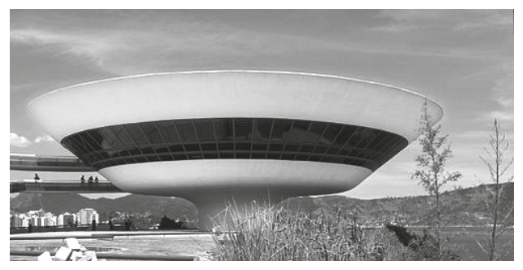
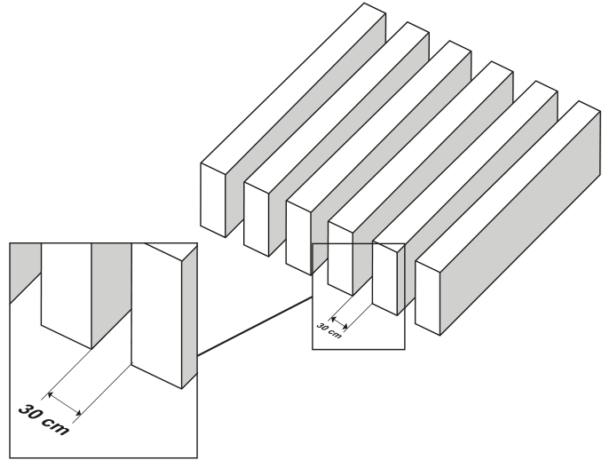

<Accordion titulo="Palavras e siglas desta aula" dica="Consulte quando encontrar um termo novo" icone="spell-check">

- **ENEM** (Exame Nacional do Ensino Médio): a prova nacional que dá acesso a faculdades e bolsas.
- **INEP** (Instituto Nacional de Estudos e Pesquisas Educacionais Anísio Teixeira): o órgão do governo que faz o ENEM.
- **MAC** (Museu de Arte Contemporânea): o museu de Niterói projetado por Oscar Niemeyer.
- **sen, cos, tg**: abreviações de seno, cosseno e tangente.
- **Planificar**: abrir uma peça sobre a mesa, como um papel desenrolado.
- **Intensidade luminosa**: quanto de luz chega a um lugar.
- **Prisma oblíquo**: um prisma "tombado", com as faces laterais inclinadas em relação à base.
- **Cúpula**: a parte de cima, arredondada ou em forma de tigela, de um prédio.
- **Tronco de cone**: o que sobra de um cone quando se corta a ponta com um corte paralelo à base; tem duas bases circulares de tamanhos diferentes.
- **Circular reto**: com base em forma de círculo e o eixo em pé, perpendicular à base.
- **Revitalizar**: reformar para deixar como novo.
- **Pergolado**: cobertura feita de vigas paralelas com espaços entre elas, por onde passa parte da luz.
- **Estrado**: conjunto de peças iguais postas lado a lado.
- **Viga**: peça comprida e reta, de madeira ou concreto, usada em construções.
- **Vão**: o espaço livre entre duas peças.
- **Solstício de verão**: o dia do ano em que o sol fica mais alto no céu ao meio-dia.
- **A pino**: o sol bem em cima da cabeça, com os raios na vertical.
- **Hélice**: a linha em espiral que sobe dando voltas em torno de um cilindro, como a rosca de um parafuso.

</Accordion>

## Antes de Começar

**O que o ENEM cobra aqui.** A prova quase nunca desenha um triângulo com um ângulo e um lado marcados. O triângulo retângulo fica escondido na situação. Os temas que costumam aparecer são estes:

- **A inclinação de uma torre** ou da lateral de uma cúpula.
- **Um raio de sol** que forma um ângulo com o chão ou com a vertical.
- **A sombra de uma viga** que tapa parte de um vão.
- **Uma faixa enrolada** num cilindro, que precisa ser planificada.
- **Uma fórmula com seno**, em que se compara um valor com o valor máximo.

**O que você precisa saber antes.**

- **Teorema de Pitágoras.** A hipotenusa é o lado oposto ao ângulo reto; os outros dois lados são os catetos. Revise a aula de Teorema de Pitágoras se precisar.
- **Raízes.** O símbolo √ é a raiz quadrada: √3 ≈ 1,73 (ou 1,7) e √2 ≈ 1,41. O sinal ≈ quer dizer "aproximadamente igual". Revise a aula de Potências e Raízes.
- **Frações e porcentagem.** Dividir por uma fração é multiplicar pelo inverso: 4 ÷ (2/3) = 4 × 3/2 = 6. Uma razão vira porcentagem multiplicando por 100: 0,64 = 64%. Revise as aulas de Frações e de Porcentagem.
- **Geometria plana.** Área do quadrado = lado²; área do círculo = π × r²; comprimento da circunferência = 2 × π × r. A letra grega π ("pi") vale cerca de 3,14; a prova às vezes manda usar 3. Revise a aula de Geometria Plana.

## Aula Teórica

### 1. Seno, cosseno e tangente

Num **triângulo retângulo**, escolha um dos ângulos agudos (menores que 90°) e chame-o de θ. A letra grega θ, lida "teta", é só um nome para o ângulo, como x. Em relação a θ, os catetos ganham nomes:

- o **cateto oposto** fica do outro lado, sem tocar em θ;
- o **cateto adjacente** encosta em θ (adjacente quer dizer "vizinho").

A hipotenusa continua sendo o lado oposto ao ângulo reto.

<figure class="figura">
  <svg viewBox="0 0 460 190" role="img" aria-labelledby="fig-trig-1-t fig-trig-1-d">
    <title id="fig-trig-1-t">Cateto oposto, cateto adjacente e hipotenusa</title>
    <desc id="fig-trig-1-d">Triângulo retângulo com o ângulo reto embaixo à direita e o ângulo θ embaixo à esquerda. O cateto de baixo encosta em θ e é o adjacente. O cateto vertical, à direita, fica de frente para θ e é o oposto. A hipotenusa liga os dois.</desc>
    <path d="M 50 160 L 300 160 L 300 40 Z" class="traco" />
    <rect x="288" y="148" width="12" height="12" class="traco-fino" />
    <path d="M 90 160 A 40 40 0 0 0 86.06 142.69" class="traco-fino" />
    <text x="98" y="155" class="rotulo">θ</text>
    <text x="165" y="88" class="rotulo" text-anchor="end">hipotenusa</text>
    <text x="310" y="104" class="rotulo">cateto oposto a θ</text>
    <text x="175" y="180" class="rotulo" text-anchor="middle">cateto adjacente a θ</text>
  </svg>
</figure>

**Fórmula: seno, cosseno e tangente**

**sen θ = oposto ÷ hipotenusa; cos θ = adjacente ÷ hipotenusa; tg θ = oposto ÷ adjacente**

- **θ**: um ângulo agudo do triângulo retângulo.
- **oposto**: o cateto que fica de frente para θ.
- **adjacente**: o cateto que encosta em θ.
- **hipotenusa**: o lado oposto ao ângulo reto, o maior dos três.
- **Em palavras:** cada razão divide um lado por outro, sempre olhando a partir do mesmo ângulo θ.
- **Quando usar:** quando o problema dá um ângulo e um lado e pede outro lado. Com altura e distância no chão, use a tangente; com a hipotenusa, use seno ou cosseno.

**Exemplo resolvido.** Um escorregador tem uma rampa de 10 m, que sobe 6 m e avança 8 m no chão. Seja θ o ângulo entre a rampa e o chão. Quanto valem sen θ, cos θ e tg θ? E para o outro ângulo agudo, lá em cima?

1. Para θ: o oposto é a altura (6), o adjacente é o chão (8) e a hipotenusa é a rampa (10).
2. sen θ = 6 ÷ 10 = 0,6; cos θ = 8 ÷ 10 = 0,8; tg θ = 6 ÷ 8 = 0,75.
3. Para o ângulo de cima, os catetos trocam de papel: o oposto passa a ser o chão (8) e o adjacente, a altura (6).
4. Então o seno dele é 8 ÷ 10 = 0,8, o cosseno é 6 ÷ 10 = 0,6 e a tangente é 8 ÷ 6 ≈ 1,33.
5. Resposta: 0,6, 0,8 e 0,75 para θ; 0,8, 0,6 e 1,33 para o outro ângulo.

**Erro comum.** Chamar de "oposto" sempre o cateto vertical. O nome depende do ângulo: troque o ângulo e o oposto vira adjacente. A hipotenusa nunca muda.

### 2. Ângulos notáveis e contas com √3

Os ângulos de 30°, 45° e 60° têm seno, cosseno e tangente conhecidos. Eles saem de duas figuras. Metade de um triângulo equilátero de lado 2 é um triângulo retângulo com lados 1, √3 e 2 e ângulos de 30° e 60°. A diagonal de um quadrado de lado 1 mede √2 e faz 45° com os lados.

<figure class="figura">
  <svg viewBox="0 0 460 215" role="img" aria-labelledby="fig-trig-2-t fig-trig-2-d">
    <title id="fig-trig-2-t">De onde vêm os ângulos notáveis</title>
    <desc id="fig-trig-2-d">À esquerda, metade de um triângulo equilátero: triângulo retângulo com cateto de baixo 1, cateto vertical √3 e hipotenusa 2; o ângulo de baixo mede 60° e o de cima, 30°. À direita, um quadrado de lado 1 com a diagonal √2, que faz 45° com o lado de baixo.</desc>
    <path d="M 60 190 L 160 190 L 160 16.8 Z" class="traco" />
    <rect x="148" y="178" width="12" height="12" class="traco-fino" />
    <text x="110" y="206" class="rotulo" text-anchor="middle">1</text>
    <text x="168" y="108" class="rotulo">√3</text>
    <text x="102" y="95" class="rotulo" text-anchor="end">2</text>
    <text x="72" y="184" class="rotulo">60°</text>
    <text x="157" y="70" class="rotulo" text-anchor="end">30°</text>
    <rect x="270" y="60" width="130" height="130" class="traco" />
    <line x1="270" y1="190" x2="400" y2="60" class="tracejado" />
    <text x="335" y="206" class="rotulo" text-anchor="middle">1</text>
    <text x="408" y="128" class="rotulo">1</text>
    <text x="330" y="118" class="rotulo" text-anchor="end">√2</text>
    <text x="292" y="186" class="rotulo">45°</text>
  </svg>
</figure>

| ângulo | sen | cos | tg |
|---|---|---|---|
| 30° | 1/2 | √3/2 | √3/3 |
| 45° | √2/2 | √2/2 | 1 |
| 60° | √3/2 | 1/2 | √3 |

Entre 0° e 90°, o seno cresce de **sen 0° = 0** até **sen 90° = 1**. Por isso, numa fórmula do tipo k · sen x, com x entre 0° e 90°, o maior valor é k, alcançado em 90°. O ponto "·" é um sinal de vezes, como ×. Uma escrita como h(x), lida "h de x", quer dizer "o valor de h quando o ângulo é x". Para saber que **percentual do máximo** um valor representa, divida o valor pelo máximo e multiplique por 100.

Três contas aparecem sempre:

- **Dividir por √3:** multiplique em cima e embaixo por √3. Exemplo: 21 ÷ √3 = 21√3 ÷ 3 = 7√3.
- **Dividir por tg 30° = √3/3:** multiplique pelo inverso, 3/√3, que é igual a √3. Exemplo: 10 ÷ (√3/3) = 10√3 ≈ 17,3.
- **Multiplicar por √3/3:** divida o número por 3 e mantenha o √3. Exemplo: 84 × √3/3 = (84 ÷ 3)√3 = 28√3.

**Exemplo resolvido.** A altura da ponta de um braço mecânico é h(x) = 2 · sen x, em metro, com x entre 0° e 90°. Use sen 40° ≈ 0,64. Com x = 40°, a altura é que percentual da altura máxima?

1. O maior valor de sen x nesse intervalo é 1, em 90°. Então a altura máxima é h(90°) = 2 · 1 = 2 m.
2. Com 40°: h(40°) = 2 · 0,64 = 1,28 m.
3. A razão é 1,28 ÷ 2 = 0,64, ou seja, 64%. O 2 se cancela: basta comparar sen 40° com sen 90°.
4. Resposta: 64% da altura máxima.

**Erro comum.** Achar que o seno cresce na mesma proporção do ângulo. O ângulo de 40° é menos da metade de 90°, mas sen 40° ≈ 0,64 é mais da metade de sen 90° = 1. Use a tabela ou o valor dado, nunca uma regra de três com os ângulos.

### 3. Ângulo com a vertical ou com a horizontal

Quando algo está inclinado, o problema pode dar o ângulo medido a partir da **vertical** (a direção de um fio de prumo) ou a partir da **horizontal** (o chão). Isso muda quem é o cateto adjacente. Aqui o ângulo se chama α, a letra grega "alfa".

<figure class="figura">
  <svg viewBox="0 0 460 210" role="img" aria-labelledby="fig-trig-3-t fig-trig-3-d">
    <title id="fig-trig-3-t">Ângulo com a vertical e recuo de um tronco de cone</title>
    <desc id="fig-trig-3-d">À esquerda, uma peça inclinada vai do pé, no chão, até o topo. Do topo desce uma linha vertical tracejada até o chão, que é a altura. O ângulo α fica no topo, entre a vertical e a peça; o avanço é a distância no chão entre o pé da peça e o pé da vertical. À direita, um trapézio, a vista de lado de um balde em forma de tronco de cone, com a boca maior em cima. Do pé da lateral esquerda sai uma linha horizontal para fora, e o ângulo de 45° fica entre essa linha e a lateral. A altura é 14, e o recuo, a distância na horizontal entre a borda da boca e o pé da lateral, também é 14.</desc>
    <line x1="100" y1="180" x2="150" y2="40" class="traco" />
    <line x1="150" y1="40" x2="150" y2="180" class="tracejado" />
    <line x1="60" y1="180" x2="200" y2="180" class="traco-fino" />
    <path d="M 150 168 L 138 168 L 138 180" class="traco-fino" />
    <path d="M 150 70 A 30 30 0 0 1 139.9 68.25" class="traco-fino" />
    <text x="140" y="92" class="rotulo">α</text>
    <text x="158" y="112" class="rotulo">altura</text>
    <text x="125" y="198" class="rotulo" text-anchor="middle">avanço</text>
    <path d="M 266 131 L 420 131 L 371 180 L 315 180 Z" class="traco" />
    <line x1="266" y1="131" x2="266" y2="180" class="tracejado" />
    <line x1="250" y1="180" x2="315" y2="180" class="traco-fino" />
    <path d="M 295 180 A 20 20 0 0 1 300.86 165.86" class="traco-fino" />
    <text x="270" y="176" class="rotulo">45°</text>
    <text x="258" y="160" class="rotulo" text-anchor="end">14</text>
    <text x="290" y="198" class="rotulo" text-anchor="middle">recuo</text>
  </svg>
</figure>

**Fórmula: avanço horizontal de algo inclinado**

**avanço = altura × tg α**

- **altura**: a medida na vertical, do chão até o topo.
- **α**: o ângulo entre a peça inclinada e a **vertical**.
- **avanço**: quanto o topo se desloca na horizontal.
- **Em palavras:** com o ângulo medido a partir da vertical, a altura é o cateto adjacente e o avanço é o oposto. Se o ângulo for medido a partir do chão, os papéis trocam: avanço = altura ÷ tg(ângulo com o chão).
- **Quando usar:** escadas encostadas, raios de sol, rampas, prismas tombados e laterais inclinadas.

**Exemplo resolvido.** Uma escada encostada num muro alcança 4 m de altura e faz 20° com o muro, que é vertical (use tg 20° ≈ 0,36). A que distância do muro fica o pé da escada? E se os 20° fossem medidos entre a escada e o chão?

1. Ângulo com a vertical: a altura é o adjacente. Distância = 4 × tg 20° = 4 × 0,36 = 1,44 m.
2. Ângulo com o chão: agora a altura é o oposto. tg 20° = 4 ÷ distância, então distância = 4 ÷ 0,36 ≈ 11,1 m.
3. Resposta: 1,44 m no primeiro caso; cerca de 11,1 m no segundo.

**Erro comum.** Usar o ângulo com a vertical como se fosse com o chão. Olhe na figura em que linha o ângulo encosta antes de escolher oposto e adjacente.

Num **prisma oblíquo** (tombado) de base quadrada, a base fica no chão e as faces laterais se inclinam, como um bloco de folhas empurrado de lado. Às vezes o topo de uma aresta fica bem acima da aresta oposta da base. Nesse caso, o avanço do topo na horizontal é exatamente o **lado da base**.

<figure class="figura">
  <svg viewBox="0 0 460 200" role="img" aria-labelledby="fig-trig-6-t fig-trig-6-d">
    <title id="fig-trig-6-t">Prisma oblíquo visto de lado</title>
    <desc id="fig-trig-6-d">Um paralelogramo inclinado para a esquerda, a vista de lado de um bloco de folhas quadradas empurrado de lado. A base continua no chão. A quina de cima à direita fica bem acima da quina de baixo à esquerda, ligadas por uma linha vertical tracejada, que é a altura vertical h. Uma cota acima do topo mostra o avanço, o deslocamento do topo em relação à base, que tem o mesmo tamanho do lado da base, marcado embaixo. O ângulo α fica entre a vertical e a lateral inclinada.</desc>
    <line x1="120" y1="180" x2="360" y2="180" class="traco-fino" />
    <path d="M 230 180 L 300 180 L 230 30 L 160 30 Z" class="traco" />
    <line x1="230" y1="30" x2="230" y2="180" class="tracejado" />
    <path d="M 230 150 A 30 30 0 0 0 217.32 152.81" class="traco-fino" />
    <text x="219" y="142" class="rotulo">α</text>
    <text x="236" y="110" class="rotulo">h</text>
    <line x1="160" y1="20" x2="230" y2="20" class="traco-fino" />
    <line x1="160" y1="15" x2="160" y2="25" class="traco-fino" />
    <line x1="230" y1="15" x2="230" y2="25" class="traco-fino" />
    <text x="240" y="24" class="rotulo">avanço</text>
    <text x="265" y="196" class="rotulo" text-anchor="middle">lado da base</text>
  </svg>
</figure>

**Fórmula: área da base do prisma oblíquo**

**área da base = avanço²**

- **avanço**: quanto o topo se desloca na horizontal (altura vertical × tg α, com α medido a partir da vertical).
- **Em palavras:** quando o topo de uma aresta fica bem acima da aresta oposta da base, o avanço é o lado da base quadrada; a área é esse lado ao quadrado.
- **Quando usar:** blocos, pilhas e caixas inclinadas de base quadrada, desde que a figura mostre o topo acima da aresta oposta.

**Exemplo resolvido.** Um bloco de recados de folhas quadradas tem 8 cm de altura vertical. Empurrado de lado, ele virou um prisma oblíquo inclinado 25° com a vertical (use tg 25° ≈ 0,47), e a base continuou no chão. A quina da folha de cima ficou bem acima da quina oposta da folha de baixo. Qual é a área de cada folha?

1. O ângulo é com a vertical, então avanço = 8 × tg 25° = 8 × 0,47 = 3,76 cm.
2. Como a quina de cima está bem acima da quina oposta da base, o avanço é o lado da folha: 3,76 cm.
3. Área = 3,76² = 14,1376 cm².
4. Resposta: cerca de 14,14 cm².

**Erro comum.** Usar como altura o comprimento da lateral inclinada. Na fórmula do avanço entra a altura **vertical**, medida do chão até o topo, na linha de prumo.

Um **tronco de cone** visto de lado vira um **trapézio**, um quadrilátero com dois lados paralelos (as duas bases). O raio da base menor é o raio da base maior menos o **recuo** da lateral. Às vezes a figura marca o ângulo por fora, entre a lateral e uma linha horizontal que sai do pé dela. Esse ângulo é o ângulo da lateral com o chão.

**Exemplo resolvido.** Um balde tem a forma de um tronco de cone, com a boca maior em cima. A boca tem 44 cm de diâmetro, a altura é 14 cm e a lateral faz 45° com a horizontal, marcado por fora, no pé da lateral. Qual é o raio do fundo?

1. O raio da boca é 44 ÷ 2 = 22 cm.
2. O ângulo é com o chão, então a altura é o oposto e o recuo é o adjacente: recuo = 14 ÷ tg 45° = 14 ÷ 1 = 14 cm.
3. Raio do fundo: 22 − 14 = 8 cm.
4. Resposta: 8 cm.

**Erro comum.** Subtrair o recuo do diâmetro em vez do raio. O recuo acontece dos dois lados: do diâmetro, tire duas vezes o recuo.

### 4. Faixa enrolada num cilindro

Uma faixa retangular enrolada num cilindro dá voltas em torno dele. Cada volta tem o comprimento da circunferência da base, 2 × π × r. Uma linha reta desenhada na faixa vira uma **hélice** no cilindro. Para achar medidas, planifique a faixa: ela volta a ser um retângulo, e a linha é a sua diagonal.

Para contar as voltas numa figura que só mostra a frente do cilindro, conte os traços da hélice na frente: **cada traço na frente é uma volta**.

<figure class="figura">
  <svg viewBox="0 0 460 190" role="img" aria-labelledby="fig-trig-4-t fig-trig-4-d">
    <title id="fig-trig-4-t">Faixa desenrolada e faixa enrolada</title>
    <desc id="fig-trig-4-d">À esquerda, a faixa desenrolada: um retângulo dividido por linhas tracejadas em quatro partes iguais, uma para cada volta. A diagonal faz o ângulo θ com a borda de baixo. A borda de baixo mede voltas × 2πr, e a lateral direita mede h. À direita, a mesma faixa enrolada num cilindro de altura h: a diagonal vira uma hélice com quatro traços na frente, um por volta; as partes de trás aparecem tracejadas.</desc>
    <rect x="40" y="40" width="220" height="120" class="traco" />
    <line x1="95" y1="40" x2="95" y2="160" class="tracejado" />
    <line x1="150" y1="40" x2="150" y2="160" class="tracejado" />
    <line x1="205" y1="40" x2="205" y2="160" class="tracejado" />
    <line x1="40" y1="160" x2="260" y2="40" class="traco" />
    <path d="M 70 160 A 30 30 0 0 0 66.34 145.64" class="traco-fino" />
    <text x="74" y="156" class="rotulo">θ</text>
    <text x="150" y="178" class="rotulo" text-anchor="middle">voltas × 2πr</text>
    <text x="268" y="104" class="rotulo">h</text>
    <ellipse cx="360" cy="40" rx="30" ry="8" class="traco" />
    <line x1="330" y1="40" x2="330" y2="160" class="traco" />
    <line x1="390" y1="40" x2="390" y2="160" class="traco" />
    <path d="M 330 160 A 30 8 0 0 0 390 160" class="traco" />
    <line x1="330" y1="160" x2="390" y2="145" class="traco" />
    <line x1="330" y1="130" x2="390" y2="115" class="traco" />
    <line x1="330" y1="100" x2="390" y2="85" class="traco" />
    <line x1="330" y1="70" x2="390" y2="55" class="traco" />
    <line x1="390" y1="145" x2="330" y2="130" class="tracejado" />
    <line x1="390" y1="115" x2="330" y2="100" class="tracejado" />
    <line x1="390" y1="85" x2="330" y2="70" class="tracejado" />
    <line x1="390" y1="55" x2="330" y2="40" class="tracejado" />
    <text x="400" y="104" class="rotulo">h</text>
  </svg>
</figure>

**Fórmula: comprimento da faixa enrolada**

**comprimento da faixa = voltas × 2πr**

- **voltas**: quantas vezes a faixa dá a volta no cilindro (conte na figura).
- **r**: o raio da base do cilindro.
- **2πr**: o comprimento de uma volta, a circunferência da base.
- **Em palavras:** a borda da faixa que dá as voltas mede uma circunferência por volta. A outra borda é a altura do cilindro.
- **Quando usar:** faixas, fitas, molas, roscas e rampas em espiral. Depois, use a tangente ou Pitágoras no retângulo planificado.

**Exemplo resolvido.** Uma rampa em espiral sobe em volta de um silo cilíndrico de raio 5/π m. Ela dá 2 voltas completas e chega ao topo, a 21 m de altura. Planificada, a rampa é a diagonal de um retângulo. Qual é a tangente do ângulo da rampa com o chão? E quanto mede a rampa?

1. Uma volta: 2 × π × 5/π = 10 m (o π se cancela).
2. Borda de baixo do retângulo: 2 × 10 = 20 m. A outra borda é a altura, 21 m.
3. Tangente do ângulo com o chão: oposto ÷ adjacente = 21 ÷ 20 = 1,05.
4. Comprimento da rampa (a hipotenusa), por Pitágoras: 20² + 21² = 400 + 441 = 841, e √841 = 29 m.
5. Resposta: tangente 1,05; rampa de 29 m.

**Erro comum.** Usar só uma volta (10 m) como a borda de baixo, ou usar o diâmetro no lugar da circunferência. Conte as voltas e multiplique.

### 5. Luz, sombra e vãos

Os raios de sol chegam **paralelos** uns aos outros. Com o sol **a pino**, eles descem na vertical, e uma parede vertical não faz sombra para o lado. Agora incline o sol de um ângulo α em relação à vertical. Uma parede de altura h passa a fazer no chão uma sombra de largura h × tg α, que é o avanço da seção 3.

Três leituras de enunciado ajudam:

- **"Ao meio-dia" no verão:** a prova considera o sol a pino; então passa luz na largura inteira.
- **"Ângulo com a posição a pino":** é o ângulo com a vertical.
- **"Trajetória do sol num plano perpendicular às vigas":** os raios cruzam as vigas de lado. Basta olhar o corte, como na figura abaixo: a sombra de cada viga cai dentro do vão ao lado dela.

<figure class="figura">
  <svg viewBox="0 0 460 220" role="img" aria-labelledby="fig-trig-5-t fig-trig-5-d">
    <title id="fig-trig-5-t">Sombra de uma parede no chão ao lado</title>
    <desc id="fig-trig-5-d">Corte com duas paredes verticais de altura h e um espaço de chão entre elas. Raios de sol paralelos descem inclinados, fazendo o ângulo α com a vertical. O raio que passa rente ao topo da parede da esquerda chega ao chão: do pé da parede até esse ponto fica a sombra, e dali até a outra parede o chão recebe sol.</desc>
    <line x1="40" y1="160" x2="420" y2="160" class="traco-fino" />
    <rect x="80" y="80" width="20" height="80" class="traco" />
    <rect x="300" y="80" width="20" height="80" class="traco" />
    <line x1="40" y1="20" x2="180" y2="160" class="tracejado" />
    <line x1="140" y1="20" x2="280" y2="160" class="tracejado" />
    <line x1="100" y1="80" x2="100" y2="30" class="traco-fino" />
    <path d="M 100 55 A 25 25 0 0 0 82.32 62.32" class="traco-fino" />
    <text x="84" y="48" class="rotulo">α</text>
    <rect x="100" y="154" width="80" height="6" class="traco preenche" />
    <text x="72" y="124" class="rotulo" text-anchor="end">h</text>
    <text x="140" y="178" class="rotulo" text-anchor="middle">sombra</text>
    <text x="240" y="178" class="rotulo" text-anchor="middle">sol</text>
    <line x1="100" y1="194" x2="300" y2="194" class="traco-fino" />
    <text x="200" y="212" class="rotulo" text-anchor="middle">largura</text>
  </svg>
</figure>

**Fórmula: parte que recebe sol**

**parte ao sol = largura − h × tg α**

- **largura**: a largura do espaço de chão (numa fila de vigas, o vão entre duas vigas).
- **h**: a altura da parede ou da viga.
- **α**: o ângulo dos raios de sol com a vertical.
- **Em palavras:** o que recebe sol é a largura inteira menos a faixa que fica na sombra.
- **Quando usar:** calçadas junto a muros, pergolados, grades e janelas com lâminas. Com o sol a pino (α = 0°), a sombra é zero e a largura inteira recebe sol.

**Exemplo resolvido.** Um muro de 1,2 m de altura fica junto a uma calçada de 2 m de largura, e o sol está a 45° da vertical, do lado do muro. Quantos metros da calçada ficam ao sol? E qual deveria ser a altura máxima do muro para que 1,5 m da calçada fique ao sol?

1. Sombra: 1,2 × tg 45° = 1,2 × 1 = 1,2 m. Ao sol: 2 − 1,2 = 0,8 m.
2. Para 1,5 m ao sol, a sombra pode ter no máximo 2 − 1,5 = 0,5 m.
3. h × tg 45° = 0,5, ou seja, h × 1 = 0,5 e h = 0,5 m.
4. Resposta: 0,8 m ao sol; muro de no máximo 0,5 m.

**Erro comum.** Achar que a parte ao sol é proporcional ao ângulo, ou usar o ângulo com o chão no lugar do ângulo com a vertical. Desenhe o raio que passa rente ao topo da parede e marque onde ele toca o chão.

### Armadilhas típicas do INEP

1. **Trocar oposto e adjacente** ao mudar de ângulo.
2. **Confundir o ângulo com a vertical** com o ângulo com o chão.
3. **Achar que o seno é proporcional ao ângulo** (sen 40° ≈ 0,64, e não 40 ÷ 90 ≈ 0,44).
4. **Usar o diâmetro** onde a conta pede o raio, ou esquecer o recuo dos dois lados.
5. **Contar só uma volta** numa faixa enrolada.
6. **Arredondar √3 cedo demais** ou errar a divisão por √3/3.

## Tópicos-Chave para Revisão

#### 1. As três razões

**sen θ = oposto ÷ hipotenusa; cos θ = adjacente ÷ hipotenusa; tg θ = oposto ÷ adjacente**. O **oposto** fica de frente para θ e o **adjacente** encosta nele.

<figure class="figura">
  <svg viewBox="0 0 300 115" role="img" aria-labelledby="fig-trig-1-rev-t fig-trig-1-rev-d">
    <title id="fig-trig-1-rev-t">Resumo: oposto e adjacente</title>
    <desc id="fig-trig-1-rev-d">Triângulo retângulo com o ângulo θ embaixo à esquerda: o cateto de baixo é o adjacente, o vertical é o oposto e a hipotenusa liga os dois.</desc>
    <path d="M 40 95 L 200 95 L 200 15 Z" class="traco" />
    <rect x="190" y="85" width="10" height="10" class="traco-fino" />
    <path d="M 70 95 A 30 30 0 0 0 66.83 81.58" class="traco-fino" />
    <text x="76" y="91" class="rotulo">θ</text>
    <text x="120" y="110" class="rotulo" text-anchor="middle">adjacente</text>
    <text x="208" y="60" class="rotulo">oposto</text>
    <text x="112" y="44" class="rotulo" text-anchor="end">hipotenusa</text>
  </svg>
</figure>

#### 2. Ângulos notáveis

**sen 30° = 1/2**, sen 60° = √3/2, **tg 45° = 1**, tg 60° = √3 e tg 30° = √3/3. Entre 0° e 90°, o seno vai de 0 a 1; o máximo de k · sen x é k.

#### 3. Vertical ou horizontal

**avanço = altura × tg α**, com α medido a partir da **vertical**. Com o ângulo medido a partir do chão, divida: avanço = altura ÷ tg(ângulo). No prisma oblíquo com o topo acima da aresta oposta, o avanço é o lado da base e **área da base = avanço²**; no tronco de cone, o raio menor é o maior menos o **recuo**.

<figure class="figura">
  <svg viewBox="0 0 300 120" role="img" aria-labelledby="fig-trig-3-rev-t fig-trig-3-rev-d">
    <title id="fig-trig-3-rev-t">Resumo: ângulo com a vertical</title>
    <desc id="fig-trig-3-rev-d">Uma peça inclinada com a altura na vertical tracejada; o ângulo α fica no topo, entre a vertical e a peça, e o avanço fica no chão.</desc>
    <line x1="60" y1="100" x2="240" y2="100" class="traco-fino" />
    <line x1="120" y1="100" x2="160" y2="15" class="traco" />
    <line x1="160" y1="15" x2="160" y2="100" class="tracejado" />
    <path d="M 160 90 L 150 90 L 150 100" class="traco-fino" />
    <path d="M 160 40 A 25 25 0 0 1 149.36 37.62" class="traco-fino" />
    <text x="150" y="58" class="rotulo">α</text>
    <text x="168" y="62" class="rotulo">altura</text>
    <text x="140" y="116" class="rotulo" text-anchor="middle">avanço</text>
  </svg>
</figure>

#### 4. Faixa enrolada

**comprimento da faixa = voltas × 2πr**; planificada, a faixa é um **retângulo** e a hélice é a sua diagonal. Cada traço na frente do cilindro é uma volta.

<figure class="figura">
  <svg viewBox="0 0 300 110" role="img" aria-labelledby="fig-trig-4-rev-t fig-trig-4-rev-d">
    <title id="fig-trig-4-rev-t">Resumo: faixa planificada</title>
    <desc id="fig-trig-4-rev-d">Um retângulo com a diagonal: a borda de baixo mede voltas × 2πr e a lateral direita é a altura h.</desc>
    <rect x="50" y="15" width="170" height="70" class="traco" />
    <line x1="50" y1="85" x2="220" y2="15" class="traco" />
    <text x="135" y="102" class="rotulo" text-anchor="middle">voltas × 2πr</text>
    <text x="228" y="54" class="rotulo">h</text>
  </svg>
</figure>

#### 5. Luz e sombra

**parte ao sol = largura − h × tg α**, com α medido a partir da vertical. Com o sol **a pino**, não há sombra ao lado da parede.

<figure class="figura">
  <svg viewBox="0 0 300 120" role="img" aria-labelledby="fig-trig-5-rev-t fig-trig-5-rev-d">
    <title id="fig-trig-5-rev-t">Resumo: sombra dentro do vão</title>
    <desc id="fig-trig-5-rev-d">Duas paredes com um vão entre elas; um raio inclinado passa rente ao topo da parede da esquerda e divide o chão do vão em sombra e sol.</desc>
    <line x1="20" y1="90" x2="280" y2="90" class="traco-fino" />
    <rect x="50" y="40" width="14" height="50" class="traco" />
    <rect x="200" y="40" width="14" height="50" class="traco" />
    <line x1="30" y1="6" x2="114" y2="90" class="tracejado" />
    <rect x="64" y="86" width="50" height="4" class="traco preenche" />
    <text x="89" y="106" class="rotulo-fraco" text-anchor="middle">sombra</text>
    <text x="157" y="106" class="rotulo-fraco" text-anchor="middle">sol</text>
  </svg>
</figure>

## Questões do ENEM

*Marque uma alternativa em cada questão e confira tudo de uma vez no botão do fim.*

**Questão 1**

*ENEM 2017 · 2º dia · caderno azul · questão 138*

Raios de luz solar estão atingindo a superfície de um lago formando um ângulo x com a sua superfície, conforme indica a figura.

Em determinadas condições, pode-se supor que a intensidade luminosa desses raios, na superfície do lago, seja dada aproximadamente por I(x) = k · sen(x), sendo k uma constante, e supondo-se que x está entre 0° e 90°.

<figure class="figura">
  <svg viewBox="0 0 360 170" role="img" aria-labelledby="fig-trig-q1-t fig-trig-q1-d">
    <title id="fig-trig-q1-t">Raio de sol chegando à superfície do lago</title>
    <desc id="fig-trig-q1-d">Um sol no alto, à direita, e um raio pontilhado com uma seta descendo até a superfície do lago, desenhada como uma linha horizontal. O ângulo x fica entre o raio e a superfície. Figura redesenhada a partir da prova oficial, com os mesmos dados.</desc>
    <line x1="40" y1="150" x2="330" y2="150" class="traco" />
    <line x1="50" y1="150" x2="40" y2="160" class="traco-fino" />
    <line x1="70" y1="150" x2="60" y2="160" class="traco-fino" />
    <line x1="90" y1="150" x2="80" y2="160" class="traco-fino" />
    <line x1="110" y1="150" x2="100" y2="160" class="traco-fino" />
    <line x1="130" y1="150" x2="120" y2="160" class="traco-fino" />
    <line x1="150" y1="150" x2="140" y2="160" class="traco-fino" />
    <line x1="170" y1="150" x2="160" y2="160" class="traco-fino" />
    <line x1="190" y1="150" x2="180" y2="160" class="traco-fino" />
    <line x1="210" y1="150" x2="200" y2="160" class="traco-fino" />
    <line x1="230" y1="150" x2="220" y2="160" class="traco-fino" />
    <line x1="250" y1="150" x2="240" y2="160" class="traco-fino" />
    <line x1="270" y1="150" x2="260" y2="160" class="traco-fino" />
    <line x1="290" y1="150" x2="280" y2="160" class="traco-fino" />
    <line x1="310" y1="150" x2="300" y2="160" class="traco-fino" />
    <line x1="330" y1="150" x2="320" y2="160" class="traco-fino" />
    <circle cx="300" cy="40" r="10" class="traco" />
    <line x1="300" y1="24" x2="300" y2="18" class="traco-fino" />
    <line x1="300" y1="56" x2="300" y2="62" class="traco-fino" />
    <line x1="284" y1="40" x2="278" y2="40" class="traco-fino" />
    <line x1="316" y1="40" x2="322" y2="40" class="traco-fino" />
    <line x1="311.3" y1="28.7" x2="315.6" y2="24.4" class="traco-fino" />
    <line x1="288.7" y1="28.7" x2="284.4" y2="24.4" class="traco-fino" />
    <line x1="311.3" y1="51.3" x2="315.6" y2="55.6" class="traco-fino" />
    <line x1="288.7" y1="51.3" x2="284.4" y2="55.6" class="traco-fino" />
    <line x1="290" y1="48.7" x2="170" y2="150" class="tracejado" />
    <path d="M 230 99.3 L 240.8 96.5 L 234.3 89 Z" class="traco preenche" />
    <path d="M 195 150 A 25 25 0 0 0 189.1 133.9" class="traco-fino" />
    <text x="200" y="143" class="rotulo">x</text>
  </svg>
</figure>

Quando x = 30°, a intensidade luminosa se reduz a qual percentual de seu valor máximo?

A) 33%\
B) 50%\
C) 57%\
D) 70%\
E) 86%

**Questão 2**

*ENEM 2013 · 2º dia · caderno azul · questão 136*

As torres Puerta de Europa são duas torres inclinadas uma contra a outra, construídas numa avenida de Madri, na Espanha. A inclinação das torres é de 15° com a vertical e elas têm, cada uma, uma altura de 114 m (a altura é indicada na figura como o segmento AB). Estas torres são um bom exemplo de um prisma oblíquo de base quadrada e uma delas pode ser observada na imagem.

Foto: ver prova oficial, página 19 ([PDF do INEP](https://download.inep.gov.br/educacao%5Fbasica/enem/provas/2013/dia2%5Fcaderno7%5Fazul.pdf)). Na foto, o ponto A fica no alto da torre e o ponto B, no chão, bem abaixo de A.

Disponível em: www.flickr.com. Acesso em: 27 mar. 2012.

<figure class="figura">
  <svg viewBox="0 0 360 210" role="img" aria-labelledby="fig-trig-q2-t fig-trig-q2-d">
    <title id="fig-trig-q2-t">Esquema de uma torre vista de lado</title>
    <desc id="fig-trig-q2-d">Esquema feito para esta aula; a foto está na prova oficial. A torre, vista de lado, é um paralelogramo inclinado para a direita. O segmento AB é vertical: A fica no alto da torre e B no chão, bem abaixo de A. O ângulo de 15° fica em B, entre o segmento AB e a lateral inclinada da torre.</desc>
    <line x1="60" y1="180" x2="300" y2="180" class="traco-fino" />
    <path d="M 140 180 L 180 180 L 220 30 L 180 30 Z" class="traco" />
    <line x1="180" y1="30" x2="180" y2="180" class="tracejado" />
    <path d="M 180 150 A 30 30 0 0 1 187.73 151.01" class="traco-fino" />
    <line x1="185" y1="147" x2="198" y2="147" class="traco-fino" />
    <text x="201" y="151" class="rotulo">15°</text>
    <text x="172" y="26" class="rotulo" text-anchor="end">A</text>
    <text x="180" y="198" class="rotulo" text-anchor="middle">B</text>
  </svg>
</figure>

Utilizando 0,26 como valor aproximado para a tangente de 15° e duas casas decimais nas operações, descobre-se que a área da base desse prédio ocupa na avenida um espaço

A) menor que 100 m².\
B) entre 100 m² e 300 m².\
C) entre 300 m² e 500 m².\
D) entre 500 m² e 700 m².\
E) maior que 700 m².

**Questão 3**

*ENEM 2020 · 2ª aplicação · 2º dia · caderno azul · questão 154*

Projetado pelo arquiteto Oscar Niemeyer, o Museu de Arte Contemporânea (MAC) tornou-se um dos cartões-postais da cidade de Niterói (Figura 1).

<figure class="figura">

</figure>

Considere que a forma da cúpula do MAC seja a de um tronco de cone circular reto (Figura 2), cujo diâmetro da base maior mede 50 m e 12 m é a distância entre as duas bases. A administração do museu deseja fazer uma reforma revitalizando o piso de seu pátio e, para isso, precisa estimar a sua área. (Utilize 1,7 como valor aproximado para √3 e 3 para π).

<figure class="figura">
  <svg viewBox="0 0 460 190" role="img" aria-labelledby="fig-trig-q3-t fig-trig-q3-d">
    <title id="fig-trig-q3-t">Figura 2: a cúpula como tronco de cone</title>
    <desc id="fig-trig-q3-d">Um tronco de cone com a base maior em cima e a base menor embaixo. A base de baixo é o pátio, pintado. A lateral da esquerda faz 60° com uma linha horizontal que sai do pé dela. Figura redesenhada a partir da prova oficial, com os mesmos dados.</desc>
    <ellipse cx="230" cy="40" rx="180" ry="22" class="traco" />
    <line x1="50" y1="40" x2="120" y2="160" class="traco" />
    <line x1="410" y1="40" x2="340" y2="160" class="traco" />
    <ellipse cx="230" cy="160" rx="110" ry="18" class="tracejado preenche" />
    <line x1="60" y1="160" x2="120" y2="160" class="traco-fino" />
    <path d="M 98 160 A 22 22 0 0 1 108.9 141" class="traco-fino" />
    <text x="62" y="152" class="rotulo">60°</text>
    <text x="230" y="165" class="rotulo" text-anchor="middle">Pátio</text>
  </svg>
</figure>

A medida da área do pátio do museu a ser revitalizada, em metro quadrado, está no intervalo

A) [100, 200]\
B) [300, 400]\
C) [600, 700]\
D) [900, 1 000]\
E) [1 000, 1 100]

**Questão 4**

*ENEM 2020 · 2º dia · caderno azul · questão 173*

Pergolado é o nome que se dá a um tipo de cobertura projetada por arquitetos, comumente em praças e jardins, para criar um ambiente para pessoas ou plantas, no qual há uma quebra da quantidade de luz, dependendo da posição do sol. É feito como um estrado de vigas iguais, postas paralelas e perfeitamente em fila, como ilustra a figura.

<figure class="figura">

</figure>

Um arquiteto projeta um pergolado com vãos de 30 cm de distância entre suas vigas, de modo que, no solstício de verão, a trajetória do sol durante o dia seja realizada num plano perpendicular à direção das vigas, e que o sol da tarde, no momento em que seus raios fizerem 30° com a posição a pino, gere a metade da luz que passa no pergolado ao meio-dia.

Para atender à proposta do projeto elaborado pelo arquiteto, as vigas do pergolado devem ser construídas de maneira que a altura, em centímetro, seja a mais próxima possível de

A) 9.\
B) 15.\
C) 26.\
D) 52.\
E) 60.

**Questão 5**

*ENEM 2018 · 2º dia · caderno azul · questão 180*

Para decorar um cilindro circular reto será usada uma faixa retangular de papel transparente, na qual está desenhada em negrito uma diagonal que forma 30° com a borda inferior. O raio da base do cilindro mede 6/π cm, e ao enrolar a faixa obtém-se uma linha em formato de hélice, como na figura.

<figure class="figura">
  <svg viewBox="0 0 480 220" role="img" aria-labelledby="fig-trig-q5-t fig-trig-q5-d">
    <title id="fig-trig-q5-t">Faixa com a diagonal e o cilindro enrolado</title>
    <desc id="fig-trig-q5-d">À esquerda, um cilindro com a faixa retangular presa na linha do meio dele e estendida para a direita. A diagonal da faixa, em negrito, sai do canto de baixo junto ao cilindro e sobe até o canto de cima à direita, formando 30° com a borda inferior. Uma seta tracejada mostra a faixa sendo enrolada. À direita, o cilindro com a faixa enrolada: a diagonal virou uma hélice, com 6 voltas visíveis na frente do cilindro. Figura redesenhada a partir da prova oficial, com os mesmos dados.</desc>
    <ellipse cx="60" cy="40" rx="30" ry="7" class="traco-fino" />
    <line x1="30" y1="40" x2="30" y2="190" class="traco-fino" />
    <line x1="90" y1="40" x2="90" y2="190" class="traco-fino" />
    <path d="M 30 190 A 30 7 0 0 0 90 190" class="traco-fino" />
    <path d="M 30 190 A 30 7 0 0 1 90 190" class="tracejado" />
    <line x1="60" y1="40" x2="60" y2="190" class="traco-fino" />
    <line x1="60" y1="40" x2="319.8" y2="40" class="traco-fino" />
    <line x1="319.8" y1="40" x2="319.8" y2="190" class="traco-fino" />
    <line x1="60" y1="190" x2="319.8" y2="190" class="traco-fino" />
    <line x1="60" y1="190" x2="319.8" y2="40" class="traco" />
    <path d="M 95 190 A 35 35 0 0 0 90.31 172.5" class="traco-fino" />
    <text x="100" y="184" class="rotulo">30°</text>
    <path d="M 319.8 34 Q 200 4 84 18" class="tracejado" />
    <path d="M 78 18.5 L 88 13 L 88.5 23.5 Z" class="traco preenche" />
    <ellipse cx="410" cy="40" rx="30" ry="7" class="traco-fino" />
    <line x1="380" y1="40" x2="380" y2="190" class="traco-fino" />
    <line x1="440" y1="40" x2="440" y2="190" class="traco-fino" />
    <path d="M 380 190 A 30 7 0 0 0 440 190" class="traco-fino" />
    <path d="M 380 190 A 30 7 0 0 1 440 190" class="tracejado" />
    <line x1="380" y1="190" x2="440" y2="177.5" class="traco" />
    <line x1="380" y1="165" x2="440" y2="152.5" class="traco" />
    <line x1="380" y1="140" x2="440" y2="127.5" class="traco" />
    <line x1="380" y1="115" x2="440" y2="102.5" class="traco" />
    <line x1="380" y1="90" x2="440" y2="77.5" class="traco" />
    <line x1="380" y1="65" x2="440" y2="52.5" class="traco" />
  </svg>
</figure>

O valor da medida da altura do cilindro, em centímetro, é

A) 36√3\
B) 24√3\
C) 4√3\
D) 36\
E) 72
