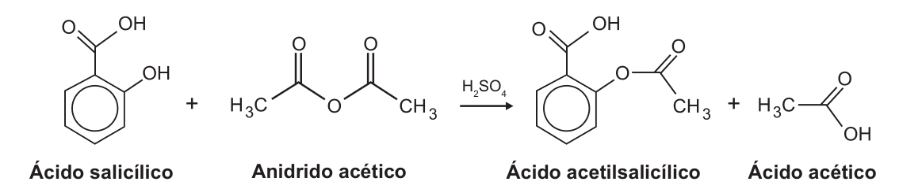

<Accordion titulo="Palavras e siglas desta aula" dica="Consulte quando encontrar um termo novo" icone="spell-check">

- **ENEM** (Exame Nacional do Ensino Médio): a prova nacional que dá acesso a faculdades e bolsas.
- **INEP** (Instituto Nacional de Estudos e Pesquisas Educacionais Anísio Teixeira): o órgão do governo que faz o ENEM.
- **AAS** (ácido acetilsalicílico): o princípio ativo da aspirina.
- **Minério**: rocha de onde se tira um metal ou outra substância útil.
- **Bauxita**: minério de onde se tira o alumínio.
- **Esfalerita**: minério de onde se tira o zinco; é formado principalmente por sulfeto de zinco (ZnS).
- **Galvanização**: cobrir o aço com uma camada de zinco para ele não enferrujar.
- **Síntese**: produção de uma substância a partir de outras, por reação química.
- **Redução aluminotérmica**: jeito de tirar um metal do seu óxido usando alumínio, que "rouba" o oxigênio.
- **Antitérmico**: que baixa a febre.
- **Analgésico**: que alivia a dor.
- **Antitrombótico**: que dificulta a formação de coágulos no sangue.
- **Slogan**: frase curta de campanha, fácil de lembrar.
- **Sedã**: tipo de carro com porta-malas separado.
- **Chassi**: a estrutura de base do carro.

</Accordion>

## Antes de Começar

**O que o ENEM cobra aqui.** A prova dá uma equação química (ou pede que você a monte), as massas molares e uma quantidade conhecida. Você precisa achar outra quantidade. Os temas que costumam aparecer são estes:

- **Massa de produto** formada a partir de uma massa de reagente, ou o contrário.
- **Combustão completa**, em que você mesmo escreve e acerta a equação.
- **Minério impuro**: só uma parte da amostra é a substância útil.
- **Rendimento** menor que 100%: sai menos produto do que a conta prevê.
- **Reações em sequência**, em que o produto de uma vira reagente da outra.
- **Reagente em excesso**: coloca-se mais do que o necessário, de propósito.

**O que você precisa saber antes.**

- **Regra de três.** Se 2 kg custam R$ 10, 6 kg custam 6 × 10 ÷ 2 = R$ 30. Toda conta desta aula termina numa regra de três (aula de Regra de Três, em Matemática Básica).
- **Porcentagem como número decimal.** 60% = 60 ÷ 100 = 0,6; 25% a mais = × 1,25 (aula de Porcentagem).
- **Potências de 10.** 10³ = 1 000; 10⁶ = 1 000 000. Um número como 6,0 × 10²³ é 6 seguido de 23 zeros.
- **Fórmula química.** Em H₂O, o número pequeno embaixo (o **índice**) conta os átomos: 2 de hidrogênio e 1 de oxigênio. Sem índice, é 1 (aula de Ligações Químicas).

## Aula Teórica

### 1. Mol e massa molar

Átomos são pequenos demais para contar um a um. Por isso a química conta em **pacotes**, como a dúzia conta ovos de 12 em 12. O pacote da química se chama **mol**: 1 mol é 6,0 × 10²³ unidades (a **constante de Avogadro**). Um mol de moléculas de água são 6,0 × 10²³ moléculas de água.

A **massa molar** (M) é a massa de 1 mol de uma substância, em g/mol (gramas por mol). A prova também escreve **g mol⁻¹**: o expoente −1 quer dizer "por", então g mol⁻¹ é o mesmo que g/mol.

Para achar a massa molar, some as massas dos átomos da fórmula, cada uma vezes o seu índice. As massas dos elementos vêm na questão ou na tabela periódica. Em g/mol: H = 1, C = 12, N = 14, O = 16, S = 32, Ca = 40, Fe = 56.

**Fórmula: número de mols**

**n = m ÷ M**

- **n**: quantidade de matéria, em mol.
- **m**: massa da amostra, em gramas (g).
- **M**: massa molar da substância, em g/mol.
- **Em palavras:** quantos pacotes de 1 mol cabem naquela massa.
- **Quando usar:** sempre que precisar passar de massa para mol. Para o caminho inverso, **m = n × M**.

**Exemplo resolvido.** Quantos mols há em 350 g de carbonato de cálcio (CaCO₃), o principal componente do calcário?

1. Átomos: 1 Ca, 1 C e 3 O.
2. Massa molar: 40 + 12 + 3 × 16 = 40 + 12 + 48 = 100 g/mol.
3. Fórmula: n = m ÷ M.
4. Substituir: n = 350 ÷ 100.
5. Resposta: 3,5 mol de CaCO₃.

**Erro comum.** Esquecer o índice. Em CaCO₃ há **3** oxigênios: são 48 g, não 16 g.

### 2. Equação balanceada: a receita da reação

Uma **equação química** é a receita da reação. À esquerda da seta (→, lê-se "forma") ficam os **reagentes**; à direita, os **produtos**. O número grande na frente de cada fórmula é o **coeficiente**: quantas unidades (ou quantos mols) participam. Sem número, o coeficiente é 1.

Numa reação, nenhum átomo some nem aparece do nada. Por isso a equação precisa estar **balanceada**: o número de átomos de cada elemento é igual dos dois lados.

A **combustão completa** de um combustível feito de carbono e hidrogênio (e às vezes oxigênio) é a queima com oxigênio suficiente. Ela sempre forma **gás carbônico (CO₂) e água (H₂O)**. Muitas questões só dizem "combustão completa": a equação fica por sua conta.

**Exemplo resolvido.** Monte a equação da combustão completa do etanol (C₂H₆O), o álcool combustível.

1. Esqueleto: C₂H₆O + O₂ → CO₂ + H₂O.
2. Carbono: há 2 à esquerda, então 2 CO₂.
3. Hidrogênio: há 6 à esquerda; cada H₂O tem 2, então 3 H₂O.
4. Oxigênio à direita: 2 × 2 + 3 × 1 = 7. À esquerda, o etanol já traz 1; faltam 6, que são 3 O₂.
5. Resposta: C₂H₆O + 3 O₂ → 2 CO₂ + 3 H₂O. Conferência: C 2 = 2; H 6 = 6; O 1 + 6 = 7 = 4 + 3.

Às vezes o oxigênio só fecha com fração. No etano (C₂H₆): C₂H₆ + 7/2 O₂ → 2 CO₂ + 3 H₂O. A fração pode ficar (a proporção vale do mesmo jeito) ou tudo pode ser multiplicado por 2: 2 C₂H₆ + 7 O₂ → 4 CO₂ + 6 H₂O. O que importa é a proporção entre as substâncias.

Algumas questões desenham as moléculas com a **fórmula estrutural** (os átomos ligados por traços) em vez da fórmula comum. A leitura é igual: cada desenho sem número na frente vale 1. Uma fórmula escrita **em cima da seta** é o catalisador: ele ajuda a reação, mas não entra na conta.

**Erro comum.** Mexer no índice para balancear (trocar H₂O por H₂O₂, por exemplo). Isso cria outra substância. Só se mudam os coeficientes.

### 3. De massa para massa

Os coeficientes dão a proporção **em mol**, não em gramas. Por isso a conta tem três passos: massa → mol, mol → mol pela proporção, mol → massa. O esquema abaixo mostra o caminho.

<figure class="figura">
  <svg viewBox="0 0 460 110" role="img" aria-labelledby="fig-est-1-t fig-est-1-d">
    <title id="fig-est-1-t">O caminho da estequiometria</title>
    <desc id="fig-est-1-d">Quatro caixas em fila: massa de A, mols de A, mols de B, massa de B. Da primeira para a segunda, divide-se pela massa molar de A. Da segunda para a terceira, usa-se a proporção dos coeficientes. Da terceira para a quarta, multiplica-se pela massa molar de B.</desc>
    <rect x="6" y="14" width="76" height="46" rx="6" class="traco" />
    <text x="44" y="34" class="rotulo" text-anchor="middle">massa</text>
    <text x="44" y="50" class="rotulo" text-anchor="middle">de A</text>
    <rect x="130" y="14" width="76" height="46" rx="6" class="traco preenche" />
    <text x="168" y="34" class="rotulo" text-anchor="middle">mols</text>
    <text x="168" y="50" class="rotulo" text-anchor="middle">de A</text>
    <rect x="254" y="14" width="76" height="46" rx="6" class="traco preenche" />
    <text x="292" y="34" class="rotulo" text-anchor="middle">mols</text>
    <text x="292" y="50" class="rotulo" text-anchor="middle">de B</text>
    <rect x="378" y="14" width="76" height="46" rx="6" class="traco" />
    <text x="416" y="34" class="rotulo" text-anchor="middle">massa</text>
    <text x="416" y="50" class="rotulo" text-anchor="middle">de B</text>
    <line x1="86" y1="37" x2="122" y2="37" class="traco" />
    <polygon points="126,37 118,33 118,41" class="traco" />
    <line x1="210" y1="37" x2="246" y2="37" class="traco" />
    <polygon points="250,37 242,33 242,41" class="traco" />
    <line x1="334" y1="37" x2="370" y2="37" class="traco" />
    <polygon points="374,37 366,33 366,41" class="traco" />
    <text x="106" y="84" class="rotulo-fraco" text-anchor="middle">÷ massa molar</text>
    <text x="106" y="98" class="rotulo-fraco" text-anchor="middle">de A</text>
    <text x="230" y="84" class="rotulo-fraco" text-anchor="middle">× proporção dos</text>
    <text x="230" y="98" class="rotulo-fraco" text-anchor="middle">coeficientes</text>
    <text x="354" y="84" class="rotulo-fraco" text-anchor="middle">× massa molar</text>
    <text x="354" y="98" class="rotulo-fraco" text-anchor="middle">de B</text>
  </svg>
</figure>

Na prática, dá para juntar os três passos numa só regra de três: escreva, embaixo de cada substância, **coeficiente × massa molar**. Essa linha é a proporção em massa, e ela vale em g, kg ou toneladas (t), desde que as duas substâncias fiquem na mesma unidade.

**Fórmula: proporção em massa**

**massa de B = massa de A × (coef. de B × M de B) ÷ (coef. de A × M de A)**

- **A**: a substância cuja massa é dada.
- **B**: a substância cuja massa é pedida.
- **coef.**: o coeficiente de cada uma na equação balanceada.
- **M**: a massa molar de cada uma, em g/mol.
- **Em palavras:** a massa pedida está para a massa dada assim como "coeficiente × massa molar" de uma está para o da outra.
- **Quando usar:** em toda questão que dá uma massa e pede outra, na mesma reação.

**Exemplo resolvido.** Aquecido, o calcário se decompõe: CaCO₃ → CaO + CO₂. O CaO é a cal virgem (massa molar 56 g/mol). Quanta cal virgem se obtém de 2 t de CaCO₃ puro? E quanto CaCO₃ é preciso para obter 7 kg de CaO?

1. Proporção: 1 CaCO₃ para 1 CaO. Embaixo de cada um: 1 × 100 = 100 e 1 × 56 = 56.
2. Ida: 100 t de CaCO₃ dão 56 t de CaO; 2 t dão 2 × 56 ÷ 100 = 1,12 t de CaO.
3. Volta: 56 kg de CaO vêm de 100 kg de CaCO₃; 7 kg vêm de 7 × 100 ÷ 56 = 12,5 kg de CaCO₃.
4. Resposta: 1,12 t de cal virgem; 12,5 kg de calcário puro.

Quando a pergunta pede a quantidade exata, sem sobra, é a conta direta pela proporção. E, se as alternativas vêm com "mais próximo de", arredonde só no fim.

**Erro comum.** Usar só as massas molares e esquecer o coeficiente. Se a equação diz 1 para 3, a massa do segundo é 3 × a massa molar dele.

### 4. Quanto de um elemento há num composto

Às vezes a questão fala de um **elemento** (o ferro, o alumínio) que está preso num composto (um óxido). A fórmula do composto diz a proporção: em Fe₂O₃, cada 1 mol do óxido tem 2 mol de ferro.

Em massa: Fe₂O₃ = 2 × 56 + 3 × 16 = 112 + 48 = 160 g/mol, dos quais 112 g são de ferro. Então o ferro é 112 ÷ 160 = 0,7 = 70% da massa do óxido.

Quando o composto está misturado com outras coisas (terra, rocha), a amostra é **impura**. A **pureza** (ou o **teor**) é a porcentagem da amostra que é a substância útil. "X% em massa" quer dizer X g da substância em cada 100 g da amostra.

**Fórmula: pureza**

**massa da substância pura = massa da amostra × pureza**

- **pureza**: em número decimal (70% = 0,7).
- **Em palavras:** só a parte pura da amostra entra na reação.
- **Quando usar:** quando o enunciado dá a porcentagem de uma substância numa amostra, num minério ou num produto.
- **Caminho de volta:** se você sabe quanto de substância pura precisa e quer a amostra, **divida** pela pureza: massa da amostra = massa pura ÷ pureza.

**Exemplo resolvido.** Uma siderúrgica (fábrica de aço) quer 63 kg de ferro. Ela usa um minério em que 60% da massa é Fe₂O₃. Quanto minério é preciso?

1. Ferro no óxido: 112 kg de Fe em cada 160 kg de Fe₂O₃.
2. Óxido necessário: 63 × 160 ÷ 112 = 90 kg de Fe₂O₃.
3. Minério: o óxido é só 60% dele, então divida: 90 ÷ 0,6 = 150 kg.
4. Conferência: 150 kg × 0,6 = 90 kg de óxido, e 90 × 112 ÷ 160 = 63 kg de ferro.
5. Resposta: 150 kg de minério.

**Erro comum.** No caminho de volta, multiplicar pela pureza em vez de dividir. A amostra impura precisa ser **maior** que a massa pura, nunca menor.

### 5. Pureza e rendimento

O **rendimento** diz quanto do produto previsto pela conta realmente se obtém. Um rendimento de 60% quer dizer que sai 60% do que a equação promete: parte se perde na purificação, parte não reage.

**Fórmula: rendimento**

**produto real = produto teórico × rendimento**

- **produto teórico**: o que a conta da equação dá (rendimento de 100%).
- **rendimento**: em número decimal (60% = 0,6).
- **Em palavras:** a fábrica só recebe uma fração do que a química promete.
- **Quando usar:** quando o enunciado dá o rendimento da reação ou do processo.
- **Caminho de volta:** para garantir uma quantidade real de produto, a matéria-prima tem de ser **maior**: divida pelo rendimento.

A pureza e o rendimento se encaixam no caminho da seção 3, como mostra o esquema abaixo. Na ida, os dois multiplicam; na volta, os dois dividem.

<figure class="figura">
  <svg viewBox="0 0 460 110" role="img" aria-labelledby="fig-est-2-t fig-est-2-d">
    <title id="fig-est-2-t">Onde entram a pureza e o rendimento</title>
    <desc id="fig-est-2-d">Quatro caixas em fila: amostra impura, reagente puro, produto teórico, produto real. Da amostra para o reagente puro, multiplica-se pela pureza. Do reagente puro para o produto teórico, usa-se a proporção da equação. Do produto teórico para o produto real, multiplica-se pelo rendimento. No caminho de volta, divide-se.</desc>
    <rect x="6" y="14" width="76" height="46" rx="6" class="traco" />
    <text x="44" y="34" class="rotulo" text-anchor="middle">amostra</text>
    <text x="44" y="50" class="rotulo" text-anchor="middle">impura</text>
    <rect x="130" y="14" width="76" height="46" rx="6" class="traco preenche" />
    <text x="168" y="34" class="rotulo" text-anchor="middle">reagente</text>
    <text x="168" y="50" class="rotulo" text-anchor="middle">puro</text>
    <rect x="254" y="14" width="76" height="46" rx="6" class="traco preenche" />
    <text x="292" y="34" class="rotulo" text-anchor="middle">produto</text>
    <text x="292" y="50" class="rotulo" text-anchor="middle">teórico</text>
    <rect x="378" y="14" width="76" height="46" rx="6" class="traco" />
    <text x="416" y="34" class="rotulo" text-anchor="middle">produto</text>
    <text x="416" y="50" class="rotulo" text-anchor="middle">real</text>
    <line x1="86" y1="37" x2="122" y2="37" class="traco" />
    <polygon points="126,37 118,33 118,41" class="traco" />
    <line x1="210" y1="37" x2="246" y2="37" class="traco" />
    <polygon points="250,37 242,33 242,41" class="traco" />
    <line x1="334" y1="37" x2="370" y2="37" class="traco" />
    <polygon points="374,37 366,33 366,41" class="traco" />
    <text x="106" y="84" class="rotulo-fraco" text-anchor="middle">× pureza</text>
    <text x="230" y="84" class="rotulo-fraco" text-anchor="middle">× proporção</text>
    <text x="230" y="98" class="rotulo-fraco" text-anchor="middle">em massa</text>
    <text x="354" y="84" class="rotulo-fraco" text-anchor="middle">× rendimento</text>
  </svg>
</figure>

**Exemplo resolvido.** Caminho de ida: um forno de cal (caieira) aquece 400 kg de calcário com 90% de CaCO₃. O rendimento do forno é de 60%. Quanta cal virgem (CaO) sai?

1. Pureza: 400 × 0,9 = 360 kg de CaCO₃.
2. Proporção (seção 3): 360 × 56 ÷ 100 = 201,6 kg de CaO teórico.
3. Rendimento: 201,6 × 0,6 ≈ 121 kg de CaO (≈ quer dizer "aproximadamente").
4. Resposta: cerca de 121 kg de cal virgem.

Caminho de volta: com o mesmo forno (60%), quanto CaCO₃ puro é preciso para obter de fato 42 kg de CaO?

1. Produto teórico: se só 60% aparece, a conta precisa prever 42 ÷ 0,6 = 70 kg de CaO.
2. Proporção: 70 × 100 ÷ 56 = 125 kg de CaCO₃.
3. Conferência: 125 kg dão 70 kg de CaO teórico; 70 × 0,6 = 42 kg reais.
4. Resposta: 125 kg de CaCO₃.

Cuidado com as **unidades**. Um remédio costuma vir em miligramas (mg): 1 g = 1 000 mg e 1 kg = 1 000 g = 1 000 000 mg. "Mil" é 1 000, e "1 milhão" é 1 000 000. Exemplo: 300 mil cápsulas de 150 mg somam 300 000 × 150 = 45 000 000 mg, que dividido por 1 000 000 dá 45 kg.

**Erro comum.** Aplicar o rendimento na direção errada. Se a pergunta é "quanto reagente usar" para obter um produto, o rendimento baixo **aumenta** a quantidade de reagente: divida por ele.

### 6. Reações em sequência

Às vezes o produto sai de várias reações seguidas: o produto de uma é reagente da seguinte. Não é preciso calcular etapa por etapa. Siga o elemento que interessa e ache a **proporção total** entre a primeira substância e a última.

**Exemplo resolvido.** O ácido sulfúrico (H₂SO₄, 98 g/mol) é feito a partir de enxofre (S, 32 g/mol) nesta sequência:

S + O₂ → SO₂\
2 SO₂ + O₂ → 2 SO₃\
SO₃ + H₂O → H₂SO₄

Quanto ácido sai de 16 t de enxofre?

1. Primeira etapa: 1 S dá 1 SO₂.
2. Segunda: 2 SO₂ dão 2 SO₃, ou seja, 1 para 1.
3. Terceira: 1 SO₃ dá 1 H₂SO₄.
4. Proporção total: 1 S → 1 H₂SO₄. Em massa: 32 t de S → 98 t de ácido.
5. Regra de três: 16 × 98 ÷ 32 = 49 t de H₂SO₄.

Se as etapas tiverem coeficientes diferentes, multiplique as proporções. Se o enunciado der um rendimento para o processo todo, aplique-o uma vez só, no fim.

**Erro comum.** Somar as massas molares de todas as substâncias intermediárias. Elas não importam: só a primeira e a última entram na regra de três. A questão pode dar massas molares que não servem para a conta; use só as de que precisa.

### 7. Reagente em excesso

Na indústria, é comum colocar **mais** de um reagente do que a equação pede, para ter certeza de que o outro (o mais caro) reaja todo. O reagente que sobra é o reagente em **excesso**. O que acaba primeiro e decide quanto produto se forma é o **reagente limitante**.

A **quantidade estequiométrica** é a quantidade exata que a equação pede. "Excesso de X% em relação à quantidade estequiométrica" quer dizer: calcule a quantidade exata e some X% a ela.

**Fórmula: quantidade com excesso**

**quantidade usada = quantidade estequiométrica × (1 + X ÷ 100)**

- **X**: a porcentagem de excesso.
- **Em palavras:** 25% a mais é multiplicar por 1,25.
- **Quando usar:** quando o enunciado diz que um reagente é colocado "em excesso de X%".

**Exemplo resolvido.** A amônia sai da reação N₂ + 3 H₂ → 2 NH₃ (H₂ = 2 g/mol; NH₃ = 17 g/mol). Uma fábrica quer 34 kg de NH₃ e usa hidrogênio com 25% de excesso. Quanto H₂ ela coloca?

1. Mols de amônia: 34 kg ÷ 17 g/mol. Em kg, a conta dá **quilomols** (kmol, 1 kmol = 1 000 mol): 34 ÷ 17 = 2 kmol.
2. Proporção: 2 NH₃ pedem 3 H₂, então 2 kmol de NH₃ pedem 3 kmol de H₂.
3. Massa estequiométrica: 3 kmol × 2 g/mol = 6 kg de H₂.
4. Excesso: 6 × 1,25 = 7,5 kg.
5. Resposta: 7,5 kg de H₂.

Quando a proporção não é redonda (como 3 para 7), faça a regra de três com fração: 7 ÷ 3 ≈ 2,33 de um para cada 1 do outro. O "(s)" ao lado de uma fórmula indica **sólido**; "(g)", gás; "(l)", líquido. Isso não muda a conta.

**Erro comum.** Esquecer o excesso e marcar a quantidade estequiométrica, que costuma estar entre as alternativas. Ou fazer o contrário: tirar X% em vez de somar.

### Armadilhas típicas do INEP

1. **Usar a proporção em gramas direto dos coeficientes**: os coeficientes contam mols; multiplique pela massa molar.
2. **Esquecer o índice** na massa molar (O₃ são 3 oxigênios).
3. **Não balancear** a combustão antes de usar a proporção.
4. **Multiplicar** pela pureza ou pelo rendimento **no caminho de volta**: na volta, divide-se.
5. **Parar no meio**: calcular o óxido e esquecer o minério, ou o produto teórico e esquecer o rendimento. As alternativas trazem esses valores intermediários.
6. **Misturar unidades**: mg com kg, "mil" com "milhão".
7. **Ignorar o excesso** ou tirá-lo em vez de somá-lo.

## Tópicos-Chave para Revisão

#### 1. Mol e massa molar

**Mol** é um pacote de 6,0 × 10²³ unidades; a **massa molar** soma as massas dos átomos (com os **índices**): **n = m ÷ M** e **m = n × M**; g mol⁻¹ = g/mol.

#### 2. Equação balanceada

Os **coeficientes** dão a proporção em mol; a **combustão completa** sempre forma **CO₂ + H₂O**; balanceie C, depois H, depois O; sem número, vale 1, também na **fórmula estrutural**; o que está em cima da seta é **catalisador**.

#### 3. De massa para massa

Caminho **massa → mol → mol → massa**: escreva **coeficiente × massa molar** embaixo de cada substância e faça a **regra de três**: **massa de B = massa de A × (coef. de B × M de B) ÷ (coef. de A × M de A)**.

<figure class="figura">
  <svg viewBox="0 0 460 70" role="img" aria-labelledby="fig-est-1-rev-t fig-est-1-rev-d">
    <title id="fig-est-1-rev-t">O caminho da estequiometria (resumo)</title>
    <desc id="fig-est-1-rev-d">Massa de A, dividida pela massa molar de A, dá mols de A; pela proporção dos coeficientes, mols de B; multiplicando pela massa molar de B, massa de B.</desc>
    <rect x="6" y="10" width="76" height="30" rx="6" class="traco" />
    <text x="44" y="29" class="rotulo" text-anchor="middle">massa A</text>
    <rect x="130" y="10" width="76" height="30" rx="6" class="traco preenche" />
    <text x="168" y="29" class="rotulo" text-anchor="middle">mol A</text>
    <rect x="254" y="10" width="76" height="30" rx="6" class="traco preenche" />
    <text x="292" y="29" class="rotulo" text-anchor="middle">mol B</text>
    <rect x="378" y="10" width="76" height="30" rx="6" class="traco" />
    <text x="416" y="29" class="rotulo" text-anchor="middle">massa B</text>
    <line x1="86" y1="25" x2="122" y2="25" class="traco" />
    <polygon points="126,25 118,21 118,29" class="traco" />
    <line x1="210" y1="25" x2="246" y2="25" class="traco" />
    <polygon points="250,25 242,21 242,29" class="traco" />
    <line x1="334" y1="25" x2="370" y2="25" class="traco" />
    <polygon points="374,25 366,21 366,29" class="traco" />
    <text x="106" y="60" class="rotulo-fraco" text-anchor="middle">÷ M(A)</text>
    <text x="230" y="60" class="rotulo-fraco" text-anchor="middle">× proporção</text>
    <text x="354" y="60" class="rotulo-fraco" text-anchor="middle">× M(B)</text>
  </svg>
</figure>

#### 4. Elemento no composto e pureza

A **fórmula** diz quanto do elemento há no composto (Fe₂O₃: 112 g de Fe em 160 g); **massa da substância pura = massa da amostra × pureza**; para achar a amostra, **divida** pela pureza.

#### 5. Rendimento

O **rendimento** entra assim: **produto real = produto teórico × rendimento**; para garantir um produto, **divida** a matéria-prima pelo rendimento; confira **unidades** (1 kg = 1 000 000 mg).

#### 6. Reações em sequência

Ache a **proporção total** entre a primeira e a última substância seguindo o **elemento**; os **intermediários** não entram na conta.

#### 7. Reagente em excesso

Com **excesso** de X%: **quantidade usada = quantidade estequiométrica × (1 + X ÷ 100)**; o **reagente limitante** acaba primeiro e decide o produto.

## Questões do ENEM

*Marque uma alternativa em cada questão e confira tudo de uma vez no botão do fim.*

**Questão 1**

*ENEM 2012 · 1º dia · caderno azul · questão 59*

No Japão, um movimento nacional para a promoção da luta contra o aquecimento global leva o *slogan*: **1 pessoa, 1 dia, 1 kg de CO₂ a menos!** A ideia é cada pessoa reduzir em 1 kg a quantidade de CO₂ emitida todo dia, por meio de pequenos gestos ecológicos, como diminuir a queima de gás de cozinha.

Um hamburguer ecológico? É pra já! Disponível em: http://lqes.iqm.unicamp.br. Acesso em: 24 fev. 2012 (adaptado).

Considerando um processo de combustão completa de um gás de cozinha composto exclusivamente por butano (C₄H₁₀), a mínima quantidade desse gás que um japonês deve deixar de queimar para atender à meta diária, apenas com esse gesto, é de

Dados: CO₂ (44 g/mol); C₄H₁₀ (58 g/mol)

A) 0,25 kg.\
B) 0,33 kg.\
C) 1,0 kg.\
D) 1,3 kg.\
E) 3,0 kg.

**Questão 2**

*ENEM 2023 · 2ª aplicação · 2º dia · caderno azul · questão 95*

Um carro sedã apresenta tipicamente 200 kg de alumínio distribuídos pelo chassi, motor e cabine. Uma amostra de bauxita, principal fonte natural do metal, é composta por 50% em massa de óxido de alumínio (Al₂O₃). Considere a massa molar do alumínio (Al) igual a 27 g mol⁻¹ e a do oxigênio (O) igual a 16 g mol⁻¹.

A massa de bauxita que deve ser empregada para produzir o alumínio usado na fabricação de um carro desse modelo é mais próxima de

A) 378 kg.\
B) 400 kg.\
C) 637 kg.\
D) 756 kg.\
E) 1 512 kg.

**Questão 3**

*ENEM 2015 · 1º dia · caderno azul · questão 76*

Para proteger estruturas de aço da corrosão, a indústria utiliza uma técnica chamada galvanização. Um metal bastante utilizado nesse processo é o zinco, que pode ser obtido a partir de um minério denominado esfalerita (ZnS), de pureza 75%. Considere que a conversão do minério em zinco metálico tem rendimento de 80% nesta sequência de equações químicas:

2 ZnS + 3 O₂ → 2 ZnO + 2 SO₂\
ZnO + CO → Zn + CO₂

Considere as massas molares: ZnS (97 g/mol); O₂ (32 g/mol); ZnO (81 g/mol); SO₂ (64 g/mol); CO (28 g/mol); CO₂ (44 g/mol); e Zn (65 g/mol).

Que valor mais próximo de massa de zinco metálico, em quilogramas, será produzido a partir de 100 kg de esfalerita?

A) 25\
B) 33\
C) 40\
D) 50\
E) 54

**Questão 4**

*ENEM 2017 · 2º dia · caderno azul · questão 122*

O ácido acetilsalicílico, AAS (massa molar igual a 180 g/mol), é sintetizado a partir da reação do ácido salicílico (massa molar igual a 138 g/mol) com anidrido acético, usando-se ácido sulfúrico como catalisador, conforme a equação química:

<figure class="figura">

</figure>

Após a síntese, o AAS é purificado e o rendimento final é de aproximadamente 50%. Devido às suas propriedades farmacológicas (antitérmico, analgésico, anti-inflamatório e antitrombótico), o AAS é utilizado como medicamento na forma de comprimidos, nos quais se emprega tipicamente uma massa de 500 mg dessa substância.

Uma indústria farmacêutica pretende fabricar um lote de 900 mil comprimidos, de acordo com as especificações do texto. Qual é a massa de ácido salicílico, em kg, que deve ser empregada para esse fim?

A) 293\
B) 345\
C) 414\
D) 690\
E) 828

**Questão 5**

*ENEM 2025 · 2º dia · caderno azul · questão 131*

O Brasil é o maior produtor mundial de nióbio (massa molar = 93 g mol⁻¹), metal utilizado na fabricação de vários tipos de aço: automotivos, estruturais e inoxidáveis. O processo utilizado na produção do nióbio é a redução aluminotérmica de Nb₂O₅ com excesso de 10% de Al (massa molar = 27 g mol⁻¹), em relação à quantidade estequiométrica da reação, representada pela equação química:

3 Nb₂O₅ (s) + 10 Al (s) → 6 Nb (s) + 5 Al₂O₃ (s)

Uma engenheira metalúrgica estimou a massa de alumínio necessária para produzir 9,3 kg de nióbio, nas condições descritas, para a produção de um lote de peças de aço encomendado por uma indústria, considerando um rendimento de 100%.

Disponível em: www.cbmm.com.br. Acesso em: 17 out. 2015 (adaptado).

A massa de alumínio, em quilograma, estimada pela engenheira é mais próxima de

A) 2,7 kg.\
B) 3,0 kg.\
C) 4,1 kg.\
D) 4,5 kg.\
E) 5,0 kg.
