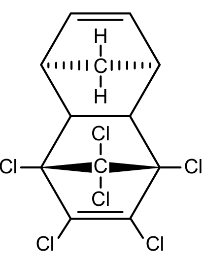
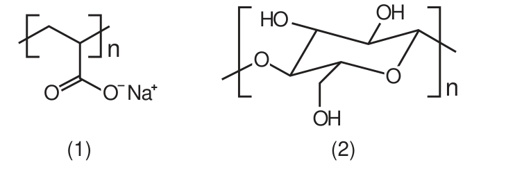

<Accordion titulo="Palavras e siglas desta aula" dica="Consulte quando encontrar um termo novo" icone="spell-check">

- **ENEM** (Exame Nacional do Ensino Médio): a prova nacional que dá acesso a faculdades e bolsas.
- **INEP** (Instituto Nacional de Estudos e Pesquisas Educacionais Anísio Teixeira): o órgão do governo que faz o ENEM.
- **GLP** (gás liquefeito de petróleo): o gás de cozinha.
- **OH** (hidroxila): grupo com um oxigênio ligado a um hidrogênio.
- **COO** (carboxilato): grupo com carbono e dois oxigênios; com carga negativa, escreve-se COO⁻.
- **Íon**: átomo ou grupo de átomos com carga, por ter ganhado ou perdido elétrons. **Cátion** é positivo; **ânion**, negativo.
- **Energia de ionização**: a energia para tirar um elétron de um átomo.
- **Afinidade eletrônica**: a energia liberada quando um átomo recebe um elétron.
- **Polarizabilidade**: facilidade com que a nuvem de elétrons de um átomo ou íon se deforma.
- **Hemácias e leucócitos**: glóbulos vermelhos e brancos do sangue. **Ureia**: substância eliminada na urina. **Enzima**: proteína que acelera reações no corpo.
- **Acriticamente**: sem questionar.
- **Halogênio**: elemento do grupo 17, como flúor e cloro.
- **Densidade**: massa por volume.
- **Ramificação**: galho lateral numa cadeia de carbonos.
- **Solúvel**: que se dissolve; **insolúvel**, que não se dissolve.
- **Hidratação**: envolvimento de uma partícula por moléculas de água.
- **Polímero**: molécula enorme, formada pela repetição de uma mesma unidade.
- **Organoclorado**: composto de carbono com átomos de cloro.
- **Destilação fracionada**: separação de líquidos pela temperatura em que cada um ferve.

</Accordion>

## Antes de Começar

**O que o ENEM cobra aqui.** Os temas que costumam aparecer são estes:

- **Explicar por que um sal** se dissolve mais que outro, ou funde a temperaturas mais altas.
- **Contar elétrons** numa fórmula de Lewis, inclusive fora da regra do octeto.
- **Prever onde uma substância se dissolve**: em água ou em gordura.
- **Comparar temperaturas de ebulição** pelas forças entre as moléculas.
- **Nomear a interação** entre uma substância e a água.

**O que você precisa saber antes.**

- **Estrutura atômica.** Elétrons de valência são os do nível mais externo; numa notação como 2s²2p⁴, some os expoentes do nível mais externo: 2 + 4 = 6. Metais ficam à esquerda da tabela, ametais à direita (aula de Estrutura Atômica).
- **Cargas.** Cargas opostas se atraem, e cargas maiores se atraem com mais força.

## Aula Teórica

### 1. Ligação iônica

Na **ligação iônica**, um **metal** (que perde elétrons com facilidade) passa elétrons para um **ametal** (que os recebe). Surgem **íons**: o metal vira **cátion** (+), o ametal vira **ânion** (−). Os íons de cargas opostas se atraem e se arrumam num **retículo cristalino**, um arranjo regular e repetido.

<figure class="figura">
  <svg viewBox="0 0 460 200" role="img" aria-labelledby="fig-lq-1-t fig-lq-1-d">
    <title id="fig-lq-1-t">Retículo cristalino iônico</title>
    <desc id="fig-lq-1-d">Um arranjo regular de íons: cátions positivos, menores, e ânions negativos, maiores, alternados em linhas e colunas. Cada íon fica cercado por íons de carga oposta.</desc>
    <circle cx="90" cy="30" r="12" class="traco preenche" />
    <text x="90" y="35" class="rotulo-fraco" text-anchor="middle">+</text>
    <circle cx="90" cy="70" r="17" class="traco" />
    <text x="90" y="75" class="rotulo-fraco" text-anchor="middle">−</text>
    <circle cx="90" cy="110" r="12" class="traco preenche" />
    <text x="90" y="115" class="rotulo-fraco" text-anchor="middle">+</text>
    <circle cx="90" cy="150" r="17" class="traco" />
    <text x="90" y="155" class="rotulo-fraco" text-anchor="middle">−</text>
    <circle cx="135" cy="30" r="17" class="traco" />
    <text x="135" y="35" class="rotulo-fraco" text-anchor="middle">−</text>
    <circle cx="135" cy="70" r="12" class="traco preenche" />
    <text x="135" y="75" class="rotulo-fraco" text-anchor="middle">+</text>
    <circle cx="135" cy="110" r="17" class="traco" />
    <text x="135" y="115" class="rotulo-fraco" text-anchor="middle">−</text>
    <circle cx="135" cy="150" r="12" class="traco preenche" />
    <text x="135" y="155" class="rotulo-fraco" text-anchor="middle">+</text>
    <circle cx="180" cy="30" r="12" class="traco preenche" />
    <text x="180" y="35" class="rotulo-fraco" text-anchor="middle">+</text>
    <circle cx="180" cy="70" r="17" class="traco" />
    <text x="180" y="75" class="rotulo-fraco" text-anchor="middle">−</text>
    <circle cx="180" cy="110" r="12" class="traco preenche" />
    <text x="180" y="115" class="rotulo-fraco" text-anchor="middle">+</text>
    <circle cx="180" cy="150" r="17" class="traco" />
    <text x="180" y="155" class="rotulo-fraco" text-anchor="middle">−</text>
    <circle cx="225" cy="30" r="17" class="traco" />
    <text x="225" y="35" class="rotulo-fraco" text-anchor="middle">−</text>
    <circle cx="225" cy="70" r="12" class="traco preenche" />
    <text x="225" y="75" class="rotulo-fraco" text-anchor="middle">+</text>
    <circle cx="225" cy="110" r="17" class="traco" />
    <text x="225" y="115" class="rotulo-fraco" text-anchor="middle">−</text>
    <circle cx="225" cy="150" r="12" class="traco preenche" />
    <text x="225" y="155" class="rotulo-fraco" text-anchor="middle">+</text>
    <circle cx="270" cy="30" r="12" class="traco preenche" />
    <text x="270" y="35" class="rotulo-fraco" text-anchor="middle">+</text>
    <circle cx="270" cy="70" r="17" class="traco" />
    <text x="270" y="75" class="rotulo-fraco" text-anchor="middle">−</text>
    <circle cx="270" cy="110" r="12" class="traco preenche" />
    <text x="270" y="115" class="rotulo-fraco" text-anchor="middle">+</text>
    <circle cx="270" cy="150" r="17" class="traco" />
    <text x="270" y="155" class="rotulo-fraco" text-anchor="middle">−</text>
    <circle cx="315" cy="30" r="17" class="traco" />
    <text x="315" y="35" class="rotulo-fraco" text-anchor="middle">−</text>
    <circle cx="315" cy="70" r="12" class="traco preenche" />
    <text x="315" y="75" class="rotulo-fraco" text-anchor="middle">+</text>
    <circle cx="315" cy="110" r="17" class="traco" />
    <text x="315" y="115" class="rotulo-fraco" text-anchor="middle">−</text>
    <circle cx="315" cy="150" r="12" class="traco preenche" />
    <text x="315" y="155" class="rotulo-fraco" text-anchor="middle">+</text>
    <circle cx="360" cy="30" r="12" class="traco preenche" />
    <text x="360" y="35" class="rotulo-fraco" text-anchor="middle">+</text>
    <circle cx="360" cy="70" r="17" class="traco" />
    <text x="360" y="75" class="rotulo-fraco" text-anchor="middle">−</text>
    <circle cx="360" cy="110" r="12" class="traco preenche" />
    <text x="360" y="115" class="rotulo-fraco" text-anchor="middle">+</text>
    <circle cx="360" cy="150" r="17" class="traco" />
    <text x="360" y="155" class="rotulo-fraco" text-anchor="middle">−</text>
    <text x="225" y="192" class="rotulo-fraco" text-anchor="middle">cátions (+, menores) e ânions (−) alternados</text>
  </svg>
</figure>

A carga de cada íon costuma ser o número de elétrons ganhos ou perdidos, e dá para prever pelo grupo da tabela. O grupo 1 forma íons 1+ (K⁺); o grupo 2, 2+ (Mg²⁺); o grupo 16, 2− (O²⁻); o grupo 17, 1− (F⁻). Grupos de átomos também podem ter carga, como o sulfato (SO₄²⁻), o nitrato (NO₃⁻) e o carbonato (CO₃²⁻). O composto final é neutro: as cargas se compensam.

A **energia de rede** é a energia necessária para separar completamente os íons do sólido. Ela mede a força da **atração entre os íons**, que aumenta com a **carga** deles: íons de carga 2 se atraem bem mais que íons de carga 1. Quanto maior essa atração:

- mais alto o **ponto de fusão** do sólido;
- mais difícil a água separar os íons, então o sal tende a ser **menos solúvel**.

**Exemplo resolvido.** O óxido de magnésio (Mg²⁺ e O²⁻) funde a cerca de 2 800 °C. O fluoreto de sódio (Na⁺ e F⁻) funde a cerca de 990 °C. Por que a diferença?

1. No óxido de magnésio, os íons têm carga 2; no fluoreto de sódio, carga 1.
2. Cargas maiores se atraem mais: a energia de rede do óxido de magnésio é maior.
3. É preciso mais energia (temperatura mais alta) para desmontar o retículo.
4. Resposta: a atração entre os íons de carga 2 é maior.

**Erro comum.** Atribuir a diferença à densidade do sólido ou a propriedades de um átomo ou íon isolado, como energia de ionização, eletronegatividade ou polarizabilidade. A energia de rede depende da atração **entre** os íons.

### 2. Ligação covalente e fórmula de Lewis

Entre dois **ametais**, nenhum cede elétrons: eles **compartilham pares** de elétrons. É a **ligação covalente**, que forma **moléculas**, como H₂O, CO₂ e CH₄.

A **fórmula de Lewis** mostra os elétrons de valência como pontos em volta do símbolo; cada par compartilhado é uma ligação. A **regra do octeto** diz que muitos átomos ficam estáveis com 8 elétrons na camada de valência, como os gases nobres. Mas há **exceções**: átomos grandes, como o fósforo, o enxofre e o iodo, podem ficar com **mais de 8**; o berílio e o boro, com menos.

Quantas ligações simples um átomo faz, em geral: o que falta para 8. Um halogênio (7 elétrons de valência) faz 1; o oxigênio (6) faz 2; o nitrogênio (5) faz 3; o carbono (4) faz 4. Um gás nobre, exceto o hélio, já tem 8.

Na fórmula de Lewis, um **par ligante** é um par compartilhado numa ligação; um **par não ligante** (ou isolado) é um par que fica só com um átomo, sem formar ligação.

<figure class="figura">
  <svg viewBox="0 0 460 175" role="img" aria-labelledby="fig-lq-4-t fig-lq-4-d">
    <title id="fig-lq-4-t">Fórmula de Lewis da água</title>
    <desc id="fig-lq-4-d">A água na fórmula de Lewis: o oxigênio no meio, um hidrogênio de cada lado. Entre o oxigênio e cada hidrogênio há um par de pontos, o par ligante. Acima e abaixo do oxigênio há mais dois pares de pontos, os pares não ligantes. Em volta do oxigênio ficam 8 elétrons.</desc>
    <text x="170" y="106" class="rotulo" text-anchor="middle">H</text>
    <text x="230" y="106" class="rotulo" text-anchor="middle">O</text>
    <text x="290" y="106" class="rotulo" text-anchor="middle">H</text>
    <circle cx="200" cy="96" r="3" class="traco preenche" />
    <circle cx="200" cy="106" r="3" class="traco preenche" />
    <circle cx="260" cy="96" r="3" class="traco preenche" />
    <circle cx="260" cy="106" r="3" class="traco preenche" />
    <circle cx="224" cy="80" r="3" class="traco preenche" />
    <circle cx="236" cy="80" r="3" class="traco preenche" />
    <circle cx="224" cy="122" r="3" class="traco preenche" />
    <circle cx="236" cy="122" r="3" class="traco preenche" />
    <line x1="200" y1="112" x2="170" y2="146" class="traco-fino" />
    <text x="150" y="160" class="rotulo-fraco" text-anchor="middle">par ligante</text>
    <line x1="240" y1="76" x2="300" y2="44" class="traco-fino" />
    <text x="306" y="42" class="rotulo-fraco">par não ligante</text>
  </svg>
</figure>

Para contar os elétrons em volta de um átomo central numa fórmula de Lewis, some os **elétrons de valência dele** com **1 elétron de cada ligação simples** que ele faz. Em cada par compartilhado, um elétron é dele e o outro vem do vizinho.

**Exemplo resolvido.** No hidreto de berílio, BeH₂, o berílio (2 elétrons de valência) faz uma ligação simples com cada hidrogênio. Quantos elétrons ficam em volta do berílio? Ele segue a regra do octeto?

1. Elétrons do berílio: 2.
2. Mais 1 de cada hidrogênio, nas 2 ligações: 2 + 2 = 4.
3. São 2 pares ligantes e nenhum par não ligante.
4. Resposta: 4 elétrons; não segue o octeto (fica com menos de 8).

**Erro comum.** Achar que todo átomo termina com 8 elétrons. A regra do octeto tem exceções, e a conta dos elétrons em volta do átomo central mostra quando ela não vale.

### 3. Polaridade e solubilidade

Cada elemento puxa os elétrons de uma ligação com força diferente: é a **eletronegatividade** (flúor, oxigênio e nitrogênio puxam muito). Numa ligação entre átomos diferentes, o par fica mais perto do mais eletronegativo, que fica com uma carga parcial negativa (δ−); o outro fica δ+.

O símbolo δ (letra grega "delta") indica carga parcial, menor que a de um íon. Uma **molécula** é **polar** quando essas cargas não se cancelam, como na água, que é "dobrada": ela forma um **dipolo**, com um polo δ+ e outro δ−. É **apolar** quando as cargas se cancelam por **simetria** (como no CO₂, reto) ou quando quase não há diferença de eletronegatividade (como nos hidrocarbonetos, só C e H).

<figure class="figura">
  <svg viewBox="0 0 460 195" role="img" aria-labelledby="fig-lq-2-t fig-lq-2-d">
    <title id="fig-lq-2-t">Molécula polar e molécula apolar</title>
    <desc id="fig-lq-2-d">À esquerda, a molécula de água, dobrada: o oxigênio fica com carga parcial negativa e os dois hidrogênios com carga parcial positiva, e as cargas não se cancelam: é polar. À direita, o gás carbônico, O=C=O, reto e simétrico: os dois oxigênios têm carga parcial negativa em lados opostos, e as cargas se cancelam: é apolar.</desc>
    <line x1="105" y1="90" x2="87" y2="103" class="traco" />
    <line x1="135" y1="90" x2="153" y2="103" class="traco" />
    <circle cx="120" cy="80" r="18" class="traco preenche" />
    <text x="120" y="85" class="rotulo" text-anchor="middle">O</text>
    <circle cx="78" cy="110" r="12" class="traco" />
    <text x="78" y="115" class="rotulo" text-anchor="middle">H</text>
    <circle cx="162" cy="110" r="12" class="traco" />
    <text x="162" y="115" class="rotulo" text-anchor="middle">H</text>
    <text x="120" y="50" class="rotulo-fraco" text-anchor="middle">δ−</text>
    <text x="66" y="140" class="rotulo-fraco" text-anchor="middle">δ+</text>
    <text x="174" y="140" class="rotulo-fraco" text-anchor="middle">δ+</text>
    <text x="120" y="182" class="rotulo-fraco" text-anchor="middle">água: dobrada, polar</text>
    <line x1="308" y1="96" x2="326" y2="96" class="traco" />
    <line x1="308" y1="104" x2="326" y2="104" class="traco" />
    <line x1="354" y1="96" x2="372" y2="96" class="traco" />
    <line x1="354" y1="104" x2="372" y2="104" class="traco" />
    <circle cx="290" cy="100" r="18" class="traco preenche" />
    <text x="290" y="105" class="rotulo" text-anchor="middle">O</text>
    <circle cx="340" cy="100" r="14" class="traco" />
    <text x="340" y="105" class="rotulo" text-anchor="middle">C</text>
    <circle cx="390" cy="100" r="18" class="traco preenche" />
    <text x="390" y="105" class="rotulo" text-anchor="middle">O</text>
    <text x="290" y="70" class="rotulo-fraco" text-anchor="middle">δ−</text>
    <text x="340" y="72" class="rotulo-fraco" text-anchor="middle">δ+</text>
    <text x="390" y="70" class="rotulo-fraco" text-anchor="middle">δ−</text>
    <text x="340" y="182" class="rotulo-fraco" text-anchor="middle">gás carbônico: reto, apolar</text>
  </svg>
</figure>

A regra de ouro da solubilidade: **semelhante dissolve semelhante**.

- Substâncias **polares** se dissolvem em água (polar).
- Substâncias **apolares** ou de **baixa polaridade** se dissolvem em óleos e gorduras (apolares). No corpo, elas se acumulam nos tecidos e líquidos ricos em **gordura**, e não nos que são quase só água.

**Exemplo resolvido.** Uma mancha de graxa numa ferramenta não sai com água, mas sai com querosene. Já uma mancha de açúcar sai com água. Por quê?

1. A graxa é feita de hidrocarbonetos: é apolar.
2. O querosene também é apolar, e a água é polar: semelhante dissolve semelhante, então a graxa se dissolve no querosene.
3. O açúcar é polar (tem muitos grupos OH) e se dissolve na água.
4. Resposta: cada mancha sai com o solvente de polaridade parecida.

**Erro comum.** Achar que substâncias apolares se acumulam onde há mais sais ou mais água. Sais e água são polares; o que atrai as apolares é a gordura.

### 4. Forças intermoleculares

Além das ligações dentro de cada molécula, há forças **entre** as moléculas, as **forças intermoleculares**. São elas que precisam ser vencidas para um líquido ferver. Da mais fraca para a mais forte (para moléculas de tamanho parecido):

- **Dispersão de London** (dipolo induzido-dipolo induzido): os elétrons de qualquer molécula se deslocam o tempo todo e criam polos momentâneos, os **dipolos induzidos**, que atraem as moléculas vizinhas. Aparece em todas as moléculas, e é a única nas apolares. Fica **mais forte quanto maior a molécula**, porque há mais elétrons e mais área de contato.
- **Dipolo-dipolo**: entre moléculas polares.
- **Ligação de hidrogênio**: um caso forte de dipolo-dipolo, quando o hidrogênio está ligado a flúor, oxigênio ou nitrogênio (grupos F–H, O–H, N–H), como na água e no etanol.

Quanto **mais fortes** as forças intermoleculares, **maior a temperatura de ebulição**.

**Exemplo resolvido.** Os halogênios flúor (F₂), cloro (Cl₂), bromo (Br₂) e iodo (I₂) têm moléculas cada vez maiores. À temperatura ambiente, o flúor e o cloro são gases, o bromo é líquido e o iodo é sólido. Por quê?

1. As quatro moléculas são apolares: só têm dispersão de London.
2. A dispersão de London fica mais forte com o tamanho da molécula.
3. Quanto mais forte a atração, mais difícil separar as moléculas: sobem as temperaturas de fusão e de ebulição.
4. Resposta: as moléculas maiores se atraem com mais força.

**Erro comum.** Achar que a temperatura de ebulição sobe porque a molécula "quebra" mais difícil. Ao ferver, as moléculas **não se quebram**: elas só se afastam umas das outras. Também não é a densidade, que não é uma força entre moléculas, nem a solubilidade, que trata de misturar substâncias diferentes. E, com o mesmo número de carbonos, **ramificações** deixam a molécula mais compacta, com menos área de contato: a dispersão de London fica mais fraca e a ebulição **abaixa**. Na notação C₁₄, o número indica 14 átomos de carbono.

### 5. Íons e água

Quando um sal ou um material com íons encontra a água, cada íon atrai o lado de carga oposta das moléculas de água, que são polares. O cátion atrai o lado do oxigênio (δ−), e o ânion atrai o lado dos hidrogênios (δ+). Essa é a **interação íon-dipolo**, mais forte que as ligações de hidrogênio.

<figure class="figura">
  <svg viewBox="0 0 460 200" role="img" aria-labelledby="fig-lq-3-t fig-lq-3-d">
    <title id="fig-lq-3-t">Interação íon-dipolo</title>
    <desc id="fig-lq-3-d">À esquerda, um íon sódio cercado por quatro moléculas de água, todas com o oxigênio, de carga parcial negativa, voltado para o íon. À direita, um íon cloreto cercado por quatro moléculas de água com os hidrogênios, de carga parcial positiva, voltados para o íon.</desc>
    <circle cx="120" cy="100" r="16" class="traco" />
    <text x="120" y="105" class="rotulo" text-anchor="middle">Na⁺</text>
    <circle cx="151.1" cy="131.1" r="10" class="traco preenche" />
    <circle cx="167.1" cy="132.5" r="6" class="traco" />
    <circle cx="152.5" cy="147.1" r="6" class="traco" />
    <circle cx="88.9" cy="131.1" r="10" class="traco preenche" />
    <circle cx="87.5" cy="147.1" r="6" class="traco" />
    <circle cx="72.9" cy="132.5" r="6" class="traco" />
    <circle cx="88.9" cy="68.9" r="10" class="traco preenche" />
    <circle cx="72.9" cy="67.5" r="6" class="traco" />
    <circle cx="87.5" cy="52.9" r="6" class="traco" />
    <circle cx="151.1" cy="68.9" r="10" class="traco preenche" />
    <circle cx="152.5" cy="52.9" r="6" class="traco" />
    <circle cx="167.1" cy="67.5" r="6" class="traco" />
    <circle cx="340" cy="100" r="20" class="traco" />
    <text x="340" y="105" class="rotulo" text-anchor="middle">Cl⁻</text>
    <circle cx="381.0" cy="141.0" r="10" class="traco preenche" />
    <circle cx="365.1" cy="139.6" r="6" class="traco" />
    <circle cx="379.6" cy="125.1" r="6" class="traco" />
    <circle cx="299.0" cy="141.0" r="10" class="traco preenche" />
    <circle cx="300.4" cy="125.1" r="6" class="traco" />
    <circle cx="314.9" cy="139.6" r="6" class="traco" />
    <circle cx="299.0" cy="59.0" r="10" class="traco preenche" />
    <circle cx="314.9" cy="60.4" r="6" class="traco" />
    <circle cx="300.4" cy="74.9" r="6" class="traco" />
    <circle cx="381.0" cy="59.0" r="10" class="traco preenche" />
    <circle cx="379.6" cy="74.9" r="6" class="traco" />
    <circle cx="365.1" cy="60.4" r="6" class="traco" />
    <text x="120" y="190" class="rotulo-fraco" text-anchor="middle">o oxigênio (δ−) vira para o cátion</text>
    <text x="340" y="190" class="rotulo-fraco" text-anchor="middle">os hidrogênios (δ+) viram para o ânion</text>
  </svg>
</figure>

Um material com **grupos iônicos** prende a água com mais força que um material que só tem grupos hidroxila (OH), que fazem **ligações de hidrogênio**. Para reconhecer um íon numa fórmula estrutural, procure um sinal + ou − ao lado de um átomo, como em K⁺ ou em Cl⁻. Onde não há sinal, não há íon, e a interação com a água não é íon-dipolo.

**Exemplo resolvido.** Sal de cozinha (NaCl) e açúcar se dissolvem em água. Que interação prende a água em cada caso? Qual é mais forte?

1. O sal tem íons Na⁺ e Cl⁻: interação **íon-dipolo** com a água.
2. O açúcar não tem íons, mas tem muitas hidroxilas: **ligações de hidrogênio** com a água.
3. Resposta: íon-dipolo no sal e ligações de hidrogênio no açúcar; a íon-dipolo é mais forte.

**Erro comum.** Chamar de "íon-íon" a interação entre um íon e a água. A água não é um íon: é uma molécula polar, um **dipolo**.

### Armadilhas típicas do INEP

1. **Explicar solubilidade de sais pela densidade**: o que vale é a atração entre os íons.
2. **Aplicar o octeto sem conferir**: conte os elétrons em volta do átomo central.
3. **Pôr substância apolar na água**: ela vai para a gordura.
4. **Achar que ferver quebra a molécula**: ferver só afasta as moléculas.
5. **Esquecer o tamanho**: molécula maior tem dispersão de London mais forte.
6. **Chamar de íon-íon** a interação de um íon com a água: é íon-dipolo.

## Tópicos-Chave para Revisão

#### 1. Iônica

Metal passa elétrons para ametal; **carga maior**, atração maior: mais **energia de rede**, menos solúvel.

#### 2. Covalente

Pares **compartilhados**; elétrons em volta do central = **valência + 1 por ligação**; o **octeto** tem exceções.

#### 3. Polaridade

**Semelhante dissolve semelhante**: polar na água; baixa polaridade na **gordura**.

#### 4. Forças intermoleculares

Da mais fraca à mais forte: **London**, dipolo-dipolo, **ligação de hidrogênio**; molécula maior, London mais forte; forças maiores, **ebulição** mais alta; ramificação abaixa a ebulição.

#### 5. Íons e água

Íon com água: **íon-dipolo**, mais forte que a **ligação de hidrogênio**.

## Questões do ENEM

*Marque uma alternativa em cada questão e confira tudo de uma vez no botão do fim.*

**Questão 1**

*ENEM 2021 · 2ª aplicação · 2º dia · caderno azul · questão 128*

Os compostos iônicos CaCO₃ e NaCl têm solubilidades muito diferentes em água. Enquanto o carbonato de cálcio, principal constituinte do mármore, é praticamente insolúvel em água, o sal de cozinha é muito solúvel. A solubilidade de qualquer sal é o resultado do balanço entre a energia de rede (energia necessária para separar completamente os íons do sólido cristalino) e a energia envolvida na hidratação dos íons dispersos em solução.

Em relação à energia de rede, a menor solubilidade do primeiro composto é explicada pelo fato de ele apresentar maior

A) atração entre seus íons.\
B) densidade do sólido iônico.\
C) energia de ionização do cálcio.\
D) eletronegatividade dos átomos.\
E) polarizabilidade do íon carbonato.

**Questão 2**

*ENEM 2019 · 2º dia · caderno azul · questão 108*

Por terem camada de valência completa, alta energia de ionização e afinidade eletrônica praticamente nula, considerou-se por muito tempo que os gases nobres não formariam compostos químicos. Porém, em 1962, foi realizada com sucesso a reação entre o xenônio (camada de valência 5s²5p⁶) e o hexafluoreto de platina e, desde então, mais compostos novos de gases nobres vêm sendo sintetizados. Tais compostos demonstram que não se pode aceitar acriticamente a regra do octeto, na qual se considera que, numa ligação química, os átomos tendem a adquirir estabilidade assumindo a configuração eletrônica de gás nobre. Dentre os compostos conhecidos, um dos mais estáveis é o difluoreto de xenônio, no qual dois átomos do halogênio flúor (camada de valência 2s²2p⁵) se ligam covalentemente ao átomo de gás nobre para ficarem com oito elétrons de valência.

Ao se escrever a fórmula de Lewis do composto de xenônio citado, quantos elétrons na camada de valência haverá no átomo do gás nobre?

A) 6\
B) 8\
C) 10\
D) 12\
E) 14

**Questão 3**

*ENEM 2023 · 2º dia · caderno azul · questão 129*

O Aldrin é um inseticida agrícola organoclorado sintético de baixa polaridade, cuja estrutura molecular simétrica, de fórmula C₁₂H₈Cl₆, está representada na figura. Introduzido na agricultura a partir da década de 1950, esse composto apresenta alta persistência no meio ambiente e acumulação nos organismos, sendo danoso para a saúde.

<figure class="figura">

</figure>

VIEGAS JÚNIOR, C. Terpenos com atividade inseticida: uma alternativa para o controle químico de insetos. **Química Nova**, v. 26, n. 3, 2003 (adaptado).

Um pesquisador coletou fluidos biológicos de indivíduos de uma população contaminada por esse inseticida agrícola. Ele analisou amostras de saliva, sangue, lágrima, urina e leite quanto à presença dessa substância.

Em qual dos fluidos o pesquisador provavelmente encontrou a maior concentração dessa substância?

A) Saliva, por consequência da atividade de enzimas.\
B) Sangue, em função das hemácias e leucócitos.\
C) Lágrima, em razão da concentração de sais.\
D) Urina, pela presença de moléculas de ureia.\
E) Leite, por causa do alto teor de gorduras.

**Questão 4**

*ENEM 2019 · 2º dia · caderno azul · questão 112*

Os hidrocarbonetos são moléculas orgânicas com uma série de aplicações industriais. Por exemplo, eles estão presentes em grande quantidade nas diversas frações do petróleo e normalmente são separados por destilação fracionada, com base em suas temperaturas de ebulição. O quadro apresenta as principais frações obtidas na destilação do petróleo em diferentes faixas de temperaturas.

<figure class="figura">

| Fração | Faixa de temperatura (°C) | Exemplos de produto(s) | Número de átomos de carbono (hidrocarboneto de fórmula geral CₙH₂ₙ₊₂) |
|---|---|---|---|
| 1 | Até 20 | Gás natural e gás de cozinha (GLP) | C₁ a C₄ |
| 2 | 30 a 180 | Gasolina | C₆ a C₁₂ |
| 3 | 170 a 290 | Querosene | C₁₁ a C₁₆ |
| 4 | 260 a 350 | Óleo diesel | C₁₄ a C₁₈ |

</figure>

SANTA MARIA, L. C. et al. Petróleo: um tema para o ensino de química. **Química Nova na Escola**, n. 15, maio 2002 (adaptado).

Na fração 4, a separação dos compostos ocorre em temperaturas mais elevadas porque

A) suas densidades são maiores.\
B) o número de ramificações é maior.\
C) sua solubilidade no petróleo é maior.\
D) as forças intermoleculares são mais intensas.\
E) a cadeia carbônica é mais difícil de ser quebrada.

**Questão 5**

*ENEM 2013 · 1º dia · caderno azul · questão 86*

As fraldas descartáveis que contêm o polímero poliacrilato de sódio (1) são mais eficientes na retenção de água que as fraldas de pano convencionais, constituídas de fibras de celulose (2).

<figure class="figura">

</figure>

CURI, D. **Química Nova na Escola**, São Paulo, n. 23, maio 2006 (adaptado).

A maior eficiência dessas fraldas descartáveis, em relação às de pano, deve-se às

A) interações dipolo-dipolo mais fortes entre o poliacrilato e a água, em relação às ligações de hidrogênio entre a celulose e as moléculas de água.\
B) interações íon-íon mais fortes entre o poliacrilato e as moléculas de água, em relação às ligações de hidrogênio entre a celulose e as moléculas de água.\
C) ligações de hidrogênio mais fortes entre o poliacrilato e a água, em relação às interações íon-dipolo entre a celulose e as moléculas de água.\
D) ligações de hidrogênio mais fortes entre o poliacrilato e as moléculas de água, em relação às interações dipolo induzido-dipolo induzido entre a celulose e as moléculas de água.\
E) interações íon-dipolo mais fortes entre o poliacrilato e as moléculas de água, em relação às ligações de hidrogênio entre a celulose e as moléculas de água.
