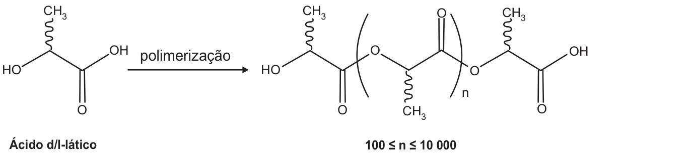
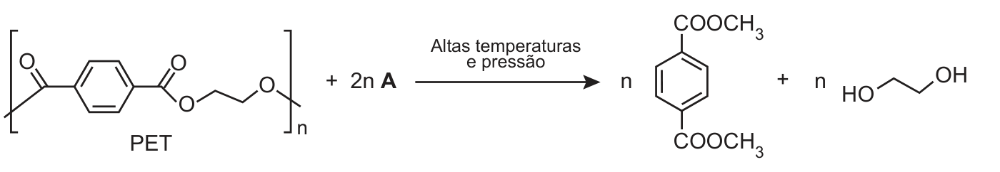
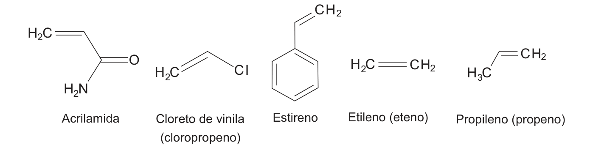
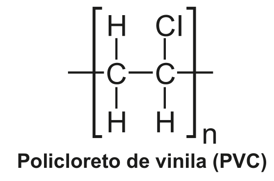
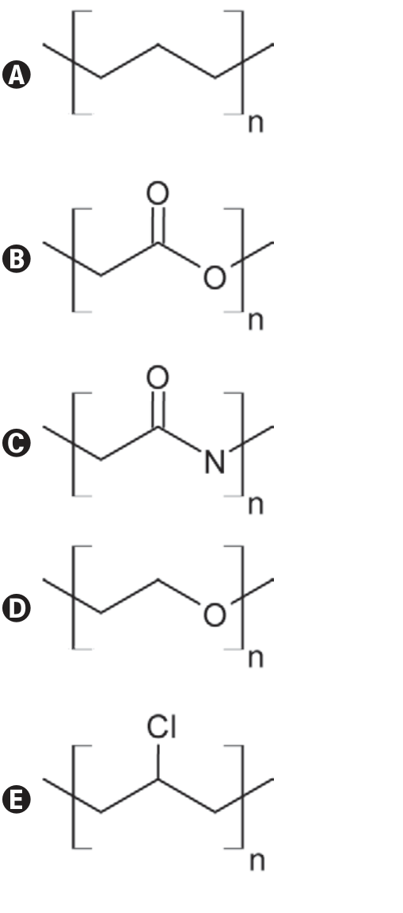

<Accordion titulo="Palavras e siglas desta aula" dica="Consulte quando encontrar um termo novo" icone="spell-check">

- **ENEM** (Exame Nacional do Ensino Médio): a prova nacional que dá acesso a faculdades e bolsas.
- **INEP** (Instituto Nacional de Estudos e Pesquisas Educacionais Anísio Teixeira): o órgão do governo que faz o ENEM.
- **PVC** (policloreto de vinila): plástico de canos e tubos.
- **PET** (poli(tereftalato de etileno)): plástico das garrafas de refrigerante.
- **PLA** (poli(ácido lático)): plástico biodegradável feito a partir do ácido lático.
- **PE** (polietileno): plástico de sacolas e embalagens.
- **PP** (polipropileno): plástico de potes e para-choques.
- **PS** (poliestireno): plástico do isopor e de copos descartáveis.
- **pH** (potencial hidrogeniônico): escala de 0 a 14; abaixo de 7 é ácido, acima é básico.
- **Anidrido etanoico**: composto formado pela união de duas moléculas de ácido etanoico com perda de água; não é álcool.
- **PVA** (poli(álcool vinílico)): polímero solúvel em água, usado em colas e embalagens que se dissolvem.
- **Metabólito**: substância produzida pelo corpo durante o funcionamento das células.
- **Bioabsorvível**: que o próprio corpo consegue absorver aos poucos.
- **Solução alcalina**: solução básica (pH acima de 7).

</Accordion>

## Antes de Começar

**O que o ENEM cobra aqui.** A prova mostra a estrutura de monômeros ou de polímeros e pede uma classificação ou uma consequência prática. Os temas que costumam aparecer são estes:

- **Tipo de polímero**: adição ou condensação; poliéster, poliamida.
- **Reações de ésteres**: hidrólise e transesterificação, usadas na reciclagem química.
- **Solubilidade**: que polímero se dissolve em água.
- **Biodegradação**: que polímero os microrganismos conseguem quebrar.
- **Queima e aquecimento**: que gás um plástico libera.

**O que você precisa saber antes.**

- **Funções orgânicas.** Álcool (−OH), ácido carboxílico (−COOH), éster (−COO−C), amida (−CO−N), éter (C−O−C), amina (C−N) (aula de Química Orgânica).
- **Polaridade e ligação de hidrogênio.** Moléculas polares se misturam com a água; grupos com O−H ou N−H fazem ligações de hidrogênio com ela (aula de Ligações Químicas).
- **Ácidos, bases e indicadores.** Ácidos deixam a água com pH abaixo de 7 e mudam a cor dos indicadores; ácido com carbonato solta CO₂ (aula de Funções Inorgânicas).

## Aula Teórica

### 1. Monômeros e polímeros

Pense num colar de contas. Cada conta é uma molécula pequena, o **monômero** ("mono" = um). O colar inteiro é o **polímero** ("poli" = muitos), uma molécula gigante com centenas ou milhares de unidades repetidas. A reação que une os monômeros é a **polimerização**.

<figure class="figura">
  <svg viewBox="0 0 460 110" role="img" aria-labelledby="fig-pol-1-t fig-pol-1-d">
    <title id="fig-pol-1-t">Monômeros formam um polímero</title>
    <desc id="fig-pol-1-d">À esquerda, várias contas soltas, que representam os monômeros. Uma seta leva à direita, onde as mesmas contas estão ligadas em fila, formando uma corrente: o polímero.</desc>
    <circle cx="40" cy="40" r="9" class="traco preenche" />
    <circle cx="75" cy="30" r="9" class="traco preenche" />
    <circle cx="55" cy="70" r="9" class="traco preenche" />
    <circle cx="95" cy="62" r="9" class="traco preenche" />
    <circle cx="120" cy="35" r="9" class="traco preenche" />
    <text x="80" y="100" class="rotulo" text-anchor="middle">monômeros</text>
    <line x1="150" y1="50" x2="205" y2="50" class="traco" />
    <polygon points="211,50 203,46 203,54" class="traco" />
    <line x1="240" y1="50" x2="430" y2="50" class="traco" />
    <circle cx="240" cy="50" r="9" class="traco preenche" />
    <circle cx="287" cy="50" r="9" class="traco preenche" />
    <circle cx="334" cy="50" r="9" class="traco preenche" />
    <circle cx="381" cy="50" r="9" class="traco preenche" />
    <circle cx="428" cy="50" r="9" class="traco preenche" />
    <text x="334" y="100" class="rotulo" text-anchor="middle">polímero</text>
  </svg>
</figure>

Na fórmula, o polímero aparece como a **unidade que se repete**, entre colchetes ou parênteses, com um **n** embaixo: n é o número de repetições (centenas ou milhares). As pontas abertas indicam que a cadeia continua dos dois lados.

- **Homopolímero**: feito de um só tipo de monômero.
- **Copolímero**: feito de dois ou mais tipos.

O nome costuma ser "poli" + nome do monômero: o polietileno vem do etileno; o poliestireno, do estireno.

Muitas estruturas vêm em **fórmula de esqueleto**: cada ponta ou dobra da linha é um carbono. Os H presos aos carbonos não aparecem; só O, N, Cl e outros átomos vêm escritos. Uma linha dupla até um O é um C=O. A linha ondulada só indica a posição do grupo no espaço e pode ser ignorada. Um **anel benzênico** é um anel de 6 carbonos, desenhado como um hexágono com três ligações duplas; preso a uma cadeia, é −C₆H₅.

**Exemplo resolvido.** O teflon é o homopolímero do tetrafluoroeteno, F₂C=CF₂. Qual é o nome dele pela regra, e o que fica entre os colchetes?

1. Nome: poli + tetrafluoroeteno = politetrafluoroeteno.
2. A unidade que se repete tem os mesmos átomos do monômero: 2 C e 4 F.
3. Resposta: −[CF₂−CF₂]ₙ−.

**Erro comum.** Achar que o n é um número fixo pequeno. Ele é grande e varia de cadeia para cadeia; por isso um plástico é uma mistura de cadeias de tamanhos diferentes.

### 2. Polímeros de adição

Na **adição**, o monômero tem uma ligação dupla **C=C**. A dupla se abre, e cada carbono usa a ligação livre para se prender ao monômero vizinho. **Nada sobra**: todos os átomos do monômero ficam no polímero.

**Fórmula: polimerização por adição**

**n CH₂=CH−X → −[CH₂−CH(X)]ₙ−**

- **n**: número de monômeros que se unem.
- **CH₂=CH−X**: o monômero, com a dupla C=C e um grupo X (H, CH₃, Cl, anel…).
- **−[CH₂−CH(X)]ₙ−**: a unidade que se repete, agora só com ligações simples entre carbonos.
- **Em palavras:** a dupla vira simples e as unidades se encadeiam.
- **Quando usar:** para achar o polímero de um monômero com C=C, ou o monômero de um polímero de cadeia só de carbonos.

<figure class="figura">

| Monômero | Grupo X | Polímero | Uso comum |
|---|---|---|---|
| etileno (eteno), CH₂=CH₂ | H | polietileno (PE) | sacolas, frascos |
| propileno (propeno), CH₂=CH−CH₃ | CH₃ | polipropileno (PP) | potes, para-choques |
| cloreto de vinila (cloroeteno; algumas provas escrevem "cloropropeno"), CH₂=CH−Cl | Cl | policloreto de vinila (PVC) | canos, forros |
| estireno, CH₂=CH−C₆H₅ | anel benzênico | poliestireno (PS) | isopor, copos |
| tetrafluoroeteno, F₂C=CF₂ | (4 F) | teflon | antiaderentes |

</figure>

**Exemplo resolvido.** A acrilonitrila, CH₂=CH−CN, forma fibras sintéticas. Escreva a unidade do polímero.

1. O monômero tem C=C: é adição.
2. A dupla vira simples; o grupo −CN fica preso ao segundo carbono.
3. Resposta: −[CH₂−CH(CN)]ₙ−, a poliacrilonitrila.

**Erro comum.** Manter a ligação dupla no polímero. Na adição, a dupla do monômero é justamente o que se gasta.

### 3. Polímeros de condensação

Na **condensação**, cada monômero tem **dois grupos** que reagem (um em cada ponta). Quando dois grupos se encontram, eles se ligam e **soltam uma molécula pequena**, quase sempre água (H₂O).

<figure class="figura">
  <svg viewBox="0 0 460 130" role="img" aria-labelledby="fig-pol-2-t fig-pol-2-d">
    <title id="fig-pol-2-t">Condensação: ácido + álcool formam éster e água</title>
    <desc id="fig-pol-2-d">Em cima, um monômero com COOH na ponta mais outro com OH na ponta. Uma seta para baixo leva ao produto: os dois monômeros unidos por uma ligação de éster, −CO−O−, mais uma molécula de água que sai.</desc>
    <rect x="40" y="16" width="60" height="26" rx="5" class="traco preenche" />
    <text x="106" y="34" class="rotulo">−COOH</text>
    <text x="175" y="34" class="rotulo">+</text>
    <text x="200" y="34" class="rotulo">HO−</text>
    <rect x="227" y="16" width="60" height="26" rx="5" class="traco preenche" />
    <line x1="165" y1="50" x2="165" y2="78" class="traco" />
    <polygon points="165,84 161,76 169,76" class="traco" />
    <rect x="40" y="92" width="60" height="26" rx="5" class="traco preenche" />
    <text x="106" y="110" class="rotulo">−CO−O−</text>
    <rect x="160" y="92" width="60" height="26" rx="5" class="traco preenche" />
    <text x="235" y="110" class="rotulo">+ H₂O</text>
    <text x="320" y="100" class="rotulo-fraco">ligação de éster</text>
    <text x="320" y="114" class="rotulo-fraco">e água que sai</text>
  </svg>
</figure>

Os dois tipos que mais caem:

- **Poliéster**: ácido carboxílico (−COOH) + álcool (−OH) → ligações de **éster** (−COO−) na cadeia, e sai água. Exemplo: o PET (poli(tereftalato de etileno)).
- **Poliamida**: ácido carboxílico (−COOH) + amina (−NH₂) → ligações de **amida** (−CO−NH−), e sai água. Exemplo: o náilon (e também as proteínas).

Os grupos podem estar em dois monômeros diferentes (um com dois COOH, outro com dois OH) ou **no mesmo monômero**, um em cada ponta. Nesse caso, a molécula se liga a outra igual a ela.

Dois nomes aparecem como alternativas: **poliuretana** (ligação −NH−CO−O−, usada em espumas) e **policarbonato** (ligação −O−CO−O−, usada em plásticos transparentes duros). **Polivinila** é nome de polímero de adição (vem do grupo vinila, CH₂=CH−), não de condensação.

**Exemplo resolvido.** O ácido adípico tem dois −COOH; a hexametilenodiamina tem dois −NH₂. Que polímero eles formam?

1. Cada monômero tem dois grupos que reagem: é condensação.
2. −COOH + −NH₂ → −CO−NH−, ligação de amida, e sai água.
3. As unidades se alternam: ácido, diamina, ácido, diamina…
4. Resposta: uma poliamida (o náilon-6,6).

**Erro comum.** Classificar pelo nome do monômero em vez da ligação formada. Olhe o que liga as unidades: −COO− é éster; −CO−NH− é amida.

### 4. Hidrólise e transesterificação

A ligação de éster pode ser desfeita. Isso explica a degradação de alguns plásticos e a **reciclagem química** (quebrar o polímero e recuperar os monômeros para fazer plástico novo). A **reciclagem mecânica**, ao contrário, só derrete e remolda o plástico, sem mudar as moléculas.

**Fórmula: hidrólise de éster**

**R−COO−R' + H₂O → R−COOH + HO−R'**

- **R e R'**: os pedaços de carbono de cada lado.
- **H₂O**: a água que quebra a ligação.
- **Em palavras:** a água devolve o ácido e o álcool que formaram o éster.
- **Quando usar:** degradação de poliésteres, ação de microrganismos.

**Exemplo resolvido.** O que a hidrólise do acetato de etila, CH₃−COO−CH₂−CH₃, produz?

1. R = CH₃ (lado do C=O); R' = CH₂−CH₃ (lado do O).
2. A água quebra a ligação C−O entre eles: o lado do C=O ganha OH; o outro lado ganha H.
3. Resposta: ácido acético (CH₃−COOH) e etanol (HO−CH₂−CH₃).

**Erro comum.** Quebrar o éster no lugar errado. A quebra é sempre entre o carbono do C=O e o O que o liga ao outro pedaço.

**Fórmula: transesterificação**

**R−COO−R' + R''−OH → R−COO−R'' + R'−OH**

- **R''−OH**: um álcool novo que entra.
- **Em palavras:** o álcool novo toma o lugar do álcool antigo no éster; o antigo sai livre.
- **Quando usar:** quando o produto é um éster com outro "final" (−COOCH₂CH₃, −COOCH₂CH₂CH₃): esse final veio do álcool que reagiu.

Para descobrir o álcool que entrou, olhe o final do éster produzido: −COO**CH₂CH₃** veio do etanol, CH₃CH₂OH; −COO**CH₂CH₂CH₃** veio do propan-1-ol, CH₃CH₂CH₂OH.

**Exemplo resolvido.** O acetato de etila, CH₃−COO−CH₂−CH₃, reage com propan-1-ol, CH₃−CH₂−CH₂−OH. Quais são os produtos?

1. O propan-1-ol toma o lugar do pedaço de etanol no éster.
2. Novo éster: CH₃−COO−CH₂−CH₂−CH₃ (acetato de propila).
3. O pedaço antigo sai como álcool livre: etanol, CH₃−CH₂−OH.

**Erro comum.** Achar que o reagente é um ácido ou um éter só porque o produto tem C=O ou C−O−C. Na transesterificação, quem entra é sempre um álcool.

### 5. Solubilidade e biodegradação

**Solubilidade.** Um polímero se dissolve em água quando tem muitos **grupos polares** capazes de fazer **ligações de hidrogênio** com ela: −OH, −COOH, −CONH₂ (amida), −NH₂. Cadeias feitas só de C e H (polietileno, polipropileno, poliestireno) são **apolares** e não se misturam com a água. O Cl do PVC deixa a cadeia só um pouco polar, e ela também não se dissolve.

**Exemplo resolvido.** O PVA (poli(álcool vinílico)) tem a unidade −[CH₂−CH(OH)]ₙ−. O teflon tem −[CF₂−CF₂]ₙ−. Qual se dissolve em água?

1. PVA: um −OH em cada unidade, que faz ligação de hidrogênio com a água.
2. Teflon: sem O−H nem N−H, não faz ligação de hidrogênio com a água.
3. Resposta: o PVA (por isso ele serve para embalagens que somem na água).

**Biodegradação.** Microrganismos (bactérias e fungos) quebram polímeros usando enzimas (proteínas que aceleram reações) que funcionam como uma **hidrólise**. Por isso, polímeros com ligações que a água consegue quebrar, principalmente **ésteres** (−COO−), são **biodegradáveis**. Cadeias só de C−C (PE, PP, PVC, PS) quase não são atacadas e ficam centenas de anos no ambiente. Éteres (C−O−C) também resistem. A amida (−CO−NH−) também pode ser hidrolisada, mas é bem mais resistente que o éster; por isso os plásticos biodegradáveis são projetados com ésteres.

Para reconhecer o éster numa unidade desenhada em esqueleto: procure um **C=O** cujo carbono também está ligado a um **O** que continua a cadeia. Se no lugar do O estiver um N, é amida; se houver O sem C=O ao lado, é éter.

**Erro comum.** Achar que qualquer polímero com oxigênio é biodegradável. O que importa é o **grupo**: éster se hidrolisa com facilidade; éter, não.

### 6. Aquecimento e queima de plásticos

Aquecido sem chama (**decomposição térmica**) ou queimado, um plástico solta gases. Os átomos que ele tem decidem os gases:

- Só C e H (PE, PP, PS): na queima completa, CO₂ e H₂O; na incompleta, também CO (monóxido de carbono, tóxico) e fuligem.
- Com **Cl** (PVC): o Cl sai junto com um H do carbono vizinho, na forma de **HCl** (cloreto de hidrogênio), um gás ácido e corrosivo.
- Com **N** (náilon): podem sair gases tóxicos com nitrogênio.

Algumas palavras para identificar o gás (o CO também é diatômico heteronuclear, mas não é ácido: não muda a cor do indicador numa solução básica nem reage com carbonato):

- **Diatômico**: molécula com 2 átomos (H₂, Cl₂, CO, HCl, NO). **Heteronuclear**: com átomos **diferentes** (CO, HCl, NO). **Homonuclear**: átomos iguais (H₂, Cl₂). O CO₂ tem 3 átomos: é triatômico.
- Um gás **ácido** borbulhado numa solução básica (**alcalina**) com indicador muda a cor dela, porque neutraliza a base.
- Ácido + **carbonato** → sal + água + **CO₂** (as bolhas de gás carbônico).

**Exemplo resolvido.** Entre O₂, NO, H₂O e N₂, qual é diatômico heteronuclear? E o que se vê quando vinagre (ácido) cai no bicarbonato de sódio?

1. O₂ e N₂: 2 átomos iguais (homonucleares).
2. H₂O: 3 átomos.
3. NO: 2 átomos diferentes: diatômico heteronuclear.
4. Vinagre + bicarbonato: ácido + carbonato, sai CO₂ (efervescência).

**Erro comum.** Achar que o PVC solta Cl₂. O cloro sai preso a um hidrogênio, como HCl, que é ácido; o Cl₂ é homonuclear.

### Armadilhas típicas do INEP

1. **Adição × condensação**: adição exige C=C e não solta nada; condensação solta água.
2. **Poliéster × poliamida**: olhe a ligação entre as unidades (−COO− ou −CO−NH−).
3. **Um monômero com dois grupos** também faz condensação, sozinho.
4. **Transesterificação**: o final do éster produzido diz qual álcool entrou.
5. **Solubilidade**: grupos polares (OH, amida) dissolvem; só C e H não.
6. **Biodegradável**: é o grupo éster que se hidrolisa, não qualquer oxigênio.
7. **PVC aquecido**: solta HCl, não Cl₂.

## Tópicos-Chave para Revisão

#### 1. Monômeros e polímeros

**Monômeros** se repetem e formam o **polímero**; a **unidade que se repete** vai entre colchetes com **n**; nome: **poli** + monômero.

<figure class="figura">
  <svg viewBox="0 0 460 70" role="img" aria-labelledby="fig-pol-1-rev-t fig-pol-1-rev-d">
    <title id="fig-pol-1-rev-t">Monômeros e polímero (resumo)</title>
    <desc id="fig-pol-1-rev-d">Contas soltas, uma seta, e as contas ligadas em fila.</desc>
    <circle cx="50" cy="30" r="8" class="traco preenche" />
    <circle cx="80" cy="45" r="8" class="traco preenche" />
    <circle cx="105" cy="25" r="8" class="traco preenche" />
    <line x1="140" y1="35" x2="195" y2="35" class="traco" />
    <polygon points="201,35 193,31 193,39" class="traco" />
    <line x1="240" y1="35" x2="420" y2="35" class="traco" />
    <circle cx="240" cy="35" r="8" class="traco preenche" />
    <circle cx="300" cy="35" r="8" class="traco preenche" />
    <circle cx="360" cy="35" r="8" class="traco preenche" />
    <circle cx="420" cy="35" r="8" class="traco preenche" />
  </svg>
</figure>

#### 2. Adição

**n CH₂=CH−X → −[CH₂−CH(X)]ₙ−**: a **dupla C=C** se abre e **nada sobra** (PE, PP, PVC, PS, teflon).

#### 3. Condensação

Dois grupos reagem e **soltam água**: ácido + álcool dá **poliéster**; ácido + amina dá **poliamida**; um monômero com os **dois grupos** também serve.

#### 4. Hidrólise e transesterificação

**R−COO−R' + H₂O → R−COOH + HO−R'**; **R−COO−R' + R''−OH → R−COO−R'' + R'−OH**: o final do **éster** produzido diz qual **álcool** entrou.

#### 5. Solubilidade e biodegradação

Grupos **polares** (OH, amida) fazem **ligação de hidrogênio** e dissolvem; **ésteres** se hidrolisam com facilidade e são **biodegradáveis**; **amidas** resistem mais; cadeias só **C−C** resistem.

#### 6. Aquecimento e queima

Só C e H: **CO₂**, H₂O e CO; **PVC** solta **HCl** (diatômico **heteronuclear**, ácido); ácido + carbonato solta **CO₂**.

## Questões do ENEM

*Marque uma alternativa em cada questão e confira tudo de uma vez no botão do fim.*

**Questão 1**

*ENEM 2015 · 2ª aplicação · 1º dia · caderno branco · questão 69*

O poli(ácido lático) ou PLA é um material de interesse tecnológico por ser um polímero biodegradável e bioabsorvível. O ácido lático, um metabólito comum no organismo humano, é a matéria-prima para produção do PLA, de acordo com a equação química simplificada:

<figure class="figura">

</figure>

Que tipo de polímero de condensação é formado nessa reação?

A) Poliéster.\
B) Polivinila.\
C) Poliamida.\
D) Poliuretana.\
E) Policarbonato.

**Questão 2**

*ENEM 2019 · 2º dia · caderno azul · questão 124*

Uma das técnicas de reciclagem química do polímero PET [poli(tereftalato de etileno)] gera o tereftalato de metila e o etanodiol, conforme o esquema de reação, e ocorre por meio de uma reação de transesterificação.

<figure class="figura">

</figure>

O composto **A**, representado no esquema de reação, é o

A) metano.\
B) metanol.\
C) éter metílico.\
D) ácido etanoico.\
E) anidrido etanoico.

**Questão 3**

*ENEM 2017 · 2ª aplicação · 2º dia · caderno azul · questão 120*

Os polímeros são materiais amplamente utilizados na sociedade moderna, alguns deles na fabricação de embalagens e filmes plásticos, por exemplo. Na figura estão relacionadas as estruturas de alguns monômeros usados na produção de polímeros de adição comuns.

<figure class="figura">

</figure>

Dentre os homopolímeros formados a partir dos monômeros da figura, aquele que apresenta solubilidade em água é

A) polietileno.\
B) poliestireno.\
C) polipropileno.\
D) poliacrilamida.\
E) policloreto de vinila.

**Questão 4**

*ENEM 2020 · 2º dia · caderno azul · questão 100*

Nos dias atuais, o amplo uso de objetos de plástico gera bastante lixo, que muitas vezes é eliminado pela população por meio da queima. Esse procedimento é prejudicial ao meio ambiente por lançar substâncias poluentes. Para constatar esse problema, um estudante analisou a decomposição térmica do policloreto de vinila (PVC), um tipo de plástico, cuja estrutura é representada na figura.

<figure class="figura">

</figure>

Para realizar esse experimento, o estudante colocou uma amostra de filme de PVC em um tubo de ensaio e o aqueceu, promovendo a decomposição térmica. Houve a liberação majoritária de um gás diatômico heteronuclear que foi recolhido em um recipiente acoplado ao tubo de ensaio. Esse gás, quando borbulhado em solução alcalina diluída contendo indicador ácido-base, alterou a cor da solução. Além disso, em contato com uma solução aquosa de carbonato de sódio (Na₂CO₃), liberou gás carbônico.

Qual foi o gás liberado majoritariamente na decomposição térmica desse tipo de plástico?

A) H₂\
B) Cl₂\
C) CO\
D) CO₂\
E) HCl

**Questão 5**

*ENEM 2024 · 2ª aplicação · 2º dia · caderno azul · questão 97*

O longo tempo que polímeros levam para serem degradados tem gerado problema de acúmulo de resíduos sólidos. A fim de contornar essa situação, têm sido propostos novos polímeros biodegradáveis que apresentam grupos ésteres hidrolisáveis, facilitando a assimilação desses polímeros pelos microrganismos.

Qual unidade monomérica representa o polímero melhor assimilado pelos microrganismos?

<figure class="figura">

</figure>

A) Estrutura A\
B) Estrutura B\
C) Estrutura C\
D) Estrutura D\
E) Estrutura E
