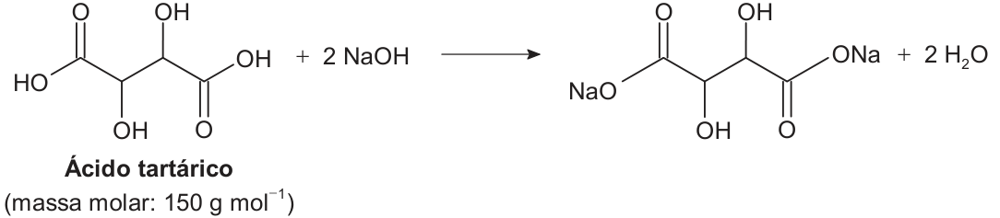

<Accordion titulo="Palavras e siglas desta aula" dica="Consulte quando encontrar um termo novo" icone="spell-check">

- **ENEM** (Exame Nacional do Ensino Médio): a prova nacional que dá acesso a faculdades e bolsas.
- **INEP** (Instituto Nacional de Estudos e Pesquisas Educacionais Anísio Teixeira): o órgão do governo que faz o ENEM.
- **ppm** (partes por milhão): quantas partes de uma substância há em cada 1 000 000 de partes da mistura.
- **Hidrocarbonetos**: compostos feitos só de carbono e hidrogênio, como os do petróleo e do diesel.
- **Fármaco**: substância que age como remédio.
- **Agregação plaquetária**: a união das plaquetas do sangue para formar um coágulo.
- **Anticoagulante**: remédio que dificulta a formação de coágulos.
- **Plasma**: a parte líquida do sangue, sem as células.
- **Intravascular**: dentro dos vasos sanguíneos.
- **Via intravenosa**: aplicação direto na veia.
- **Hemorragia**: sangramento intenso.
- **Hidroponia**: cultivo de plantas sem solo, com as raízes em água com nutrientes.

</Accordion>

## Antes de Começar

**O que o ENEM cobra aqui.** A prova descreve uma mistura real e pede uma massa, um volume ou uma concentração. Os temas que costumam aparecer são estes:

- **Concentração em g/L ou mg/L**, com conversão de unidades.
- **Limites** de concentração: o máximo permitido ou o mínimo necessário.
- **Concentração em mol/L** e a quantidade de cada **íon** de um sal.
- **Diluição** e preparo de uma solução a partir de outra mais concentrada.
- **Titulação**: achar a concentração pelo volume gasto de outra solução.
- **ppm** e redução percentual de um poluente.

**O que você precisa saber antes.**

- **Mol e massa molar.** n = m ÷ massa molar: a massa (m, em g) dividida pela massa molar (g/mol) dá a quantidade em mols (n) (aula de Estequiometria).
- **Proporção da equação.** Os coeficientes dizem quantos mols de cada substância reagem (aula de Estequiometria).
- **Íons.** Um sal é formado por íons: o NaCl tem Na⁺ e Cl⁻ (aula de Funções Inorgânicas).
- **Potências de 10.** 10⁻³ = 0,001 e 10⁻⁴ = 0,0001. Para multiplicar, some os expoentes: 10² × 10⁻⁶ = 10⁻⁴.

## Aula Teórica

### 1. Solução e concentração

Quando você mexe açúcar na água e ele some, formou-se uma **solução**: uma mistura homogênea, em que não se enxergam as partes. Quem se dissolve é o **soluto** (o açúcar). Quem dissolve é o **solvente** (a água). No ENEM (Exame Nacional do Ensino Médio), o solvente é quase sempre a água; aí a solução é **aquosa**.

<figure class="figura">
  <svg viewBox="0 0 460 150" role="img" aria-labelledby="fig-sol-1-t fig-sol-1-d">
    <title id="fig-sol-1-t">Soluto e solvente formam a solução</title>
    <desc id="fig-sol-1-d">Um monte de soluto mais um copo de solvente formam um copo de solução, com as partículas do soluto espalhadas por igual no líquido.</desc>
    <circle cx="50" cy="96" r="4" class="traco preenche" />
    <circle cx="62" cy="96" r="4" class="traco preenche" />
    <circle cx="74" cy="96" r="4" class="traco preenche" />
    <circle cx="56" cy="86" r="4" class="traco preenche" />
    <circle cx="68" cy="86" r="4" class="traco preenche" />
    <circle cx="62" cy="76" r="4" class="traco preenche" />
    <text x="62" y="130" class="rotulo" text-anchor="middle">soluto</text>
    <text x="118" y="92" class="rotulo" text-anchor="middle">+</text>
    <polyline points="150,40 155,110 215,110 220,40" class="traco" />
    <line x1="152" y1="58" x2="218" y2="58" class="traco-fino" />
    <text x="185" y="130" class="rotulo" text-anchor="middle">solvente</text>
    <line x1="245" y1="78" x2="283" y2="78" class="traco" />
    <polygon points="291,78 283,74 283,82" class="traco" />
    <polyline points="315,40 320,110 380,110 385,40" class="traco" />
    <line x1="317" y1="58" x2="383" y2="58" class="traco-fino" />
    <circle cx="332" cy="70" r="4" class="traco preenche" />
    <circle cx="362" cy="68" r="4" class="traco preenche" />
    <circle cx="347" cy="84" r="4" class="traco preenche" />
    <circle cx="330" cy="98" r="4" class="traco preenche" />
    <circle cx="368" cy="92" r="4" class="traco preenche" />
    <circle cx="352" cy="102" r="4" class="traco preenche" />
    <text x="350" y="130" class="rotulo" text-anchor="middle">solução</text>
  </svg>
</figure>

A **concentração** diz quanto soluto há em cada porção da solução. É como a receita de um refresco: "30 g de pó por meio litro" é mais forte que "30 g de pó por um litro".

**Fórmula: concentração comum**

**C = m ÷ V**

- **C**: concentração, em g/L (gramas por litro).
- **m**: massa do soluto, em g.
- **V**: volume da solução, em L (litros).
- **Em palavras:** quantos gramas de soluto há em cada litro.
- **Quando usar:** quando o enunciado dá massa e volume, ou uma concentração em g/L, mg/L ou mg/mL.

As unidades aparecem de vários jeitos. 1 L = 1 000 mL (mililitros) e 1 g = 1 000 mg (miligramas). Por isso **1 mg/mL = 1 g/L**: os dois "mil" se cancelam. A prova também escreve **g L⁻¹** e **mol L⁻¹**: o expoente −1 quer dizer "por".

**Exemplo resolvido.** Um refresco leva 30 g de açúcar em 0,5 L. Qual a concentração em g/L e em mg/mL?

1. Dados: m = 30 g; V = 0,5 L.
2. Fórmula: C = m ÷ V.
3. Substituir: C = 30 ÷ 0,5.
4. Calcular: C = 60 g/L.
5. Em mg/mL: 60 g/L = 60 mg/mL (mesmo número, pela regra acima).

**Erro comum.** Esquecer de converter mL em L. 250 mL são 0,25 L, não 250 L.

### 2. Massa de soluto e limites

Virando a fórmula, dá para achar quanto soluto há num volume.

**Fórmula: massa de soluto**

**m = C × V**

- **m**: massa do soluto (na unidade de massa da concentração).
- **C**: concentração.
- **V**: volume da solução, na mesma unidade de volume da concentração.
- **Em palavras:** quanto soluto cabe naquele volume, naquela concentração.
- **Quando usar:** para achar a massa de soluto num volume, ou o volume que contém uma massa (V = m ÷ C).

Muitas questões dão **limites**: "acima de tal concentração faz mal", "abaixo de tal não funciona". Para o **máximo** permitido, use o limite de cima; para o **mínimo** necessário, use o de baixo. Leia com cuidado qual dos dois o enunciado pede.

Outro detalhe: o soluto se espalha só no líquido em que se dissolve. Se só **uma parte** do volume é esse líquido, use só essa parte como V.

**Exemplo resolvido.** Uma piscina tem 40 000 L de água, e o cloro não pode passar de 2 mg/L. O produto vendido tem 160 g/L de cloro. Qual o volume máximo de produto que se pode pôr?

1. Massa máxima de cloro: m = 2 mg/L × 40 000 L = 80 000 mg = 80 g.
2. Volume de produto que contém 80 g: V = m ÷ C = 80 ÷ 160.
3. Calcular: V = 0,5 L.
4. Resposta: no máximo 0,5 L (500 mL) de produto.

**Exemplo resolvido.** Um tanque de 1 000 L tem 200 L de óleo boiando sobre a água. Um sal que só se dissolve em água deve ficar a 3 g/L. Quanto sal usar?

1. Volume onde o sal se espalha: 1 000 − 200 = 800 L de água.
2. Massa: m = 3 g/L × 800 L = 2 400 g = 2,4 kg.
3. Resposta: 2,4 kg (usar os 1 000 L daria 3 kg, e a concentração passaria do valor).

**Erro comum.** Usar o volume total quando o soluto só ocupa uma parte dele, ou usar o limite mínimo quando a pergunta é sobre o máximo.

### 3. Concentração em mol/L e íons

Em vez de gramas, dá para contar o soluto em mols.

**Fórmula: concentração em quantidade de matéria**

**M = n ÷ V**

- **M**: concentração em mol/L (também chamada **molaridade**).
- **n**: quantidade de soluto, em mol.
- **V**: volume da solução, em L.
- **Em palavras:** quantos mols de soluto há em cada litro.
- **Quando usar:** quando o enunciado dá mol/L ou pede mols.

**Exemplo resolvido.** Há 0,5 mol de glicose dissolvidos em 250 mL de solução. Qual a concentração em mol/L?

1. Volume em litros: 250 mL = 0,25 L.
2. Fórmula: M = n ÷ V.
3. Calcular: 0,5 ÷ 0,25 = 2 mol/L.

**Erro comum.** Dividir pelo volume em mL (0,5 ÷ 250 = 0,002), o que dá um valor mil vezes menor.

**Fórmula: de mol/L para g/L**

**C = M × massa molar**

- **C**: concentração em g/L.
- **M**: concentração em mol/L.
- **massa molar**: em g/mol.
- **Em palavras:** cada mol pesa "massa molar" gramas; então cada litro tem M × massa molar gramas.
- **Quando usar:** quando a questão dá mol/L e pede g/L, ou o contrário (aí, divida pela massa molar).

Quando um sal se dissolve, ele se separa em íons (**dissociação**). A fórmula diz quantos de cada: MgCl₂ → Mg²⁺ + 2 Cl⁻. Então uma solução 0,3 mol/L de MgCl₂ tem 0,3 mol/L de Mg²⁺ e **0,6 mol/L de Cl⁻**. O índice pequeno depois de um parêntese vale para tudo que está dentro: Al₂(SO₄)₃ solta 2 íons Al³⁺ e 3 íons SO₄²⁻.

Quando a questão só dá o **nome** do sal, monte a fórmula pelas cargas: o total positivo tem de igualar o negativo. O sulfato de alumínio junta Al³⁺ (carga +3) com SO₄²⁻ (carga −2): 2 alumínios dão +6 e 3 sulfatos dão −6, então Al₂(SO₄)₃. Na massa molar, o parêntese conta tantas vezes quanto o índice. Assim, Al₂(SO₄)₃ = 2 × 27 + 3 × (32 + 4 × 16) = 54 + 3 × 96 = 342 g/mol. Íons comuns: nitrato (NO₃⁻), sulfato (SO₄²⁻), carbonato (CO₃²⁻), cloreto (Cl⁻), cálcio (Ca²⁺), magnésio (Mg²⁺), sódio (Na⁺) e potássio (K⁺).

**Exemplo resolvido.** Qual a concentração em g/L de uma solução 0,3 mol/L de MgCl₂ (Mg = 24, Cl = 35,5)?

1. Massa molar: 24 + 2 × 35,5 = 24 + 71 = 95 g/mol.
2. Fórmula: C = M × massa molar.
3. Calcular: 0,3 × 95 = 28,5 g/L.
4. Resposta: 28,5 g/L de MgCl₂.

Às vezes a questão dá a concentração de um **íon** e pede a massa do **sal**. Use a proporção em massa entre o íon e o sal. No KCl (74,5 g/mol), cada 74,5 g têm 39 g de potássio (K⁺).

**Exemplo resolvido.** Uma solução de laboratório tem 0,39 g/L de K⁺, que vem só do KCl. Quanto KCl há em 4 L?

1. Massa de K⁺: 0,39 g/L × 4 L = 1,56 g.
2. Proporção: 39 g de K⁺ vêm de 74,5 g de KCl.
3. Regra de três: 1,56 × 74,5 ÷ 39 = 2,98 g de KCl.
4. Resposta: cerca de 3,0 g de KCl.

Se essa solução fosse dividida igualmente entre 4 frascos, cada frasco teria o total dividido por 4. Leia se a pergunta quer o total ou uma porção.

**Erro comum.** Dividir pela massa molar quando é para multiplicar (de mol/L para g/L, multiplique). Outro: confundir a massa do íon com a massa do sal. O sal pesa mais, porque traz o outro íon junto.

### 4. Diluição e preparo a partir de solução concentrada

**Diluir** é juntar solvente. O volume cresce, a concentração cai, mas a **quantidade de soluto não muda**. Veja no esquema: as mesmas partículas, espalhadas num volume maior.

<figure class="figura">
  <svg viewBox="0 0 460 160" role="img" aria-labelledby="fig-sol-2-t fig-sol-2-d">
    <title id="fig-sol-2-t">Diluição</title>
    <desc id="fig-sol-2-d">À esquerda, um copo pequeno com seis partículas de soluto: solução concentrada. Uma seta indica que se junta água. À direita, um copo maior com as mesmas seis partículas mais espalhadas: solução diluída. A quantidade de soluto é a mesma.</desc>
    <polyline points="60,60 64,120 116,120 120,60" class="traco" />
    <line x1="62" y1="74" x2="118" y2="74" class="traco-fino" />
    <circle cx="76" cy="86" r="4" class="traco preenche" />
    <circle cx="90" cy="84" r="4" class="traco preenche" />
    <circle cx="104" cy="88" r="4" class="traco preenche" />
    <circle cx="80" cy="104" r="4" class="traco preenche" />
    <circle cx="94" cy="100" r="4" class="traco preenche" />
    <circle cx="106" cy="108" r="4" class="traco preenche" />
    <text x="90" y="142" class="rotulo" text-anchor="middle">concentrada</text>
    <line x1="160" y1="90" x2="230" y2="90" class="traco" />
    <polygon points="238,90 230,86 230,94" class="traco" />
    <text x="198" y="80" class="rotulo-fraco" text-anchor="middle">+ água</text>
    <polyline points="280,20 288,120 392,120 400,20" class="traco" />
    <line x1="283" y1="34" x2="397" y2="34" class="traco-fino" />
    <circle cx="306" cy="50" r="4" class="traco preenche" />
    <circle cx="360" cy="46" r="4" class="traco preenche" />
    <circle cx="334" cy="72" r="4" class="traco preenche" />
    <circle cx="376" cy="84" r="4" class="traco preenche" />
    <circle cx="304" cy="98" r="4" class="traco preenche" />
    <circle cx="350" cy="106" r="4" class="traco preenche" />
    <text x="340" y="142" class="rotulo" text-anchor="middle">diluída (mesmo soluto)</text>
  </svg>
</figure>

**Fórmula: diluição**

**C₁ × V₁ = C₂ × V₂**

- **C₁, V₁**: concentração e volume da solução **antes** (a concentrada).
- **C₂, V₂**: concentração e volume **depois** (a diluída).
- **Em palavras:** a quantidade de soluto (C × V) é a mesma antes e depois.
- **Quando usar:** para saber quanto de uma solução concentrada (um **estoque**) usar para preparar outra, mais fraca. Vale em g/L ou em mol/L, desde que os dois lados usem a mesma unidade.

Às vezes as unidades são diferentes: a solução final em mol/L de um íon, o estoque em g/L de um sal. Faça em etapas: **mols** do íon → mols do **sal** → **gramas** do sal → **volume** do estoque.

**Exemplo resolvido.** Quanto de um xarope de glicose a 200 g/L é preciso para preparar 10 L de solução a 4 g/L?

1. Soluto necessário: 4 g/L × 10 L = 40 g de glicose.
2. Volume de estoque com 40 g: 40 ÷ 200 = 0,2 L.
3. Resposta: 0,2 L (200 mL) de xarope, completando com água até 10 L.

**Exemplo resolvido.** Um laboratório quer 20 L de solução com 0,03 mol/L de Cl⁻. Tem um estoque de MgCl₂ a 19 g/L. Quanto estoque usar?

1. Mols de Cl⁻ necessários: 0,03 × 20 = 0,6 mol.
2. Cada MgCl₂ solta 2 Cl⁻: 0,6 ÷ 2 = 0,3 mol de MgCl₂.
3. Massa: 0,3 × 95 = 28,5 g de MgCl₂.
4. Volume do estoque: 28,5 ÷ 19 = 1,5 L.
5. Resposta: 1,5 L de estoque, completando com água até 20 L.

**Erro comum.** Esquecer quantos íons o sal solta. Sem dividir por 2 no exemplo acima, a resposta sairia o dobro.

### 5. Titulação

A **titulação** mede a concentração de uma amostra. Um volume conhecido da amostra (a **alíquota**) reage com uma solução de concentração conhecida (o **titulante**), gota a gota, até a reação acabar exatamente. Em geral é uma **neutralização**: ácido + base → sal + água. Um indicador muda de cor no ponto final.

O raciocínio tem quatro passos:

1. Mols do titulante gastos: n = M × V (com V em litros).
2. Mols da amostra, pela proporção da equação.
3. Concentração da amostra: M = n ÷ V da alíquota.
4. Se pedir g/L: multiplique pela massa molar.

**Exemplo resolvido.** Uma alíquota de 20,0 mL de água de cal, Ca(OH)₂ (74 g/mol), é titulada com HCl 0,050 mol/L e gasta 12,0 mL. A reação é Ca(OH)₂ + 2 HCl → CaCl₂ + 2 H₂O. Qual a concentração da água de cal em g/L?

1. HCl gasto: 0,050 × 0,0120 = 0,00060 mol = 6,0 × 10⁻⁴ mol.
2. Proporção: 1 Ca(OH)₂ para 2 HCl: 6,0 × 10⁻⁴ ÷ 2 = 3,0 × 10⁻⁴ mol de Ca(OH)₂.
3. Concentração: 3,0 × 10⁻⁴ ÷ 0,0200 = 0,015 mol/L.
4. Em g/L: 0,015 × 74 = 1,11 g/L.
5. Resposta: cerca de 1,1 g/L.

Um ácido pode ter mais de um H⁺ que reage (um **H ionizável**). Por isso a equação pode pedir 2 ou 3 mols de base por mol de ácido. A **fórmula estrutural** é o desenho da molécula; nela, cada ponta ou dobra da linha é um carbono. Os H que reagem com a base são os dos grupos **COOH**, que viram COONa. Os OH ligados direto à cadeia (de álcool) não reagem com a base. Se a questão dá a equação, basta ler os coeficientes.

**Erro comum.** Ignorar a proporção e igualar os mols do titulante aos da amostra. Outro: esquecer de passar mL para L (12,0 mL = 0,0120 L).

### 6. Partes por milhão e redução percentual

Para quantidades muito pequenas, usa-se **ppm** (partes por milhão): 1 ppm é 1 parte em 1 000 000 de partes. Em massa, **1 ppm = 1 mg por kg** (1 kg = 1 000 000 mg). Em água, como 1 L pesa cerca de 1 kg, 1 ppm ≈ 1 mg/L.

Se uma impureza vira poluente quando o produto é usado, a quantidade emitida acompanha o teor da impureza: teor 10 vezes menor, emissão 10 vezes menor.

**Fórmula: redução percentual**

**redução = (antes − depois) ÷ antes × 100%**

- **antes**: o valor inicial (ppm, g, qualquer unidade).
- **depois**: o valor final, na mesma unidade.
- **Em palavras:** quanto do valor inicial deixou de existir.
- **Quando usar:** quando a pergunta pede "redução percentual" ou "quanto por cento diminuiu".

**Exemplo resolvido.** Uma tinta tinha 600 ppm de chumbo e passou a ter 90 ppm. Qual a redução percentual?

1. Diferença: 600 − 90 = 510 ppm.
2. Divisão pelo valor inicial: 510 ÷ 600 = 0,85.
3. Resposta: redução de 85%.

**Erro comum.** Calcular o que sobrou (90 ÷ 600 = 15%) e marcar como redução. Outro: usar um valor intermediário da história no lugar do valor final (ou inicial) que a pergunta nomeia.

### Armadilhas típicas do INEP

1. **mL e L misturados**: converta antes de fazer a conta.
2. **Máximo × mínimo**: use o limite que a pergunta pede.
3. **Volume errado**: se o soluto só ocupa parte da mistura, use só essa parte.
4. **Íon × sal**: a massa do sal é maior que a do íon; um sal pode soltar 2 ou 3 íons iguais.
5. **Total × porção**: veja se a pergunta quer o total ou uma parte dividida.
6. **Proporção da titulação**: 1 ácido pode gastar 2 bases.
7. **Redução × o que sobrou**: redução é o que saiu, não o que ficou.

## Tópicos-Chave para Revisão

#### 1. Solução e concentração

**Soluto** dissolvido no **solvente**; **C = m ÷ V** em g/L; **1 mg/mL = 1 g/L**; **1 L = 1 000 mL**.

#### 2. Massa de soluto e limites

**m = C × V** e **V = m ÷ C**; para o **máximo**, o limite de cima; use só o **volume** em que o soluto se espalha.

#### 3. Concentração em mol/L e íons

**M = n ÷ V**; **C = M × massa molar**; na **dissociação**, MgCl₂ solta 2 Cl⁻; a massa do **sal** é maior que a do **íon**.

#### 4. Diluição

**C₁ × V₁ = C₂ × V₂**: a quantidade de **soluto** não muda; com unidades diferentes, siga **mols → sal → gramas → volume**.

<figure class="figura">
  <svg viewBox="0 0 460 90" role="img" aria-labelledby="fig-sol-2-rev-t fig-sol-2-rev-d">
    <title id="fig-sol-2-rev-t">Diluição (resumo)</title>
    <desc id="fig-sol-2-rev-d">Copo pequeno com quatro partículas, seta com mais água, copo grande com as mesmas quatro partículas mais espalhadas.</desc>
    <polyline points="90,20 93,70 137,70 140,20" class="traco" />
    <circle cx="104" cy="44" r="4" class="traco preenche" />
    <circle cx="124" cy="42" r="4" class="traco preenche" />
    <circle cx="108" cy="60" r="4" class="traco preenche" />
    <circle cx="126" cy="58" r="4" class="traco preenche" />
    <line x1="170" y1="45" x2="230" y2="45" class="traco" />
    <polygon points="238,45 230,41 230,49" class="traco" />
    <text x="202" y="36" class="rotulo-fraco" text-anchor="middle">+ água</text>
    <polyline points="270,8 276,70 364,70 370,8" class="traco" />
    <circle cx="292" cy="24" r="4" class="traco preenche" />
    <circle cx="346" cy="30" r="4" class="traco preenche" />
    <circle cx="310" cy="54" r="4" class="traco preenche" />
    <circle cx="350" cy="58" r="4" class="traco preenche" />
    <text x="115" y="85" class="rotulo-fraco" text-anchor="middle">C₁ × V₁</text>
    <text x="320" y="85" class="rotulo-fraco" text-anchor="middle">C₂ × V₂</text>
  </svg>
</figure>

#### 5. Titulação

Mols do **titulante** (**n = M × V**) → **proporção** da equação → mols da **alíquota** → concentração; H dos grupos **COOH** reagem com a base.

#### 6. ppm e redução

**1 ppm = 1 mg por kg**; **redução = (antes − depois) ÷ antes × 100%**; a **emissão** acompanha o teor.

## Questões do ENEM

*Marque uma alternativa em cada questão e confira tudo de uma vez no botão do fim.*

**Questão 1**

*ENEM 2014 · 1º dia · caderno azul · questão 56*

Diesel é uma mistura de hidrocarbonetos que também apresenta enxofre em sua composição. Esse enxofre é um componente indesejável, pois o trióxido de enxofre gerado é um dos grandes causadores da chuva ácida. Nos anos 1980, não havia regulamentação e era utilizado óleo diesel com 13 000 ppm de enxofre. Em 2009, o diesel passou a ter 1 800 ppm de enxofre (S1800) e, em seguida, foi inserido no mercado o diesel S500 (500 ppm). Em 2012, foi difundido o diesel S50, com 50 ppm de enxofre em sua composição. Atualmente, é produzido um diesel com teores de enxofre ainda menores.

Os impactos da má qualidade do óleo diesel brasileiro. Disponível em: www.cnt.org.br. Acesso em: 20 dez. 2012 (adaptado).

A substituição do diesel usado nos anos 1980 por aquele difundido em 2012 permitiu uma redução percentual de emissão de SO₃ de

A) 86,2%.\
B) 96,2%.\
C) 97,2%.\
D) 99,6%.\
E) 99,9%.

**Questão 2**

*ENEM 2013 · 1º dia · caderno azul · questão 71*

A varfarina é um fármaco que diminui a agregação plaquetária, e por isso é utilizada como anticoagulante, desde que esteja presente no plasma, com uma concentração superior a 1,0 mg/L. Entretanto, concentrações plasmáticas superiores a 4,0 mg/L podem desencadear hemorragias. As moléculas desse fármaco ficam retidas no espaço intravascular e dissolvidas exclusivamente no plasma, que representa aproximadamente 60% do sangue em volume. Em um medicamento, a varfarina é administrada por via intravenosa na forma de solução aquosa, com concentração de 3,0 mg/mL. Um indivíduo adulto, com volume sanguíneo total de 5,0 L, será submetido a um tratamento com solução injetável desse medicamento.

Qual é o máximo volume da solução do medicamento que pode ser administrado a esse indivíduo, pela via intravenosa, de maneira que não ocorram hemorragias causadas pelo anticoagulante?

A) 1,0 mL\
B) 1,7 mL\
C) 2,7 mL\
D) 4,0 mL\
E) 6,7 mL

**Questão 3**

*ENEM 2024 · 2º dia · caderno azul · questão 97*

O soro caseiro serve para combater a desidratação por meio da reposição da água e sais minerais perdidos, por exemplo, por diarreia. Uma receita simples para a sua preparação consiste em utilizar duas colheres grandes (de sopa) de açúcar e duas colheres pequenas (de café) de sal de cozinha, dissolvidos em 2 L de água fervida, obtendo-se uma solução com concentração de íon sódio de 1,4 mg/mL.

Considere as massas molares: NaCl = 58,5 g/mol; Na = 23 g/mol.

Qual é o valor mais próximo da massa, em grama, de cloreto de sódio presente em uma única colher pequena?

A) 0,7 g\
B) 1,8 g\
C) 2,8 g\
D) 3,6 g\
E) 7,0 g

**Questão 4**

*ENEM 2022 · 2º dia · caderno azul · questão 108*

O ácido tartárico é o principal ácido do vinho e está diretamente relacionado com sua qualidade. Na avaliação de um vinho branco em produção, uma analista neutralizou uma alíquota de 25,0 mL do vinho com NaOH a 0,10 mol L⁻¹, consumindo um volume igual a 8,0 mL dessa base. A reação para esse processo de titulação é representada pela equação química:

<figure class="figura">

</figure>

A concentração de ácido tartárico no vinho analisado é mais próxima de:

A) 1,8 g L⁻¹\
B) 2,4 g L⁻¹\
C) 3,6 g L⁻¹\
D) 4,8 g L⁻¹\
E) 9,6 g L⁻¹

**Questão 5**

*ENEM 2015 · 1º dia · caderno azul · questão 55*

A hidroponia pode ser definida como uma técnica de produção de vegetais sem necessariamente a presença de solo. Uma das formas de implementação é manter as plantas com suas raízes suspensas em meio líquido, de onde retiram os nutrientes essenciais. Suponha que um produtor de rúcula hidropônica precise ajustar a concentração do íon nitrato (NO₃⁻) para 0,009 mol/L em um tanque de 5 000 litros e, para tanto, tem em mãos uma solução comercial nutritiva de nitrato de cálcio 90 g/L. As massas molares dos elementos N, O e Ca são iguais a 14 g/mol, 16 g/mol e 40 g/mol, respectivamente.

Qual o valor mais próximo do volume da solução nutritiva, em litros, que o produtor deve adicionar ao tanque?

A) 26\
B) 41\
C) 45\
D) 51\
E) 82
