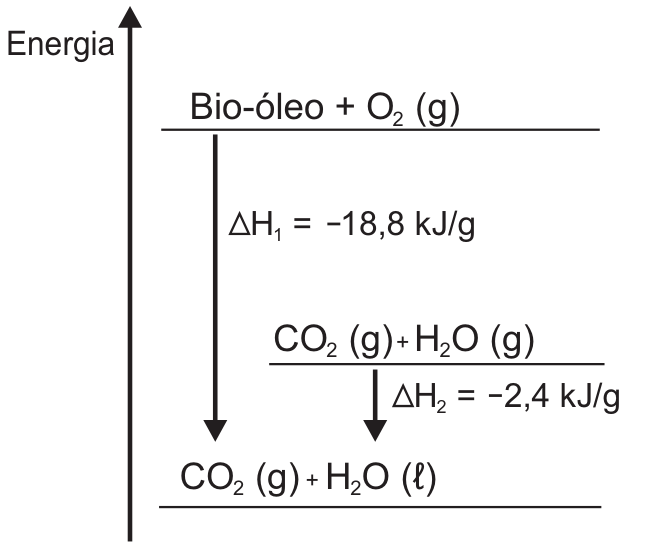

<Accordion titulo="Palavras e siglas desta aula" dica="Consulte quando encontrar um termo novo" icone="spell-check">

- **ENEM** (Exame Nacional do Ensino Médio): a prova nacional que dá acesso a faculdades e bolsas.
- **INEP** (Instituto Nacional de Estudos e Pesquisas Educacionais Anísio Teixeira): o órgão do governo que faz o ENEM.
- **GLP** (gás liquefeito de petróleo): o gás de cozinha, formado principalmente por propano e butano.
- **kJ** (quilojoule): unidade de energia; 1 kJ = 1 000 J (joules).
- **Bio-óleo**: combustível líquido obtido de restos de madeira e plantas.
- **Siderurgia**: a indústria que produz ferro e aço.
- **Ferro-gusa**: o ferro que sai do alto-forno, ainda com carbono e impurezas.
- **Alto-forno**: forno gigante em que o minério de ferro vira ferro-gusa.
- **Reduzir** (um óxido metálico): tirar o oxigênio dele, deixando o metal.
- **Hematita, magnetita, wustita**: minérios de ferro (óxidos de ferro).
- **Fusão** (de minérios): derretimento em altas temperaturas.
- **Efeito estufa**: o aquecimento da Terra causado por gases, como o CO₂, que seguram o calor na atmosfera.
- **Combustíveis fósseis**: petróleo, gás natural e carvão, formados de restos de seres vivos ao longo de milhões de anos.
- **α-** (na hematita): indica uma das formas cristalinas da substância.
- **Estado padrão**: condição de referência das tabelas (25 °C e pressão de 1 atmosfera), para que os valores possam ser comparados.

</Accordion>

## Antes de Começar

**O que o ENEM cobra aqui.** A prova dá uma equação, uma tabela de calores ou um diagrama de energia e pede um valor de calor ou uma comparação entre combustíveis. Os temas que costumam aparecer são estes:

- **Exotérmica ou endotérmica**: a reação libera ou absorve calor.
- **Diagrama de energia**, com etapas e mudança de estado.
- **Calor proporcional à quantidade**: por mol, por grama, para uma massa.
- **Energia de ligação**: calcular o calor pelas ligações rompidas e formadas.
- **Lei de Hess**: somar equações para achar o calor de outra.
- **Combustíveis**: energia liberada comparada com o CO₂ emitido.

**O que você precisa saber antes.**

- **Mol e massa molar.** n = m ÷ massa molar dá os mols; os coeficientes da equação dão a proporção em mols (aula de Estequiometria).
- **Ligações químicas.** Uma ligação simples é um traço (H−H); dupla, dois traços (O=O). Na amônia, NH₃, o N se liga a 3 H: há 3 ligações N−H (aula de Ligações Químicas).
- **Combustão completa.** A queima de um combustível com carbono forma CO₂ (dióxido de carbono, o gás carbônico) e H₂O; cada átomo de carbono do combustível vira uma molécula de CO₂ (aula de Estequiometria).

## Aula Teórica

### 1. Calor nas reações: exo e endo

Toda substância guarda energia nas suas ligações, como uma mola apertada guarda energia. Essa energia guardada se chama **entalpia** (H). Numa reação, os produtos podem guardar menos ou mais energia que os reagentes. A diferença sai ou entra como calor.

- **Reação exotérmica** ("exo" = para fora): **libera** calor. Os produtos ficam com menos energia. Exemplo: queima de gás, de madeira, de gasolina.
- **Reação endotérmica** ("endo" = para dentro): **absorve** calor. Os produtos ficam com mais energia. Exemplo: a decomposição do calcário no forno de cal, a fotossíntese. (Derreter gelo também absorve calor, mas é mudança de estado, não reação.)

**Fórmula: variação de entalpia**

**ΔH = H(produtos) − H(reagentes)**

- **ΔH**: variação de entalpia (lê-se "delta agá"; Δ quer dizer "final menos inicial"), em kJ (quilojoules).
- **H(produtos)**: energia guardada nos produtos.
- **H(reagentes)**: energia guardada nos reagentes.
- **Em palavras:** quanto a energia guardada mudou. **ΔH negativo** = exotérmica (sobrou energia, que saiu); **ΔH positivo** = endotérmica (faltou energia, que entrou).
- **Quando usar:** para classificar a reação e para todo cálculo de calor.

O diagrama abaixo mostra os dois casos. A seta vai dos reagentes aos produtos.

<figure class="figura">
  <svg viewBox="0 0 460 200" role="img" aria-labelledby="fig-tq-1-t fig-tq-1-d">
    <title id="fig-tq-1-t">Diagramas de energia: exotérmica e endotérmica</title>
    <desc id="fig-tq-1-d">Dois diagramas com eixo vertical de energia. À esquerda, reação exotérmica: o nível dos reagentes fica acima do nível dos produtos, e a seta para baixo indica ΔH negativo, calor liberado. À direita, reação endotérmica: os reagentes ficam abaixo dos produtos, e a seta para cima indica ΔH positivo, calor absorvido.</desc>
    <line x1="30" y1="170" x2="30" y2="20" class="traco" />
    <polygon points="30,14 26,24 34,24" class="traco" />
    <text x="36" y="22" class="rotulo-fraco">energia</text>
    <line x1="50" y1="55" x2="160" y2="55" class="traco" />
    <text x="105" y="47" class="rotulo" text-anchor="middle">reagentes</text>
    <line x1="80" y1="140" x2="190" y2="140" class="traco" />
    <text x="135" y="158" class="rotulo" text-anchor="middle">produtos</text>
    <line x1="110" y1="60" x2="110" y2="128" class="traco" />
    <polygon points="110,135 106,126 114,126" class="traco" />
    <text x="118" y="100" class="rotulo">ΔH &lt; 0</text>
    <text x="110" y="190" class="rotulo-fraco" text-anchor="middle">exotérmica: libera calor</text>
    <line x1="260" y1="170" x2="260" y2="20" class="traco" />
    <polygon points="260,14 256,24 264,24" class="traco" />
    <text x="266" y="22" class="rotulo-fraco">energia</text>
    <line x1="280" y1="140" x2="390" y2="140" class="traco" />
    <text x="335" y="158" class="rotulo" text-anchor="middle">reagentes</text>
    <line x1="310" y1="55" x2="420" y2="55" class="traco" />
    <text x="365" y="47" class="rotulo" text-anchor="middle">produtos</text>
    <line x1="340" y1="135" x2="340" y2="67" class="traco" />
    <polygon points="340,60 336,69 344,69" class="traco" />
    <text x="348" y="100" class="rotulo">ΔH > 0</text>
    <text x="340" y="190" class="rotulo-fraco" text-anchor="middle">endotérmica: absorve calor</text>
  </svg>
</figure>

**Exemplo resolvido.** A reação N₂ + O₂ → 2 NO (monóxido de nitrogênio) tem ΔH = +181 kJ. Ela libera ou absorve calor?

1. O sinal é positivo: os produtos guardam mais energia que os reagentes.
2. A energia a mais veio de fora.
3. Resposta: absorve 181 kJ; é endotérmica.

**Erro comum.** Achar que "ΔH negativo" é "menos calor". O sinal só diz a direção: negativo é calor saindo; o tamanho do número é quanto.

### 2. Diagramas de energia e mudança de estado

Nas equações, o estado físico vem entre parênteses: **(g)** = gasoso, **(ℓ)** ou **(l)** = líquido, **(s)** = sólido, **(aq)** = dissolvido em água.

Mudar de estado físico também troca calor. Para ferver ou derreter, é preciso **dar** calor (endotérmico). No caminho inverso, **condensar** (vapor → líquido) e **solidificar** (líquido → sólido) **liberam** calor (exotérmico).

Por isso o calor de uma reação depende do estado dos produtos. Quando uma queima forma água **líquida**, ela libera mais calor do que quando forma água **gasosa**: além da reação, entra o calor da condensação.

Num diagrama com vários níveis, os ΔH se somam pelo caminho. Ir direto de um nível a outro dá o mesmo ΔH que passar por um nível intermediário, como no diagrama da água abaixo.

<figure class="figura">
  <svg viewBox="0 0 460 170" role="img" aria-labelledby="fig-tq-2-t fig-tq-2-d">
    <title id="fig-tq-2-t">Níveis de energia da água</title>
    <desc id="fig-tq-2-d">Três níveis de energia para 1 mol de água, fora de escala: vapor, H₂O (g), no alto; líquido, H₂O (ℓ), no meio; gelo, H₂O (s), embaixo. Seta direta do vapor ao gelo: −50 kJ. Seta do vapor ao líquido: −44 kJ. Seta do líquido ao gelo: −6 kJ.</desc>
    <line x1="40" y1="30" x2="330" y2="30" class="traco" />
    <text x="340" y="34" class="rotulo">H₂O (g), vapor</text>
    <line x1="170" y1="100" x2="330" y2="100" class="traco" />
    <text x="340" y="104" class="rotulo">H₂O (ℓ), líquido</text>
    <line x1="40" y1="145" x2="330" y2="145" class="traco" />
    <text x="340" y="149" class="rotulo">H₂O (s), gelo</text>
    <line x1="80" y1="34" x2="80" y2="134" class="traco" />
    <polygon points="80,141 76,132 84,132" class="traco" />
    <text x="88" y="92" class="rotulo">−50 kJ</text>
    <line x1="210" y1="34" x2="210" y2="89" class="traco" />
    <polygon points="210,96 206,87 214,87" class="traco" />
    <text x="218" y="68" class="rotulo">−44 kJ</text>
    <line x1="280" y1="104" x2="280" y2="134" class="traco" />
    <polygon points="280,141 276,132 284,132" class="traco" />
    <text x="288" y="126" class="rotulo">−6 kJ</text>
  </svg>
</figure>

**Exemplo resolvido.** Para 1 mol de água: vapor → líquido, ΔH = −44 kJ; vapor → gelo, ΔH = −50 kJ. Qual o ΔH de líquido → gelo? E quanto calor liberam 3 mol de vapor virando líquido?

1. Caminho: vapor → gelo pode ser feito como vapor → líquido → gelo.
2. Então: −50 = −44 + ΔH(líquido → gelo).
3. ΔH(líquido → gelo) = −50 + 44 = −6 kJ por mol.
4. 3 mol de vapor → líquido: 3 × (−44) = −132 kJ; saem 132 kJ.
5. Respostas: −6 kJ/mol; 132 kJ liberados.

Uma boa conferência: no diagrama, olhe a **altura** de cada nível. A distância do nível de cima até o de baixo é o calor liberado; se o caminho para antes (num nível mais alto), sai **menos** calor.

**Erro comum.** Somar todas as setas quando o caminho pedido termina num nível intermediário: o trecho que não acontece precisa ser descontado.

### 3. O calor acompanha a quantidade

O ΔH de uma equação vale para as quantidades escritas nela. Se a quantidade muda, o calor muda na mesma proporção.

**Fórmula: calor para uma quantidade**

**calor total = ΔH por unidade × número de unidades**

- **calor total**: calor liberado ou absorvido, em kJ, com sinal.
- **ΔH por unidade**: o calor por mol (kJ/mol) ou por grama (kJ/g), com seu sinal.
- **número de unidades**: quantos mols ou gramas reagem.
- **Em palavras:** o dobro de combustível dá o dobro de calor.
- **Quando usar:** sempre que a pergunta for sobre uma massa ou um número de mols diferente do da equação.

Duas regras completam esta:

- **Inverter** a equação troca o sinal do ΔH: se A → B libera 100 kJ, B → A absorve 100 kJ.
- **Multiplicar** a equação por um número multiplica o ΔH pelo mesmo número.

Preste atenção em "kJ/mol **de** X": o valor é por mol daquela substância. Se a equação tem 2 mol dela, o calor da equação inteira é o dobro.

**Exemplo resolvido.** A queima do carbono, C + O₂ → CO₂, tem ΔH = −394 kJ/mol. Quanto calor sai de 36 g de carvão (carbono puro, 12 g/mol)?

1. Mols: 36 ÷ 12 = 3 mol de carbono.
2. Calor: 3 × (−394) = −1 182 kJ.
3. Resposta: são liberados 1 182 kJ.

**Erro comum.** Usar o ΔH por mol direto com a massa em gramas, sem passar para mols (ou o contrário, quando o dado vem em kJ/g).

### 4. Energia de ligação

Para uma reação acontecer, as ligações dos reagentes se **rompem** e novas ligações se **formam** nos produtos. Romper uma ligação **custa** energia (absorve). Formar uma ligação **devolve** energia (libera). A **energia de ligação** é o valor, em kJ/mol, para romper 1 mol daquela ligação.

**Fórmula: ΔH pelas energias de ligação**

**ΔH = soma das ligações rompidas − soma das ligações formadas**

- **ΔH**: em kJ, para os coeficientes da equação.
- **ligações rompidas**: todas as ligações dos reagentes, cada uma vezes quantas existem, em kJ.
- **ligações formadas**: todas as ligações dos produtos, do mesmo jeito, em kJ.
- **Em palavras:** o que se gasta para quebrar menos o que se ganha ao formar. Se formar devolve mais do que romper gastou, o ΔH é negativo (exotérmica).
- **Quando usar:** quando a questão dá uma tabela de energias de ligação.

Para contar as ligações, desenhe cada molécula e multiplique pelo coeficiente. Uma ligação dupla (como C=O) é uma ligação só, com seu próprio valor na tabela. O ΔH calculado vale para os coeficientes escritos: se a equação tem 2 mol de um reagente, divida por 2 para ter o valor por mol dele.

**Exemplo resolvido.** CH₄ + Cl₂ → CH₃Cl (clorometano) + HCl (cloreto de hidrogênio). Energias (kJ/mol): C−H 413; Cl−Cl 242; C−Cl 328; H−Cl 431. Qual o ΔH? E quanto calor sai com 160 g de CH₄ (16 g/mol)?

1. Rompidas: só muda uma ligação C−H do metano e a Cl−Cl: 413 + 242 = 655 kJ. (As outras 3 C−H continuam iguais e podem ficar fora da conta dos dois lados.)
2. Formadas: C−Cl e H−Cl: 328 + 431 = 759 kJ.
3. ΔH = 655 − 759 = −104 kJ por mol de CH₄.
4. 160 g de CH₄ = 160 ÷ 16 = 10 mol; 10 × (−104) = −1 040 kJ.
5. Resposta: ΔH = −104 kJ/mol; saem 1 040 kJ.

**Exemplo resolvido.** Contagem completa: N₂ + 3 H₂ → 2 NH₃. Energias (kJ/mol): N≡N (ligação tripla) 944; H−H 436; N−H 390. Qual o ΔH por mol de H₂?

1. Rompidas: 1 N≡N + 3 H−H = 944 + 3 × 436 = 944 + 1 308 = 2 252 kJ.
2. Formadas: cada NH₃ tem 3 ligações N−H, e são 2 NH₃: 2 × 3 = 6 ligações; 6 × 390 = 2 340 kJ.
3. ΔH da equação: 2 252 − 2 340 = −88 kJ (para 3 mol de H₂).
4. Por mol de H₂: −88 ÷ 3 ≈ −29,3 kJ.

**Erro comum.** Fazer "formadas − rompidas" (o sinal sai trocado) ou esquecer de multiplicar pelo número de ligações e pelos coeficientes.

### 5. Lei de Hess

O calor de uma reação não depende do caminho, só do começo e do fim (é como subir um prédio: pela escada ou pelo elevador, a altura é a mesma). Por isso dá para achar o ΔH de uma reação **somando outras** cujos ΔH são conhecidos. Essa é a **Lei de Hess**.

O roteiro:

1. Olhe a reação que você quer (a **reação-alvo**).
2. Arrume cada equação dada para que as substâncias fiquem do lado certo e na quantidade certa: **inverta** (troca o sinal do ΔH) e **multiplique** (multiplica o ΔH) quando precisar. Pode-se multiplicar por fração (½, ⅓) ou pelo menor múltiplo comum, para ficar com números inteiros, e dividir no fim.
3. Some as equações. O que aparece igual dos dois lados se **cancela**.
4. Some os ΔH arrumados.
5. Se a soma deu a reação-alvo multiplicada (por 4, por exemplo), **divida** o ΔH pelo mesmo número para ter o valor "por mol".

As tabelas também escrevem **ΔᵣH°**: o "r" pequeno quer dizer "de reação" e o "°" (às vezes um círculo cortado) quer dizer "no estado padrão". É o mesmo ΔH. Um número junto, como em ΔH°₂₅, indica a temperatura (25 °C).

**Exemplo resolvido.** Ache o ΔH da reação 2 S + 3 O₂ → 2 SO₃, por mol de SO₃, com:

(I) S + O₂ → SO₂ (dióxido de enxofre)  ΔH = −297 kJ\
(II) 2 SO₂ + O₂ → 2 SO₃ (trióxido de enxofre)  ΔH = −198 kJ

1. A reação-alvo tem 2 S à esquerda: multiplique (I) por 2: 2 S + 2 O₂ → 2 SO₂, ΔH = 2 × (−297) = −594 kJ.
2. (II) já tem 2 SO₃ à direita e 2 SO₂ à esquerda: use como está, −198 kJ.
3. Soma: 2 S + 2 O₂ + 2 SO₂ + O₂ → 2 SO₂ + 2 SO₃. O 2 SO₂ cancela: 2 S + 3 O₂ → 2 SO₃.
4. ΔH total: −594 + (−198) = −792 kJ, para 2 mol de SO₃.
5. Por mol de SO₃: −792 ÷ 2 = −396 kJ/mol.

**Exemplo resolvido.** Agora com inversão e três equações. Ache o ΔH de 2 C + H₂ → C₂H₂ (etino), com:

(I) C + O₂ → CO₂  ΔH = −394 kJ\
(II) H₂ + ½ O₂ → H₂O  ΔH = −286 kJ\
(III) C₂H₂ + 5/2 O₂ → 2 CO₂ + H₂O  ΔH = −1 300 kJ

1. O C₂H₂ tem de ficar à direita: **inverta** (III): 2 CO₂ + H₂O → C₂H₂ + 5/2 O₂, ΔH = +1 300 kJ.
2. São 2 C à esquerda: multiplique (I) por 2: 2 C + 2 O₂ → 2 CO₂, ΔH = −788 kJ.
3. (II) já tem 1 H₂ à esquerda: fica como está, −286 kJ.
4. Some: 2 CO₂, H₂O e 5/2 O₂ se cancelam (2 O₂ + ½ O₂ = 5/2 O₂ de cada lado). Sobra 2 C + H₂ → C₂H₂.
5. ΔH = +1 300 − 788 − 286 = +226 kJ (endotérmica).

Quando uma substância aparece em mais de uma equação dada, comece pelas que aparecem em **uma só**: elas decidem se a equação é invertida e por quanto multiplicar.

**Erro comum.** Inverter a equação e esquecer de trocar o sinal, ou marcar o ΔH da soma sem dividir pelo número de mols pedido.

### 6. Combustíveis: energia e CO₂

O **calor de combustão** (ΔH°c) é o calor liberado na queima completa de 1 mol do combustível. Para comparar combustíveis do ponto de vista do ambiente, olhe também quanto **CO₂** cada um solta. Na queima completa, **cada carbono** da fórmula vira 1 CO₂: o propano, C₃H₈, solta 3 CO₂ por mol.

**Fórmula: energia por CO₂**

**energia por mol de CO₂ = |ΔH de combustão| ÷ número de carbonos**

- **|ΔH|**: o valor do calor sem o sinal (as barras querem dizer "sem o sinal"), em kJ/mol.
- **número de carbonos**: o índice do C na fórmula (mols de CO₂ por mol de combustível).
- **energia por mol de CO₂**: em kJ por mol de CO₂.
- **Em palavras:** quanta energia cada CO₂ emitido "paga". Quanto maior, mais limpo o combustível nesse critério.
- **Quando usar:** quando a pergunta compara energia e CO₂.
- **O inverso:** **CO₂ por energia = número de carbonos ÷ |ΔH|**, em mol de CO₂ por kJ. Quanto **maior**, **mais** CO₂ para a mesma energia.

**Exemplo resolvido.** Calores de combustão (kJ/mol): carbono, C, 394; etino, C₂H₂, 1 300; propano, C₃H₈, 2 220. Ordene do que dá menos energia por CO₂ ao que dá mais.

1. Carbono: 394 ÷ 1 = 394 kJ por mol de CO₂.
2. Etino: 1 300 ÷ 2 = 650 kJ por mol de CO₂.
3. Propano: 2 220 ÷ 3 = 740 kJ por mol de CO₂.
4. Ordem crescente: carbono, etino, propano.
5. Pelo inverso, o carbono é o que mais solta CO₂ para a mesma energia (1 ÷ 394 é o maior).

Combustíveis com mais hidrogênio por carbono (como o etano, C₂H₆) costumam dar mais energia por CO₂: o hidrogênio também queima e libera calor, mas vira água, não CO₂. Combustíveis que já têm oxigênio na fórmula (como o metanol, CH₃OH) liberam menos calor por carbono.

**Erro comum.** Escolher o combustível de maior ΔH na tabela. Um ΔH grande pode vir junto com muitos carbonos; é preciso dividir.

### Armadilhas típicas do INEP

1. **Sinal do ΔH**: negativo é calor liberado (exotérmica).
2. **Estado da água**: parar no vapor libera menos que chegar ao líquido.
3. **Por mol × total**: ajuste o calor à massa ou aos mols pedidos.
4. **Energia de ligação ao contrário**: é rompidas − formadas.
5. **Hess sem trocar o sinal** ao inverter, ou sem dividir no final.
6. **Maior ΔH ≠ mais limpo**: divida pelo número de carbonos.
7. **"Crescente" e "decrescente"**: confira a ordem pedida.

## Tópicos-Chave para Revisão

#### 1. Exo e endo

**ΔH = H(produtos) − H(reagentes)**; **ΔH negativo**: exotérmica, libera calor; **ΔH positivo**: endotérmica, absorve.

<figure class="figura">
  <svg viewBox="0 0 460 100" role="img" aria-labelledby="fig-tq-1-rev-t fig-tq-1-rev-d">
    <title id="fig-tq-1-rev-t">Exo e endo (resumo)</title>
    <desc id="fig-tq-1-rev-d">À esquerda, reagentes acima dos produtos, seta para baixo, ΔH negativo. À direita, reagentes abaixo dos produtos, seta para cima, ΔH positivo.</desc>
    <line x1="60" y1="25" x2="150" y2="25" class="traco" />
    <text x="105" y="18" class="rotulo-fraco" text-anchor="middle">reagentes</text>
    <line x1="80" y1="75" x2="170" y2="75" class="traco" />
    <text x="125" y="92" class="rotulo-fraco" text-anchor="middle">produtos</text>
    <line x1="100" y1="30" x2="100" y2="65" class="traco" />
    <polygon points="100,72 96,63 104,63" class="traco" />
    <text x="108" y="54" class="rotulo">ΔH &lt; 0</text>
    <line x1="290" y1="75" x2="380" y2="75" class="traco" />
    <text x="335" y="92" class="rotulo-fraco" text-anchor="middle">reagentes</text>
    <line x1="310" y1="25" x2="400" y2="25" class="traco" />
    <text x="355" y="18" class="rotulo-fraco" text-anchor="middle">produtos</text>
    <line x1="330" y1="70" x2="330" y2="36" class="traco" />
    <polygon points="330,29 326,38 334,38" class="traco" />
    <text x="338" y="54" class="rotulo">ΔH > 0</text>
  </svg>
</figure>

#### 2. Diagramas e mudança de estado

**Condensar** e **solidificar** liberam calor; os ΔH se **somam** pelo caminho; parar no **vapor** libera menos.

<figure class="figura">
  <svg viewBox="0 0 460 110" role="img" aria-labelledby="fig-tq-2-rev-t fig-tq-2-rev-d">
    <title id="fig-tq-2-rev-t">Níveis da água (resumo)</title>
    <desc id="fig-tq-2-rev-d">Vapor no alto, líquido no meio, gelo embaixo; a seta direta de −50 kJ é a soma de −44 kJ e −6 kJ.</desc>
    <line x1="40" y1="20" x2="330" y2="20" class="traco" />
    <text x="340" y="24" class="rotulo">vapor</text>
    <line x1="170" y1="65" x2="330" y2="65" class="traco" />
    <text x="340" y="69" class="rotulo">líquido</text>
    <line x1="40" y1="95" x2="330" y2="95" class="traco" />
    <text x="340" y="99" class="rotulo">gelo</text>
    <line x1="80" y1="24" x2="80" y2="85" class="traco" />
    <polygon points="80,91 76,82 84,82" class="traco" />
    <text x="88" y="62" class="rotulo">−50</text>
    <line x1="210" y1="24" x2="210" y2="55" class="traco" />
    <polygon points="210,61 206,52 214,52" class="traco" />
    <text x="218" y="46" class="rotulo">−44</text>
    <line x1="280" y1="69" x2="280" y2="85" class="traco" />
    <polygon points="280,91 276,82 284,82" class="traco" />
    <text x="288" y="84" class="rotulo">−6</text>
  </svg>
</figure>

#### 3. Calor e quantidade

**calor total = ΔH por unidade × número de unidades**; **inverter** troca o sinal; **multiplicar** a equação multiplica o ΔH.

#### 4. Energia de ligação

**ΔH = soma das ligações rompidas − soma das ligações formadas**; **romper** absorve, **formar** libera.

#### 5. Lei de Hess

**Some** as equações arrumadas (**inverter** troca o sinal, multiplicar multiplica o ΔH) e **divida** no fim para ter o valor por mol; **ΔᵣH°** em "kJ/mol de X" é por mol de X.

#### 6. Combustíveis

**energia por mol de CO₂ = |ΔH de combustão| ÷ número de carbonos**; cada **carbono** vira 1 CO₂; **CO₂ por energia = número de carbonos ÷ |ΔH|**.

## Questões do ENEM

*Marque uma alternativa em cada questão e confira tudo de uma vez no botão do fim.*

**Questão 1**

*ENEM 2015 · 1º dia · caderno azul · questão 84*

O aproveitamento de resíduos florestais vem se tornando cada dia mais atrativo, pois eles são uma fonte renovável de energia. A figura representa a queima de um bio-óleo extraído do resíduo de madeira, sendo ΔH₁ a variação de entalpia devido à queima de 1 g desse bio-óleo, resultando em gás carbônico e água líquida, e ΔH₂ a variação de entalpia envolvida na conversão de 1 g de água no estado gasoso para o estado líquido.

<figure class="figura">

</figure>

A variação de entalpia, em kJ, para a queima de 5 g desse bio-óleo resultando em CO₂ (gasoso) e H₂O (gasoso) é:

A) −106.\
B) −94,0.\
C) −82,0.\
D) −21,2.\
E) −16,4.

**Questão 2**

*ENEM 2019 · 2ª aplicação · 2º dia · caderno azul · questão 131*

O gás hidrogênio é considerado um ótimo combustível — o único produto da combustão desse gás é o vapor de água, como mostrado na equação química.

2 H₂ (g) + O₂ (g) → 2 H₂O (g)

Um cilindro contém 1 kg de hidrogênio e todo esse gás foi queimado. Nessa reação, são rompidas e formadas ligações químicas que envolvem as energias listadas no quadro.

<figure class="figura">

| Ligação química | Energia de ligação (kJ/mol) |
|---|---|
| H−H | 437 |
| H−O | 463 |
| O=O | 494 |

</figure>

Massas molares (g/mol): H₂ = 2; O₂ = 32; H₂O = 18.

Qual é a variação da entalpia, em quilojoule, da reação de combustão do hidrogênio contido no cilindro?

A) −242 000\
B) −121 000\
C) −2 500\
D) +110 500\
E) +234 000

**Questão 3**

*ENEM 2017 · 2º dia · caderno azul · questão 124*

O ferro é encontrado na natureza na forma de seus minérios, tais como a hematita (α-Fe₂O₃), a magnetita (Fe₃O₄) e a wustita (FeO). Na siderurgia, o ferro-gusa é obtido pela fusão de minérios de ferro em altos fornos em condições adequadas. Uma das etapas nesse processo é a formação de monóxido de carbono. O CO (gasoso) é utilizado para reduzir o FeO (sólido), conforme a equação química:

FeO (s) + CO (g) → Fe (s) + CO₂ (g)

Considere as seguintes equações termoquímicas:

Fe₂O₃ (s) + 3 CO (g) → 2 Fe (s) + 3 CO₂ (g)  ΔᵣH° = −25 kJ/mol de Fe₂O₃\
3 FeO (s) + CO₂ (g) → Fe₃O₄ (s) + CO (g)  ΔᵣH° = −36 kJ/mol de CO₂\
2 Fe₃O₄ (s) + CO₂ (g) → 3 Fe₂O₃ (s) + CO (g)  ΔᵣH° = +47 kJ/mol de CO₂

O valor mais próximo de ΔᵣH°, em kJ/mol de FeO, para a reação indicada do FeO (sólido) com o CO (gasoso) é

A) −14.\
B) −17.\
C) −50.\
D) −64.\
E) −100.

**Questão 4**

*ENEM 2011 · 1º dia · caderno azul · questão 50*

Um dos problemas dos combustíveis que contêm carbono é que sua queima produz dióxido de carbono. Portanto, uma característica importante, ao se escolher um combustível, é analisar seu calor de combustão (ΔH°c), definido como a energia liberada na queima completa de um mol de combustível no estado padrão. O quadro seguinte relaciona algumas substâncias que contêm carbono e seu ΔH°c.

<figure class="figura">

| Substância | Fórmula | ΔH°c (kJ/mol) |
|---|---|---|
| benzeno | C₆H₆ (l) | −3 268 |
| etanol | C₂H₅OH (l) | −1 368 |
| glicose | C₆H₁₂O₆ (s) | −2 808 |
| metano | CH₄ (g) | −890 |
| octano | C₈H₁₈ (l) | −5 471 |

</figure>

ATKINS, P. Princípios de Química. Bookman, 2007 (adaptado).

Neste contexto, qual dos combustíveis, quando queimado completamente, libera mais dióxido de carbono no ambiente pela mesma quantidade de energia produzida?

A) Benzeno.\
B) Metano.\
C) Glicose.\
D) Octano.\
E) Etanol.

**Questão 5**

*ENEM 2009 · 1º dia · caderno azul · questão 43*

Nas últimas décadas, o efeito estufa tem-se intensificado de maneira preocupante, sendo esse efeito muitas vezes atribuído à intensa liberação de CO₂ durante a queima de combustíveis fósseis para geração de energia. O quadro traz as entalpias-padrão de combustão a 25 ºC (ΔH°₂₅) do metano, do butano e do octano.

<figure class="figura">

| composto | fórmula molecular | massa molar (g/mol) | ΔH°₂₅ (kJ/mol) |
|---|---|---|---|
| metano | CH₄ | 16 | −890 |
| butano | C₄H₁₀ | 58 | −2.878 |
| octano | C₈H₁₈ | 114 | −5.471 |

</figure>

À medida que aumenta a consciência sobre os impactos ambientais relacionados ao uso da energia, cresce a importância de se criar políticas de incentivo ao uso de combustíveis mais eficientes. Nesse sentido, considerando-se que o metano, o butano e o octano sejam representativos do gás natural, do gás liquefeito de petróleo (GLP) e da gasolina, respectivamente, então, a partir dos dados fornecidos, é possível concluir que, do ponto de vista da quantidade de calor obtido por mol de CO₂ gerado, a ordem crescente desses três combustíveis é

A) gasolina, GLP e gás natural.\
B) gás natural, gasolina e GLP.\
C) gasolina, gás natural e GLP.\
D) gás natural, GLP e gasolina.\
E) GLP, gás natural e gasolina.
